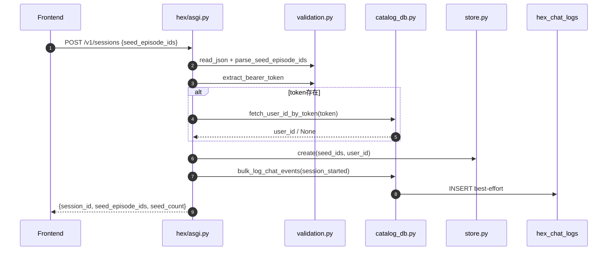
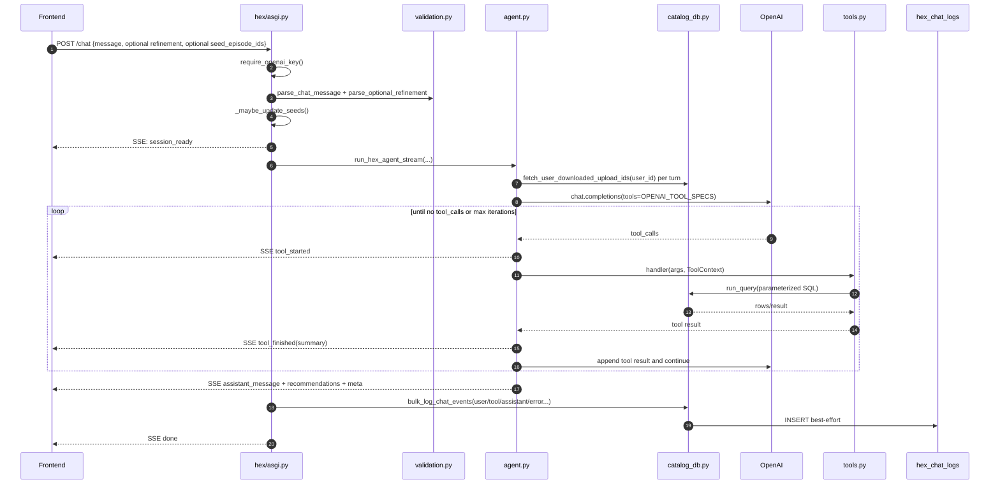
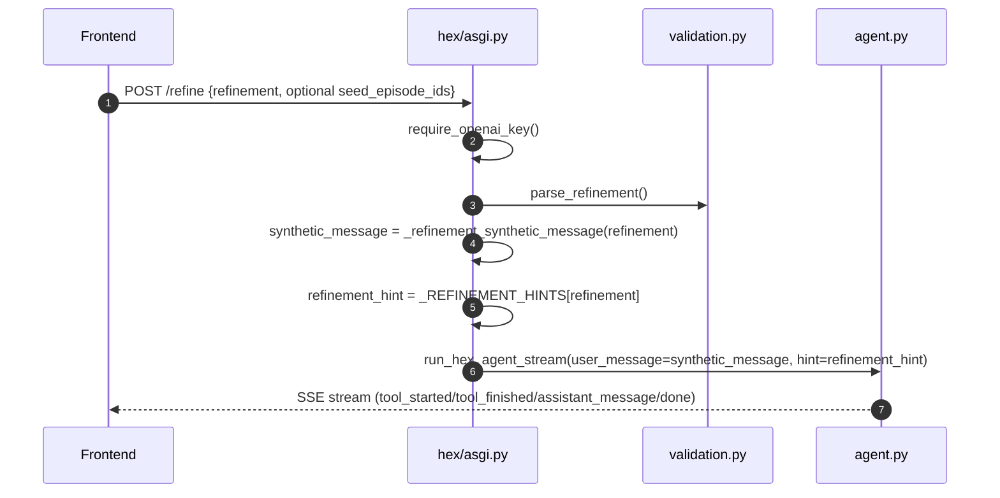

# app-prismax-rp-backend：AI Data Assistant（Hex）逻辑分析

## 1. 范围与结论

本分析聚焦仓库 `app-prismax-rp-backend` 中与 **AI Data assistant Hex** 相关的后端逻辑。

核心结论：当前 Hex 是一个 **独立 Cloud Run 服务 + 直接查 Cloud SQL + OpenAI tool-calling + SSE 流式返回** 的编排层，不是仅依赖 data_pipeline 接口拉全量 catalog 再本地排序的旧模式。

---

## 2. 技术解读

### 2.1 代码位置与部署

- Hex 服务目录：`app-prismax-rp-backend/app_prismax_hex/`
- ASGI 入口：`app_prismax_hex/hex/asgi.py`
- Agent 主循环：`app_prismax_hex/hex/agent.py`
- 工具注册与 SQL 过滤：`app_prismax_hex/hex/tools.py`
- DB 与审计日志：`app_prismax_hex/hex/catalog_db.py`
- 配置：`app_prismax_hex/hex/settings.py`
- 校验：`app_prismax_hex/hex/validation.py`
- Cloud Build/部署：`app-prismax-rp-backend/cloudbuild.yaml`（包含 `app-prismax-hex` build + deploy）

#### 2.1.1 ASGI 说明

ASGI 是 **Asynchronous Server Gateway Interface**，可以理解为 Python Web 服务中“应用和服务器之间的标准接口”。

它主要用于支持异步 Web 应用，例如：

- HTTP API
- WebSocket
- Server-Sent Events（SSE）
- 长连接 / 流式响应
- 异步并发请求

在 Hex 服务里，`app_prismax_hex/hex/asgi.py` 定义 Starlette 应用：

```python
app = create_app()
```

然后由 `uvicorn` 作为 ASGI server 启动：

```bash
uvicorn hex.asgi:app --host 0.0.0.0 --port ${PORT}
```

对应关系：

- `asgi.py`：定义 Web 应用、路由、中间件、接口逻辑。
- `uvicorn`：ASGI server，负责接收 HTTP 请求并调用 `app`。
- `Starlette`：ASGI Web 框架，提供路由、Request/Response、StreamingResponse 等能力。

Hex 使用 ASGI 是合理的，因为它需要通过 SSE 流式返回事件，也就是边执行工具 / LLM 调用，边把 `tool_started`、`tool_finished`、`assistant_message` 等事件推给前端。

#### 2.1.2 SSE 流式说明

SSE 是 **Server-Sent Events**，意思是“服务器主动向浏览器连续推送事件”。

普通 HTTP 接口通常是：

1. 前端发请求。
2. 后端处理完所有逻辑。
3. 一次性返回完整结果。

SSE 流式则是：

1. 前端发起一次请求。
2. 后端保持连接不断开。
3. 后端每完成一个阶段，就立刻推一个事件给前端。
4. 最后再推 `done` 事件结束。

在 Hex 里，一轮 chat/refine 的典型 SSE 事件序列是：

```text
session_ready
tool_started
tool_finished
assistant_message
done
```

这样前端不需要一直等到 OpenAI 和工具全部跑完才显示结果，而是可以实时展示：

- 正在创建 / 准备会话。
- 正在查找相似 episodes。
- 工具执行完成。
- AI 回复和推荐结果。
- 本轮完成。

所以，**SSE 流式 = 后端通过一条 HTTP 连接，把多个过程事件按顺序实时推给前端**。

---

### 2.2 HTTP 接口与会话流

Hex 暴露主要接口（Starlette）：

- `GET /health`
- `GET /v1/refinements`
- `POST /v1/sessions`
- `POST /v1/sessions/{session_id}/chat`
- `POST /v1/sessions/{session_id}/refine`
- `GET /v1/admin/db-whoami`（DB 权限诊断）

#### 2.2.1 会话创建

`POST /v1/sessions`：

1. 解析 `seed_episode_ids`（允许空 seeds）。
2. 从 `Authorization: Bearer`（或 `?token=`）解析 token。
3. `fetch_user_id_by_token()` 映射 `users.hash_code -> user_id`。
4. 创建内存会话（`SessionStore`），记录 `seed_episode_ids`、`user_id`、history、turn counter。
5. 最佳努力写 `hex_chat_logs` 的 `session_started` 事件。

#### 2.2.2 chat / refine

- 都要求存在 OpenAI key（无 key 返回 503）。
- 返回 `text/event-stream`，事件类型：
  - `session_ready`
  - `tool_started`
  - `tool_finished`
  - `assistant_message`
  - `error`
  - `done`
- 每轮 turn 结束后，统一批量写 chat audit log（失败不影响前端响应）。

---

### 2.3 Agent 决策逻辑（LLM + Tool）

#### 2.3.1 Fast Path（不走 LLM）

`agent.py` 里对“more similar / N more”等高频句式做正则识别：

- 命中后直接调用 `add_more_similar_episodes`
- 减少 OpenAI 往返和成本

#### 2.3.2 常规循环

`run_hex_agent_stream()` 逻辑：

1. 构建 system prompt（含规则、会话 seeds、refinement hint、下载历史提示）。
2. 回放有限历史（最近 10 个 user/assistant turn，工具轨迹不回放）。
3. 调 OpenAI chat completion，使用 `OPENAI_TOOL_SPECS`。
4. 若模型发起 tool call：
   - 触发工具执行（严格 schema + 参数校验 + 参数化 SQL）
   - 将工具结果 append 回 messages
   - 继续下一轮迭代（上限 `agent_max_iterations`）
5. 若不再调用工具，输出 `assistant_message`（含 `recommendations`）。
6. 若触达迭代上限，再做一次“无工具 closing message”。

#### 2.3.3 用户下载历史联动

每个 turn 都会刷新该用户“已下载 upload_id”集合：

- 用于 add_* 默认排重（`exclude_downloaded=true`）
- 避免用户中途发起下载后，需要重建 session 才生效

---

### 2.4 Tool 体系与数据检索策略

#### 2.4.1 工具定义

`tools.py` 定义：

- OpenAI tool spec（JSON schema）
- Python handler（参数清洗 + SQL）
- display name（前端“工具执行中”文案）

常见工具：

- 查询/解释类：`count_episodes`、`list_tasks`、`search_tasks`、`list_machines`、`summarize_seeds`、`summarize_downloads`
- 推荐类：`add_more_similar_episodes`、`add_episodes_by_task_id`、`add_episodes_by_machine_id`、`add_episodes_by_quality`、`add_episodes_from_same_uploads`、`add_episodes_from_different_machines`、`add_episodes_by_text_search`

#### 2.4.2 推荐工具共性

推荐工具都围绕 `_BASE_EPISODE_SELECT` 联表查询：

- `data_episodes` + `data_uploads` + `data_tasks` + `data_machines`
- lateral 子查询取最新 QA 分数
- 通常要求 `e.status = 'DERIVED_READY'`

并有典型默认过滤：

- 排除 seeds（`exclude_seeds=true`）
- 排除已下载 upload（`exclude_downloaded=true`，匿名用户或无下载历史时为 no-op）

#### 2.4.3 `add_more_similar_episodes` 算法

这是 Hex 核心推荐策略：

1. 按 seed 的 `task_id` 分 baskets（最多 `similarity_max_baskets`）。
2. 每个 basket 做级联召回：
   - same upload
   - same task + same machine
   - same task
   - same scenario
   - same environment
3. 按配额 + 补齐策略合并多 basket 结果。
4. 返回 `tier_breakdown`、`baskets`、`shortfall` 供前端/模型解释。

---

### 2.5 数据库与安全边界

#### 2.5.1 凭据与连接

`catalog_db.py` 中：

- DB 凭据由 Secret Manager 读取（`PRISMAX_APP_DB_*` 等）
- 通过 Cloud SQL Python Connector + SQLAlchemy 建连接池
- 凭据不进入 LLM prompt，不进入 tool schema，不在 settings 对外传播

#### 2.5.2 SQL 安全

- 工具只接收结构化参数
- 后端拼接受控 SQL 片段 + bind params
- LLM 无法注入 raw SQL

#### 2.5.3 审计日志

- `bulk_log_chat_events()` 批量写 `hex_chat_logs`
- 表不存在或写失败时静默降级（不阻断聊天）
- 记录 user / assistant / tool_started / tool_finished / error / session_started

---

### 2.6 与 Data Pipeline 的关系

Hex 与 data_pipeline 是并行服务，不互相替代：

- token -> user 解析规则保持一致（查 `users.hash_code`）
- 下载逻辑事实来源依旧在 `data_downloads`
- Hex 通过下载历史做推荐排重

同时，data_pipeline 存在 Hex 扩展字段迁移：

- `app_prismax_data_pipeline/sql/20260420_hex_episode_catalog_enrichment.sql`
  - `data_episodes.hex_catalog_description`
  - `data_episodes.hex_catalog_variation`

---

### 2.7 按接口维度的时序图（更细）

#### 2.7.1 `POST /v1/sessions`（创建会话）



#### 2.7.2 `POST /v1/sessions/{id}/chat`（自然语言轮次）



#### 2.7.3 `POST /v1/sessions/{id}/refine`（预设 refinement）



---

### 2.8 每个 refinement 的“实际触发工具”拆解

> 关键事实：`/refine` 不是硬编码路由到某个 tool；它把 `synthetic_message + hint` 喂给同一个 agent/tool-calling 循环。  
> 因此“触发哪个工具”是**强引导而非绝对保证**。  
> 唯一硬分支是 chat 文本命中 fast-path 正则时，直接执行 `add_more_similar_episodes`（不经 LLM）。

#### 2.8.1 触发矩阵（按当前提示词设计）

| refinement | synthetic_message（asgi） | hint意图（asgi） | 预期首选工具路径 | 常见兜底/补救 |
|---|---|---|---|---|
| `closest_match` | `Add 10 more similar episodes.` | “更接近种子” | `add_more_similar_episodes` | 若seed为空：通常先 `summarize_downloads` 或改问澄清 |
| `more_variation` | `Add 10 episodes with more variation versus my seeds.` | 明确建议看 task variations | `list_tasks` -> `add_episodes_by_task_id` | 命中弱时用 `add_episodes_by_text_search` |
| `quality_90_plus` | `Add 10 episodes with quality score 90 or higher.` | 质量阈值筛选 | `add_episodes_by_quality(min_quality>=90)` | 若数量不足：放宽阈值或放宽时间窗口 |
| `different_machines` | “different robot arm…any task is fine” | 明确强调 robot diversity | `add_episodes_from_different_machines(related_to_seed_tasks=false)` | 若0结果：继续放宽过滤，或转 `add_episodes_by_machine_id` 多臂覆盖 |
| `include_failed_attempts` | `...failed attempts if available.` | 提示仅有 `DERIVED_READY` | 通常先解释不可得，再给替代（如 `add_more_similar_episodes`） | 不应伪造失败样本来源 |

#### 2.8.2 `/chat` 与 refinement 参数的关系（实现层）

- `/chat` body 可带 `refinement`，但当前实现只是：
  1. 做合法性校验；
  2. 取到 `refinement_hint` 注入 system prompt；
  3. **不会**在后端硬指定某个工具必须调用。
- 所以 `/chat + refinement=quality_90_plus` 仍可能先调别的工具（例如先 count 或先 list_tasks），只是概率上被 hint 引导到对应路径。

#### 2.8.3 fast-path（会覆盖“closest match”类自然语句）

当 `/chat.message` 命中模式（如 “give me more”, “20 more similar episodes”）且有 seeds：

1. 直接 `_run_fast_path_same_uploads`（函数名历史遗留，实际调用 `add_more_similar_episodes`）；
2. 发送 `tool_started/tool_finished/assistant_message`；
3. 不进入 OpenAI tool-calling 回路。

---

### 2.9 版本演进补充（2026-05-22：Hex API Download）

前文 `2.1 ~ 2.8` 主要解释“系统怎么工作”；本节从版本演进角度解释“为什么会出现 3.4.1 中这些新增可测能力（API package、历史下载、recent 追问、推荐区联动）”。

#### 2.9.1 提交时间线（前后端对照）

| 阶段 | 前端（`app-prismax-rp`） | 后端（`app-prismax-rp-backend`） | 作用 |
| --- | --- | --- | --- |
| 功能首版 | `2bfba3c` | `b4915b1` | 首次打通 Hex -> API package -> API download session |
| 合并 testing | `db4d67e` | `9c4596c` | 把 testing 并入 `cw/hex`，统一集成基线 |
| 体验增强 | `b0d506f` | `28703c7` | 意图识别、fast-path、结构化 UI 元信息增强 |
| PR 合并 | `b742b4f` | `e99ed84` | 将 `cw/hex` 汇总改动合入主线 |

#### 2.9.2 本轮演进的能力主线（按用户路径）

1. **用户意图识别**
   - 前端增加 `isApiPackageChatIntent()`；后端 agent 增加 API package fast-path。
   - 用户说 “create api package / download via api” 时，不再走冗长问答分流。

2. **建包执行与冲突处理**
   - 后端 `POST /data/api-packages` 增加重复 episode 冲突检查（`409` + `episode_ids`）。
   - 支持 `allow_already_packaged=true`，前端据此提供“全量新包/移除冲突项”分支交互。

3. **下载配额治理**
   - 后端在 `POST /v1/data/download-sessions` 增加 membership 月度配额校验（超限 `402`）。
   - 新增 `GET /data/api-download-membership/current`，前端可读取并展示当前可用额度。

4. **交付与可视化闭环**
   - 前端 Hex rail 展示 package widget（`package_id`、copy id、copy example）。
   - 前端可自动聚焦 `API Access` tab；manifest 阈值在前端预检查。

#### 2.9.3 与前文章节的对应关系（便于定位）

- 与 `2.3 Agent 决策逻辑` 对应：fast-path 不再只有 “more similar”，新增 API package 语义。  
- 与 `2.4 Tool 体系` 对应：新增 `prepare_download_estimate` / `create_api_package` 工具路径。  
- 与 `2.6 与 Data Pipeline 关系` 对应：Hex 负责对话与建包编排，真实下载会话仍由 pipeline 执行。  
- 与 `2.8 refinement 行为` 对应：API 下载类意图属于新增强规则，不改变 refinement 的“hint 而非硬路由”基本事实。

#### 2.9.4 对测试章节的直接影响

本节演进点直接映射到 `3.4.1` 与后续 E2E case，建议优先关注：

1. `409` 冲突分支：`allow_already_packaged` 前后语义一致。  
2. `402` 配额分支：`used/new/projected/remaining` 口径及跨月边界。  
3. 前后端意图一致性：regex 与 fast-path 不出现分裂体验。  
4. `API Access` 聚焦策略：只在 API 下载语境触发。  
5. session 失效处理一致性：下载/建包/API key 三条路径一致恢复。

#### 2.9.5 一句话总结

2026-05-22 这组提交把 Hex 从“推荐助手”推进到“可交付下载入口”：前端负责可操作 UI 与引导，后端负责冲突/配额/工具编排，最终形成 API 下载闭环。

---

## 3. 测试策略分析

### 3.1 目标

- 验证 Hex 在“会话、SSE、工具调用、过滤约束、错误降级”上的行为正确性。
- 覆盖高风险差异点：`refinement` 实际触发路径、下载排重、fast-path、类型不匹配风险。

### 3.2 分层策略

1. **接口契约测试（API/SSE）**  
   覆盖 `/v1/sessions`、`/chat`、`/refine`、`/refinements`、`/health`，校验 status code、字段、SSE 事件序列。
2. **工具行为测试（SQL过滤）**  
   对关键 add/count 工具喂固定数据集，断言 `filters_applied/count/shortfall/tier_breakdown`。
3. **策略路径测试（Agent）**  
   验证 fast-path 命中/未命中，验证 refinement hint 的引导效果与非硬路由事实。
4. **故障与降级测试**  
   覆盖 OpenAI 不可用、chat_logs 表不存在、token 无法映射 user、DB 查询异常。

### 3.3 高优先级用例（建议先落地）

#### P0（发布阻断项，先执行）

1. 认证与基础可用性  
   - `HEX-E2E-003`：`/chat` 无 OpenAI key -> 返回 503。  
   - `HEX-E2E-004`：无效 session -> 404，且无半截 SSE。  
   - `HEX-E2E-006`：chat 日志表缺失时主流程仍成功（静默降级）。
2. API package 核心交付链路  
   - `HEX-E2E-037`：创建 API package 成功且 package 与 selection 一致。  
   - `HEX-E2E-042`：冲突后“Create new package with all selected”分支。  
   - `HEX-E2E-043`：冲突后“Remove from selection”分支。  
   - `HEX-E2E-044`：`/v1/data/download-sessions` 配额超限返回 402 且字段完整。
3. 新增策略路径正确性  
   - `HEX-E2E-045`：聊天 API 意图直达建包（含拼写容错）。  
   - `HEX-E2E-048`：`prepare_download_estimate` 推荐路径与限制说明正确。  
   - `HEX-E2E-046`：仅 API 语义触发 API Access tab 聚焦。  
   - `HEX-E2E-047`：下载/建包/API key 三路径 session 失效恢复一致。

#### P1（高价值回归项，P0 后执行）

1. 核心推荐与 agent 路径  
   - `HEX-E2E-009`：more similar fast-path。  
   - `HEX-E2E-015`：`different_machines` 默认 `related_to_seed_tasks=false`。  
   - `HEX-E2E-002`：seed 为空时 chat 不崩溃并能给出合理引导。
2. 下载历史与排重语义  
   - `HEX-E2E-019`：`exclude_downloaded=true` 排除 full-pull upload。  
   - `HEX-E2E-020`：显式 include downloaded 时可放开排除。  
   - `HEX-E2E-022`：下载历史数量口径一致。
3. 交互完整性与可观测性  
   - `HEX-E2E-038`：复制 package id / example 一致性。  
   - `HEX-E2E-041`：推荐区加选后交付一致性。  
   - `HEX-E2E-008`：并发会话隔离。
4. 结构性风险补点（保留专项）  
   - 保留 machine 过滤专项检查：`add_episodes_by_task_id` + machine 过滤（UUID/int 风险），建议在接口/工具层补一个定向验证用例（可作为后续 `HEX-INT-*`）。

### 3.4 E2E 测试用例

> E2E 目标：从前端/接口视角验证“创建 Hex 会话 -> 发起 chat/refine -> 接收 SSE -> 展示推荐 chips/文案 -> 后续下载仍走 data pipeline”的完整用户路径。

#### 3.4.1 2026-05-22 截图新增能力判读

根据本次补充截图，Hex 前端与对话能力新增了以下可测面：

1. **time-aware 推荐**  
   用户可先追问推荐是否“recent”，Hex 应明确说明当前结果是否带时间限制；当用户继续给出 `last week`、`last month` 等时间窗口后，再按该窗口补充推荐，而不是默认把所有 similar episodes 都解释为最近上传。
2. **download history 查询与推荐优先级**  
   Hex 可回答用户已经下载的 episode 数量、下载历史明细/关联任务，并在推荐时优先给出用户之前未下载的视频。该能力需要同时验证“回答历史问题”和“推荐排重/优先级”两类路径。
3. **API package download**  
   对已选中的视频可创建 API package；界面展示 package id、API 请求示例，并提供复制 package id / 示例代码的操作。该能力属于“选中结果后的交付链路”，需要验证包创建与复制信息的正确性。
4. **Hex recommended video section**  
   除 chat 内的 recommendation chips 外，界面新增基于 selected samples 的推荐视频区。需要验证推荐区与当前 selection 联动，且添加推荐视频后 selection count 与后续 API package 输入保持一致。

| ID | Priority | 场景 | 前置条件 | 操作步骤 | 预期结果 | 重点断言 |
| --- | --- | --- | --- | --- | --- | --- |
| HEX-E2E-001 | P2 | 创建 Hex 会话成功 | 用户已登录；有合法 bearer token；准备 1-3 个 `DERIVED_READY` episode ids | 调用 `POST /v1/sessions`，body 带 `seed_episode_ids` | 返回 `session_id`、`seed_count`、去重后的 seed 列表 | HTTP 200；`session_id` 非空；seed 数量正确；若开启日志，存在 `session_started` |
| HEX-E2E-002 | P1 | 空 seeds 创建会话 | 用户已登录；不选择任何 episode | 调用 `POST /v1/sessions`，body 为 `{}` 或 `seed_episode_ids: []` | 会话创建成功 | HTTP 200；`seed_count=0`；后续 chat 不因空 seeds 直接失败 |
| HEX-E2E-049 | P1 | seed_episode_ids 超限校验（>200） | 用户已登录；准备 201 个合法 episode_id | 调用 `POST /v1/sessions`，body 中 `seed_episode_ids` 长度为 201 | 请求被参数校验拒绝 | HTTP 400；响应 `detail` 为 `seed_episode_ids limited to 200`；不创建 session，不写 `session_started` |
| HEX-E2E-003 | P0 | OpenAI key 缺失 | 部署环境未配置 `HEX_OPENAI_API_KEY/OPENAI_API_KEY` | 调用 `/chat` 或 `/refine` | 服务拒绝处理 agent 请求 | HTTP 503；错误信息为 key required；与 README 中 heuristic fallback 差异需记录 |
| HEX-E2E-004 | P0 | 无效 session | 使用不存在的 session_id | 调用 `/chat` 或 `/refine` | 返回 session not found | HTTP 404；无 SSE 半截输出；日志可记录 warning |
| HEX-E2E-005 | P2 | 无效 refinement | 已有 session | 调用 `/refine`，body 为 `{"refinement":"bad_value"}` | 参数校验失败 | HTTP 400；错误信息包含允许值 |
| HEX-E2E-006 | P0 | chat_logs 表不可用时主流程可用 | 测试环境不建 `hex_chat_logs`，或移除写权限 | 正常创建 session 并发起 `/chat` | 用户仍收到完整 SSE 与推荐 | 主流程 HTTP/SSE 成功；服务日志出现 logging disabled/failed，但不影响响应 |
| HEX-E2E-007 | P2 | data pipeline 下载链路不被 Hex 替代 | 已获得 Hex recommendations | 前端选择推荐项后，仍调用 data pipeline 下载接口 | 下载任务由 data pipeline 创建 | Hex 仅返回 recommendation；下载相关请求不打到 Hex；`data_downloads` 产生记录 |
| HEX-E2E-008 | P1 | 并发会话隔离 | 同一用户或不同用户创建两个 session，seeds 不同 | 并发调用两个 session 的 `/chat` | 推荐结果按各自 seeds/context 独立 | `session_id` 不串；turn_number 各自递增；recommendations 不因另一个 session seeds 污染 |
| HEX-E2E-009 | P1 | closest match / more similar fast-path | 已有 session，且 seeds 有同 task 或同 upload 的可推荐数据 | 调用 `/chat`，message 为 `20 more similar episodes` | 走 fast-path，返回推荐列表 | SSE 顺序包含 `session_ready -> tool_started -> tool_finished -> assistant_message -> done`；`tool_started.name=add_more_similar_episodes`；不依赖 OpenAI 额外多轮工具选择 |
| HEX-E2E-010 | P2 | 默认 more similar 多 task basket | seeds 覆盖多个 task，且每个 task 有可推荐数据 | 调用 `/chat`，message 为 `give me 10 more` | 按 seed task baskets 扩展相似 episodes | 工具链使用 `add_more_similar_episodes`；`meta.baskets` 有多个 task；`match_reasons` 包含 tier label 和 `task_<id>`；总数不超过请求 limit |
| HEX-E2E-011 | P2 | 添加同一个 capture/upload 的 episode | 已有 seeds；同一 upload 内有其他 `DERIVED_READY` episodes | 调用 `/chat`，message 为 `add more from this same capture` 或 `same upload` | 只返回与 seeds 共享 upload_id 的 episodes | 工具链使用 `add_episodes_from_same_uploads`；推荐 `upload_id` 属于 seed upload ids；不应使用更宽的 `add_more_similar_episodes` |
| HEX-E2E-012 | P2 | refine closest_match | 已有 session；OpenAI key 配置正常 | 调用 `/refine`，body 为 `{"refinement":"closest_match"}` | 返回类似 seeds 的推荐 | SSE 完整结束；`assistant_message.recommendations` 非空；推荐不包含 seed episode ids；`meta.tool_trace` 含推荐工具 |
| HEX-E2E-013 | P2 | refine more_variation | 已有 session；catalog 中 task variations 字段有可匹配内容 | 调用 `/refine`，body 为 `{"refinement":"more_variation"}` | 返回更有 variation 的 episode 推荐 | 工具链预期包含 `list_tasks` 后接 `add_episodes_by_task_id` 或文本搜索兜底；回复说明 variation 相关过滤 |
| HEX-E2E-014 | P2 | refine quality_90_plus | catalog 中存在 QA score >= 90 的 episode | 调用 `/refine`，body 为 `{"refinement":"quality_90_plus"}` | 返回高质量 episode 推荐 | 推荐项 `quality_score >= 90`；工具链优先 `add_episodes_by_quality`；若不足，回复说明实际数量与限制原因 |
| HEX-E2E-015 | P1 | refine different_machines | seeds 所属 robot 与 catalog 中其他 robot 有可推荐数据 | 调用 `/refine`，body 为 `{"refinement":"different_machines"}` | 返回不同 robot arm 的推荐 | `tool_started.name=add_episodes_from_different_machines`；`filters_applied.related_to_seed_tasks=false`；推荐的 `machine_id` 不等于 seed machine ids |
| HEX-E2E-016 | P2 | include_failed_attempts 限制说明 | catalog 仅暴露 `DERIVED_READY` episode | 调用 `/refine`，body 为 `{"refinement":"include_failed_attempts"}` | 不伪造 failed attempts；给出可用替代推荐或解释 | 回复明确说明当前 downloadable catalog 只有 `DERIVED_READY`；无虚构失败样本；若有推荐，仍来自可下载 episode |
| HEX-E2E-017 | P2 | 高质量自然语言触发质量工具 | catalog 中有 `quality_score >= 90` 数据 | 调用 `/chat`，message 为 `add QA passed episodes` 或 `high quality only` | 返回高质量 episodes | 工具链使用 `add_episodes_by_quality`；filters 中 `min_quality` 默认为或高于 90；推荐 `quality_score >= min_quality` |
| HEX-E2E-018 | P2 | 不同 robot 多样化添加 | seeds 有 machine_id，catalog 有其他 machine_id | 调用 `/chat`，message 为 `show me on a different robot` 或 `more variation across arms` | 返回不同 machine 的 episodes | 工具链使用 `add_episodes_from_different_machines`；推荐 machine_id 不在 seed machine_ids；用于 diversity，不要求同 task |
| HEX-E2E-019 | P1 | 已下载数据排重 | 用户已有 READY/PENDING 下载记录，且下载为 full pull | 创建 session 后调用 `/chat` 获取 similar 推荐 | 已 full-pull upload 不再出现在推荐中 | 推荐 episode 的 `upload_id` 不在 full-pull downloaded upload ids 中；如果短缺，回复说明数量不足 |
| HEX-E2E-020 | P1 | 允许重新推荐已下载数据 | 用户已有下载记录 | 调用 `/chat`，message 明确包含 `include downloaded` 或同义表达 | 可以返回已下载 upload 的 episode | 工具 args 中 `exclude_downloaded=false`；回复不再声称已排除下载历史 |
| HEX-E2E-021 | P2 | 推荐优先未下载视频 | 用户已有下载历史；catalog 同时存在已下载与未下载的相似 episodes | 调用 `/chat`，message 为 `recommend similar videos I have not downloaded before` | 优先返回未下载 recommendations | 推荐结果不包含应排除的已下载 upload/episode；若未下载候选不足，回复说明 shortfall；与显式 `include downloaded` 场景区分 |
| HEX-E2E-022 | P1 | 查询已下载 episode 数量 | 用户有可识别下载历史，下载状态与 episode 数量已固定 | 调用 `/chat`，message 为 `how many episodes have I downloaded before and what tasks?` | Hex 返回用户已下载 episode 总数，并概述关联 task/下载信息 | 工具链使用下载历史汇总能力；总数与下载记录口径一致；回复区分 completed 与其他状态时不混算；不新增 recommendation chips |
| HEX-E2E-023 | P2 | 查询下载历史明细 | 用户存在多次下载历史，且各记录关联 task/episode 可追溯 | 调用 `/chat`，message 为 `show details about my download history` | Hex 返回可读下载历史摘要 | 明细至少覆盖下载数量、关联任务或内容摘要；不泄露无关用户历史；无历史用户得到空态解释而不是虚构记录 |
| HEX-E2E-024 | P2 | 自然语言信息查询不添加 chips | 已有 session；catalog 有可计数数据 | 调用 `/chat`，message 为 `how many Piper episodes are there?` | 返回数量解释，不添加推荐 chips | 工具链使用 `count_episodes`；`assistant_message.recommendations=[]`；回复不声称“未下载”除非使用 `include_downloaded=false` |
| HEX-E2E-025 | P2 | 自然语言按任务添加 | catalog 中存在目标任务，如 coffee/drawer/flower | 调用 `/chat`，message 为 `add 10 episodes about pouring coffee` | 返回任务相关推荐 | 预期先 `list_tasks` 或 `search_tasks`，后 `add_episodes_by_task_id`；推荐 `task_id` 与目标任务匹配 |
| HEX-E2E-026 | P2 | 用户用自然语言描述活动 | catalog 中 `data_tasks` 有可匹配 activity，例如 `pours coffee`、`manipulates blocks` | 调用 `/chat`，message 为 `add 10 episodes where the robot pours coffee` | 先读取 task 描述，再按 task 添加 episode | 工具链预期为 `list_tasks -> add_episodes_by_task_id`；推荐 `task_id` 与选中 task 匹配 |
| HEX-E2E-027 | P2 | 单一关键词任务搜索 | catalog 中存在非常具体关键词，例如 `lego` | 调用 `/chat`，message 为 `add 10 lego episodes` | 使用关键词搜索任务或文本字段，并返回相关 episodes | 工具链可使用 `search_tasks -> add_episodes_by_task_id`；若任务匹配弱，可兜底 `add_episodes_by_text_search`；推荐与关键词相关 |
| HEX-E2E-028 | P2 | 命名 robot arm 查询/添加 | catalog 中存在 `Piper` 或 `TOK2` 等 product_name | 调用 `/chat`，message 为 `add 10 Piper episodes` | 返回指定 robot 的 episode | 工具链使用 `add_episodes_by_machine_id`；推荐 `product_name` 匹配；不应误用 `add_episodes_from_different_machines` |
| HEX-E2E-029 | P2 | 查询有哪些 robot | data_machines 表有多种 machine/product_name | 调用 `/chat`，message 为 `which robots do we have?` | 返回 robot/machine 列表，不添加 chips | 工具链使用 `list_machines`；`recommendations=[]`；回复包含可读 product_name，不泄露无意义内部 ID 作为主要文案 |
| HEX-E2E-030 | P2 | 指定 robot 前先列出 machines | 用户询问某个 arm，但表达不确定，例如 `what about the Piper arm?` | 调用 `/chat`，message 为 `what robots do we have before I choose one?` | 返回可选 robot 列表 | 工具链使用 `list_machines`；不应误触发 `add_episodes_from_different_machines` |
| HEX-E2E-031 | P2 | 根据明确 episode_id 查详情 | 已知 1-3 个合法 `episode_id` | 调用 `/chat`，message 为 `show details for episode 123` | 返回该 episode 的 join 后详情 | 工具链使用 `get_episodes_by_id`；返回 task、machine、upload、scenario、quality_score；不虚构不存在字段 |
| HEX-E2E-032 | P2 | 查询当前 seed 摘要 | 已有 session，seed 覆盖多个 task/machine/upload/quality bucket | 调用 `/chat`，message 为 `what did I pick?` 或 `summarize my selection` | 返回当前 seed selection 摘要，不新增推荐 chips | 工具链使用 `summarize_seeds`；返回 seed count、task_ids、machine_ids、upload_ids、scenario、quality bucket；`recommendations=[]` |
| HEX-E2E-033 | P2 | 添加前的 sanity check | 已有 session；用户意图是先确认再添加 | 调用 `/chat`，message 为 `before adding, tell me what I selected` | 先返回 seed 上下文，不直接添加 episode | 工具链使用 `summarize_seeds`；无 `add_*` 工具；回复不包含新增 recommendation chips |
| HEX-E2E-034 | P2 | 追问推荐是否最近 | 已有 session；上一轮推荐未显式带时间过滤 | 调用 `/chat`，message 为 `are they from recently or not` | Hex 解释上一轮结果未默认限定最近上传，并提示用户指定时间窗口 | 回复不把未过滤结果误报为 recent；不因澄清问题直接新增 recommendations；文案给出可执行时间示例，如 last week/month |
| HEX-E2E-035 | P2 | 按最近一周补充相似视频 | 已有 session；最近 7 天内与 seeds 相似的可推荐 episodes 足够 | 在上一轮追问后调用 `/chat`，message 为 `yes last week` | 返回符合最近一周窗口的 similar recommendations | 工具链/过滤摘要包含时间窗口；推荐 upload/episode 时间均落在最近一周口径内；回复说明实际追加数量；`Add all to selection` 数量与 recommendations 数量一致 |
| HEX-E2E-036 | P2 | 时间窗口无匹配结果 | 已有 session；固定测试数据在目标时间窗口内无符合条件 episodes | 调用 `/chat`，message 为 `find similar episodes from yesterday` | Hex 返回无匹配或短缺说明，不回退成未过滤的旧数据冒充近期结果 | `recommendations=[]` 或仅返回明确说明的不足集合；回复保留时间限制；无时间外 episode 混入 |
| HEX-E2E-037 | P0 | 创建 API package | 用户在推荐区或 selection 中已选中可下载 episodes | 点击 `Create API package` | 创建成功并展示 API package 信息 | package id 非空；展示用于下载 JSON body 的请求示例；package 关联的 episode 集合与创建时 selection 一致；重复点击行为符合产品约定且无静默错包 |
| HEX-E2E-038 | P1 | API package 复制信息 | 已成功创建 API package | 分别点击 `Copy package ID` 与 `Copy example` | 剪贴板内容可直接用于后续 API 下载 | package id 复制值与页面展示一致；example 中 body 引用相同 package id；复制反馈可见；示例不包含别的用户 token/敏感凭据 |
| HEX-E2E-039 | P2 | 无 selection 不创建 API package | 当前未选中任何 episode | 观察 API package 入口并尝试触发创建 | 前端阻止空包创建或后端返回明确校验错误 | 不生成无效 package id；错误/禁用态可理解；selection count 仍为 0 |
| HEX-E2E-040 | P2 | recommended video section 基于 selection 展示 | 用户已选中 samples，且存在可推荐的相似视频 | 打开 Hex 推荐视频区，观察基于 selected samples 的推荐 | 展示与当前 selection 相关的 recommended videos | 推荐区与 chat 消息区职责分离；推荐项不重复当前已选 episode；刷新/切换 selection 后推荐依据同步更新 |
| HEX-E2E-041 | P1 | 推荐区添加视频后联动交付 | recommended video section 已展示候选视频 | 从推荐区添加 1 个或批量添加视频，再创建 API package | selection 与 API package 都包含新增视频 | selection count 增量正确；重复添加不导致重复 episode；API package 输入与最终 selection 一致 |
| HEX-E2E-042 | P0 | API package 冲突分支（保留全部并新建） | 当前 selection 含部分已在历史 package 中的 episode；后端可稳定返回 `409 + episode_ids` | 在 Hex 触发建包；出现冲突提示后点击 `Create new package with all selected` | 建包成功并返回新 `package_id`；原 selection 不被删除 | 首次请求返回冲突列表；二次请求带 `allow_already_packaged=true`；成功后 package 包含全部 selected episodes，且 `apiPackageConflictResolved=create` |
| HEX-E2E-043 | P0 | API package 冲突分支（移除冲突项） | 同 HEX-E2E-042 | 在冲突提示中点击 `Remove from selection (cancel package)`，再观察 selection 与后续状态 | 冲突 episode 从 selection 移除；不创建新 package（除非用户再次主动发起） | UI 显示已移除数量；selection count 减少且与移除 ID 一致；不会静默创建 package；`apiPackageConflictResolved=remove` |
| HEX-E2E-044 | P0 | API 下载月度配额超限（402） | 测试用户 membership 存在，且 `used_episodes + new_episodes > monthly_episode_limit` | 用该用户 API key 调 `POST /v1/data/download-sessions`（package_id 指向超限包） | 请求失败并返回配额信息 | HTTP 402；响应包含 `membership/billing_month/monthly_episode_limit/used_episodes/new_episodes/projected_episodes/remaining_episodes`；下载记录标记失败且错误文案可读 |
| HEX-E2E-045 | P0 | 聊天 API 意图直达建包（fast-path） | 已有 session 且 selection 非空 | 调 `/chat`，message 为 `create api package for my selection`（可覆盖拼写 `api downlod`） | 不走冗长问答，直接进入建包流程并返回 package widget 或冲突 widget | SSE 中工具链以 `create_api_package` 为核心；assistant meta 包含 `api_package_ui`；回复包含 package 引导信息而非普通推荐问答 |
| HEX-E2E-046 | P0 | API Access tab 聚焦策略 | 页面可观察 tab 切换；已有 session | 分别发送 API 语义消息（如 `download via api`）和普通查询消息（如 `how many episodes`） | 仅 API 语义触发聚焦到 API Access | API 语义时 `onOpenApiAccessTab` 触发且 tab 切换；普通查询不切 tab；不会出现频繁抢焦点 |
| HEX-E2E-047 | P0 | session 失效处理一致性（下载/建包/API key） | 构造过期 token 或失效会话；三条入口均可触发 | 分别执行 direct/manifest 下载、Create API package、Create/Revoke API key | 三条路径都进入统一“会话失效”恢复流程 | 错误识别覆盖 `invalid token`/`jwt expired`/`not authenticated`；统一提示文案与恢复动作一致（触发重新登录或会话刷新），无单一路径漏处理 |
| HEX-E2E-048 | P0 | prepare_download_estimate 路径验证 | 已有 session；selection 分别准备“小样本可浏览器下载”“文件数超浏览器阈值”“适合 API 下载”三类数据 | 通过 `/chat` 询问 `which download method should I use` 或 `can I download these` | Hex 返回方法建议并解释限制，不伪造已发起下载 | 工具链包含 `prepare_download_estimate`；输出含 `recommended_method` 与各方法限制说明（browser/manifest/api）；仅给建议与下一步操作，不宣称已下载 |

### 3.5 E2E 自动化断言建议

1. SSE 解析必须校验事件顺序，而不只校验最终 `assistant_message`。
2. 对推荐结果同时断言 `episode_id`、`upload_id`、`task_id`、`machine_id`、`quality_score`，避免只看文案。
3. 对 refinement 类用例优先断言 `tool_trace/tool_started.name`，因为当前 refinement 是 prompt hint，不是硬路由。
4. 对已下载排重用例要区分 full-pull 与 partial pick，当前逻辑只对 full-pull upload 做强排除。
5. E2E 数据集需要固定 seed/task/machine/quality/download history，否则 LLM 路径和结果数量会不稳定。
6. 对 time-aware 用例固定当前时间与 upload/episode 时间字段，明确 `last week` 的起止口径，避免跨时区或跨周边界导致结果漂移。
7. 对 API package 用例同时断言“创建时 selection 快照”和页面复制出的 package id/example，避免只验证 UI 文案而漏掉交付内容错误。

---

## 4. 当前实现与文档不一致点（重点）

1. **README 声称无 OpenAI key 会走 heuristic fallback**  
   但当前 `chat/refine` 代码路径是强依赖 key，缺失即 503。

2. **README 仍描述 Hex 读取 `/data/downloadable-uploads` 并分页缓存**  
   当前实现已是 Hex 直接查 DB，不依赖该 API 拉 catalog。

3. **`parse_optional_refinement` 注释与行为不完全一致**  
   注释写“可跳过 intent classification 并使用该 mode”，但 `chat` 中实际仅转为 prompt hint，非硬约束执行。

4. **`add_episodes_by_task_id` 的 `machine_ids` 类型疑似不匹配**  
   该函数把 `machine_ids` 按 int 解析，但系统 machine_id 在其他路径是 UUID string，存在过滤失效风险。

5. **`hex_chat_logs` 迁移文件路径提示与仓库现状不一致**  
   代码日志提示 `app_prismax_hex/sql/20260505_hex_chat_logs_v1.sql`，但目录下未见 `sql/`。

---

## 5. 建议的后续核查清单

1. 对齐 README 与真实实现（OpenAI key、data source、fallback 机制）。
2. 修正 `add_episodes_by_task_id` 的 `machine_ids` 类型定义与解析。
3. 确认 `hex_chat_logs` migration 文件是否漏提交或路径变更。
4. 明确 `chat` 的 `refinement` 是否应升级为硬约束路由（而非 hint）。
5. 增补关键回归测试：
   - 无 key 行为
   - `exclude_downloaded` 准确性
   - machine filter 生效
   - `Different robot arms` 0 结果回退策略

---

## 6. 参考文件（仓库内）

- `app-prismax-rp-backend/app_prismax_hex/README.md`
- `app-prismax-rp-backend/app_prismax_hex/hex/asgi.py`
- `app-prismax-rp-backend/app_prismax_hex/hex/agent.py`
- `app-prismax-rp-backend/app_prismax_hex/hex/tools.py`
- `app-prismax-rp-backend/app_prismax_hex/hex/catalog_db.py`
- `app-prismax-rp-backend/app_prismax_hex/hex/settings.py`
- `app-prismax-rp-backend/app_prismax_hex/hex/validation.py`
- `app-prismax-rp-backend/app_prismax_hex/hex/store.py`
- `app-prismax-rp-backend/app_prismax_data_pipeline/app.py`
- `app-prismax-rp-backend/app_prismax_data_pipeline/sql/20260420_hex_episode_catalog_enrichment.sql`
- `app-prismax-rp-backend/cloudbuild.yaml`

---

## 7. 实操判读建议（排查“为什么这次走了这个工具”）

看一轮 SSE 即可定位：

1. 先看 `tool_started.name` 顺序（真实调用链）。
2. 再看 `tool_finished.summary`（参数与过滤摘要）。
3. 最后看 `assistant_message.meta.tool_trace`（回合内工具轨迹）。
4. 如已开 `hex_chat_logs`，可在 DB 查 `tool_args/meta/refinement` 复盘完整 turn。
