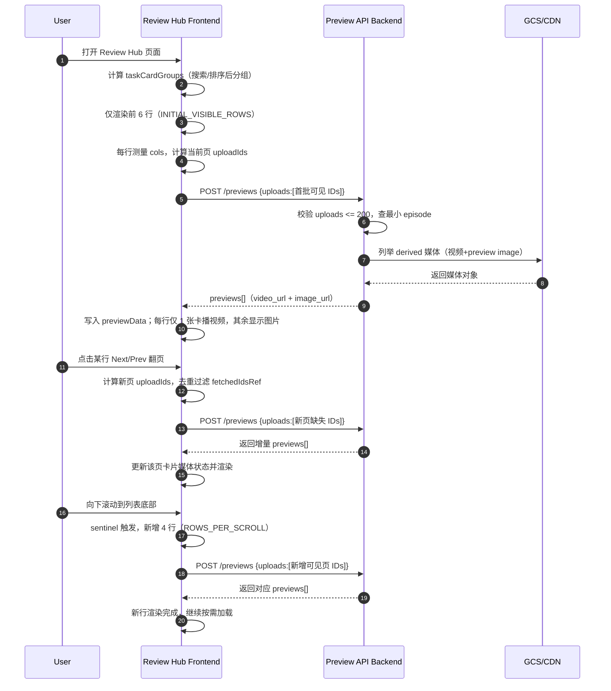

# PRIS-172 Review Hub 性能优化 Commit 分析与 QA 测试策略

## 分析范围

本次基于以下两个 commit 做联动分析：

- `app-prismax-rp`
  - `9e4633a` - PRIS-172: improve review hub performance
- `app-prismax-rp-backend`
  - `5d40c14` - PRIS-172: update reviewable uploads preview api

---

## 一句话主线

这组改动将 QA Review Hub 从“全量渲染 + 偏集中拉取”升级为“按需渲染 + 增量拉取 + 视频/图片双介质预览”，核心目标是降低首屏负载、减少无效请求、提升滚动与翻页流畅度。

---

## Commit 级别逻辑拆解

## 1) `5d40c14`（backend）
**目标**：升级预览接口能力，支撑前端的按需加载和媒体降级策略。

**核心改动：**

- `POST /data/qa/reviewable-uploads/previews` 增加请求上限：
  - `uploads` 最多 `200` 个，超限返回 `400`。
- 返回结构从“字典映射”改成“结构化数组”：
  - 旧：`{ [upload_id]: preview_video_url | null }`
  - 新：`[{ upload_id, preview_video_url, preview_image_url, preview_image_url_type }]`
- 预览媒体获取逻辑改为复用公共方法：
  - 使用 `_list_public_derived_media(...)` 收集视频和预览图。
  - 使用 `_pick_preview_video_url(...)` 选择可用视频链接。
- 对缺失数据的输出更完整：
  - 即使找不到对应 episode，仍返回该 `upload_id` 的空预览结构，便于前端逐条映射。

**业务意义：**

- 给前端提供“视频 + 图片”双通道，前端可优先视频，失败或非视频位时回退图片，提升感知稳定性。
- 结构化返回可减少前端兼容分支，降低解析和状态管理复杂度。

---

## 2) `9e4633a`（frontend）
**目标**：提升 Review Hub 首屏和交互性能，减少不必要的渲染与媒体请求。

**核心改动：**

- 渲染策略优化：
  - 新增 `INITIAL_VISIBLE_ROWS = 6` 与 `ROWS_PER_SCROLL = 4`。
  - 通过 `IntersectionObserver` + sentinel 做行级增量渲染（infinite scroll）。
- 预览请求策略优化：
  - 每行在 mount、翻页、resize 时仅按当前页所需 `uploadIds` 请求预览。
  - 使用 `fetchedIdsRef` 全局去重，避免并发重复请求。
- 媒体展示策略优化：
  - 每行每页只让一个卡片播视频（对角线分布），其余优先展示图片预览。
  - 视频/图片加载完成后再淡入（`mediaReady`），降低闪烁感。
- 状态模型简化：
  - 从旧的 `url/isLoadingUrl/isLoadingVideo` 改为 `videoUrl/imageUrl/isLoading/isError`，与后端新结构对齐。

**业务意义：**

- 首屏只处理有限行和有限媒体，减少首次渲染压力。
- 滚动和翻页期间只拉取必要资源，降低网络峰值与重复请求。
- 视频播放并发被显式控制，降低解码和绘制压力。

---

## QA Review Hub 页面内 Upload Card 排序规则

排序逻辑分两层：**组内卡片排序** 与 **组间（行）排序**。页面先按 `title` 分组，再按所选 `sortBy` 排序。

- 默认排序为 `Newest first`（`task_id_desc`）：
  - **组内卡片**：按 `uploadId` 降序（新的在前）。
  - **组间顺序**：按各组最大 `taskId` 降序。
- `Most uploads`：
  - **组间顺序**：按组内卡片数量降序。
  - **组内卡片**：不额外重排（保持当前顺序）。
- `Title A-Z`：
  - **组间顺序**：按标题字母升序。
  - **组内卡片**：按 `title` 比较；同组 `title` 相同，组内顺序基本不变。

结论：在默认配置下，用户看到的 upload card 是按 `uploadId` 从大到小（新到旧）排列。

---

## 前后端联动关系（关键）

1. 后端 `5d40c14` 提供结构化预览结果（视频 + 图片）。  
2. 前端 `9e4633a` 消费新字段并改造成按需请求。  
3. 页面层面形成“增量渲染 + 增量请求 + 媒体降级”的性能闭环。  

---

## 按用户路径时序图（页面加载 -> 首批行 -> 翻页 -> 滚动增量）

---

## 瓶颈检查点（建议重点验证）

## 1) 网络与接口层

- 单次 `uploads` 过大是否触发 `400`，前端是否有明确降级提示。
- 同时滚动 + 多行并发请求时，去重是否稳定（无重复 upload 拉取）。
- 预览接口返回慢时，前端骨架屏是否稳定、无抖动和无阻塞交互。

## 2) 媒体与渲染层

- 视频卡数量受控（每行每页 1 个）时，CPU/内存是否显著优于旧版本。
- 图片回退是否可靠（视频缺失/失败时能稳定展示图片或 placeholder）。
- 长列表持续滚动时，是否出现明显掉帧、渲染抖动、白屏闪烁。

## 3) 交互一致性层

- 搜索/排序切换后，`visibleRowCount` 重置是否正确。
- 翻页与 resize 同时发生时，当前页预览请求是否准确无漏。
- 用户快速操作（连续翻页+滚动）时，卡片内容是否错位或串行。

---

## QA 测试策略

## 1) 测试目标

- 验证性能优化主目标：首屏加载更轻、滚动更稳、翻页更快。
- 验证接口升级兼容：前端正确消费 `previews[]` 与新字段。
- 验证媒体降级策略：视频优先，失败/非视频位回退图片或 placeholder。
- 验证复杂交互下数据一致性：不重复请求、不漏请求、不串卡片。

## 2) 分层策略

- **API/契约层（高优先）**
  - 校验接口参数、边界值、错误处理、返回结构稳定性。
- **前端集成层（高优先）**
  - 校验预览数据映射、骨架屏、媒体切换、翻页与滚动联动。
- **E2E 业务层（最高优先）**
  - 按真实用户路径覆盖“打开页面 -> 浏览 -> 翻页 -> 滚动扩展”。
- **性能观测层（高优先）**
  - 记录关键指标（首屏可交互时间、滚动帧率、媒体并发、请求数）。

## 3) 数据准备策略

- 准备 3 组任务数据：
  - 小规模：3 行 * 每行 3~5 上传。
  - 中规模：20 行 * 每行 8~12 上传。
  - 大规模：100+ 行 * 每行 15+ 上传（压测）。
- 准备媒体覆盖：
  - 仅视频、仅图片、视频图片都存在、都缺失四类样本。
- 准备异常覆盖：
  - 部分 upload 不存在、接口慢响应、超限请求、临时失败重试。

## 4) 通过标准（Exit Criteria）

- P0 E2E 用例全部通过。
- 无阻断级回归：白屏、崩溃、翻页错位、媒体串卡。
- 关键性能指标较旧版本有可观改善或至少不回退。

---

## E2E 测试 Case 条目

| Priority | Case ID | 测试场景 | 前置条件 | 测试步骤 | 预期结果 |
|---|---|---|---|---|---|
| P0 | RH-P0-01 | 首屏仅加载初始行 | 中/大规模数据 | 打开 Review Hub | 仅渲染初始 6 行，页面可快速交互 |
| P0 | RH-P0-02 | 首批预览按需拉取 | 首屏行可见 | 打开页面并抓网络请求 | 仅请求首批可见 upload IDs |
| P0 | RH-P0-03 | 预览请求去重 | 同一 upload 多次进入可见区域 | 连续翻页后回到原页 | 同一 upload 不重复请求 |
| P0 | RH-P0-04 | 翻页触发增量拉取 | 某行有多页卡片 | 点击 Next/Prev | 仅新页缺失 IDs 发请求，卡片媒体正确更新 |
| P0 | RH-P0-05 | 滚动触发行增量渲染 | 数据行数 > 6 | 滚动到底部触发 sentinel | 每次新增 4 行并请求对应预览 |
| P0 | RH-P0-06 | 视频/图片回退链路 | 准备视频缺失与图片缺失样本 | 浏览包含异常样本行 | 视频缺失显示图片，图片缺失显示 placeholder |
| P0 | RH-P0-07 | 新接口结构兼容 | 后端返回 `previews[]` | 打开页面并检查展示 | 前端正确读取 `upload_id/video/image` 字段 |
| P0 | RH-P0-08 | 请求超限处理 | 构造 >200 uploads 请求 | 触发超限后观察 UI | 后端返回 400，前端无崩溃并有可感知失败态 |
| P1 | RH-P1-01 | 搜索后重置可见行 | 启用搜索框 | 输入关键字过滤 | visible rows 重置，结果与过滤一致 |
| P1 | RH-P1-02 | 排序切换稳定性 | 多组 task 场景 | 切换三种排序方式 | 分组顺序正确，媒体不串位 |
| P1 | RH-P1-03 | Resize 联动正确性 | 可手动调整窗口宽度 | 改变窗口宽度后翻页 | cols 变化后请求与当前页一致 |
| P1 | RH-P1-04 | 快速操作稳定性 | 中规模数据 | 快速连续 Next + 滚动 | 无错位、无明显卡顿、无重复请求洪峰 |
| P2 | RH-P2-01 | 弱网体验 | 模拟慢网/丢包 | 打开页面并翻页滚动 | 骨架与失败态可理解，页面可继续操作 |
| P2 | RH-P2-02 | 长时会话稳定性 | 大规模数据 | 连续浏览 15 分钟 | 内存无明显异常上涨，交互保持可用 |

---

## 结论

`5d40c14` 与 `9e4633a` 形成了明确的前后端性能协作：后端提供结构化多介质预览，前端执行按需渲染与按需拉取。  
从设计上看，已具备显著降低首屏压力与避免重复请求的基础。下一步应以 E2E + 性能指标回归为准，验证在真实数据规模下是否稳定达成优化目标。

