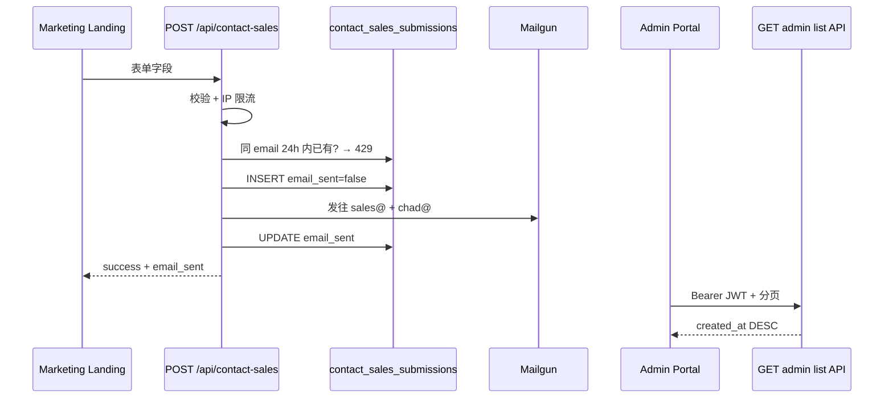

# Sprint22 Commit Range QA

> **前端** `app-prismax-rp`：`aeb3e65`（含）→ `d298ba1`（`testing` HEAD）  
> **后端** `app-prismax-rp-backend`：`775db74`（含）→ `e9ced43`（`testing` HEAD）  
> 整理：2026-08-11  
> 关联：`Sprint22_FE_0122539_BE_470ab3d_Commit_Range_QA.md`（上一区间 Data Download / CDN）

---

## 1. 总体结论

| 优先级 | 主题 | 主要风险 |
| --- | --- | --- |
| P0 | Contact Sales（提交 → 邮件 → Admin 列表） | 未入库、收件人错误、24h 去重失效、Admin 看不到/分页错 |
| P0 | Invite Code 停用全链路 | 停用后仍可兑换或进 access 队列；已绑定用户停用后权限未收回 |
| P0 | MCAP 门槛改为 960×600 | FE 文案与 BE 校验不一致；临界分辨率误判 |
| P1 | Hex 下载计数 / info 问答 | 「下载了多少」按 delivery 虚高；列任务误触发 add；video/MCAP 拒答或编造 |
| P2 | Forum 用户 FK 迁移 | 孤儿行导致启动失败；FK 未切导致发帖/点赞失败 |
| P2 | Data Download 单测补丁（`775db74`） | 无新路径，CDN 下载冒烟即可 |

**发布前确认**

1. 已建表 `contact_sales_submissions`。
2. `admin_invite_codes` 已有 `deactivated_at`、`deactivator_admin_id`（否则 deactivate 返回 500）。
3. Forum 指向旧 `forum_users` 时，migration 会改 FK；存在孤儿行会直接启动失败。
4. FE `d298ba1` 与 BE `c6680fb` 必须同环境发布。

---

## 2. 区间概览

| 仓库 | Start（含） | HEAD | 数量 |
| --- | --- | --- | --- |
| `app-prismax-rp` | `aeb3e65eda396db390268d054aea277c26a610d1` | `d298ba1dad6ad1f181da1ba068c78c47c627f749` | 5（含 2 merge） |
| `app-prismax-rp-backend` | `775db74bc27f0cb0526634eef0683867c53d5194` | `e9ced435e6715e3fc3f5136223fb5ce742426b6f` | 15（含 merge；含经 `#61` 合入的旁支 `20435ca`） |

| 主题 | Ticket | FE | BE |
| --- | --- | --- | --- |
| Contact Sales Admin + 通知邮件 | PRIS-301 | `aeb3e65` / `#73` | `085b3f4` → `15d3ed9` → `e9ced43` |
| Admin Invite 停用 | PRIS-238 | `2d2f304` / `#74` | `18c7f67` / `#59` |
| MCAP 分辨率 ≥960×600 | — | `d298ba1` | `c6680fb` |
| Forum 用户外键迁移 | — | — | `5a65706` |
| Hex：My Data 去重计数 + info 修复 | `#61` | — | `20435ca` + `dec1e2b` |

**联调对应**

| 能力 | FE | BE | 说明 |
| --- | --- | --- | --- |
| Contact Sales Admin 列表 | `aeb3e65` | `15d3ed9` | `GET /api/admin/get-contact-sales-submissions` |
| Contact Sales 提交/邮件 | 营销站（本仓库未改表单） | `085b3f4` → `e9ced43` | 收件：`sales@` + `chad@` |
| Invite 停用 | `2d2f304` | `18c7f67` | 列表 / redeem / access 队列均排除已停用 |
| MCAP 960×600 | `d298ba1`（文案） | `c6680fb`（校验） | 必须同发 |
| Hex 去重计数 + info | — | `dec1e2b` + `20435ca` | 仅后端 / Hex |
| Forum FK | — | `5a65706` | 部署注意 migration |
| Data Download 单测 | — | `775db74` | 区间起点，承接上一区间 CDN |

---

## 3. 前端 Commit List（5）

`aeb3e65^..HEAD`，旧 → 新。

| # | Commit | 日期 | Author | Message | 实质变更 |
| --- | --- | --- | --- | --- | --- |
| 1 | `aeb3e65` | 2026-08-07 | Aparna | PRIS-301: admin view for contact sales | General Tab 增加 Contact Sales 分页表，拉 `/api/admin/get-contact-sales-submissions` |
| 2 | `285cfd7` | 2026-08-07 | aparna-prismax | Merge `#73` | 合入 #1 |
| 3 | `2d2f304` | 2026-08-07 | Aparna | PRIS-238: deactivate admin invite codes | Invite 表增加 Deactivate 确认流 → `POST /api/deactivate-admin-invite-code` |
| 4 | `fdc470f` | 2026-08-07 | aparna-prismax | Merge `#74` | 合入 #3 |
| 5 | `d298ba1` | 2026-08-08 | lanmanc | Display 960x600 MCAP threshold | Upload / RoboticDataAdmin：主失败文案改为 960×600；1280×720 标 legacy |

---

## 4. 后端 Commit List（15）

`775db74^..HEAD`（含 start；含经 merge 进入 `testing` 的旁支），旧 → 新。

| # | Commit | 日期 | Author | Message | 实质变更 |
| --- | --- | --- | --- | --- | --- |
| 1 | `20435ca` | 2026-07-28 | cw | Fix Hex info replies… | 经 `#61` 合入。任务列举、video/MCAP 问答、episode id 保护等 info 行为修复 |
| 2 | `775db74` | 2026-08-06 | lanmanc | updated for data download | **区间起点**。CDN/membership 单测；`cdn_download_helper` 恢复 `import os` |
| 3 | `085b3f4` | 2026-08-06 | Aparna | PRIS-301: contact sales email | 入库 + Mailgun 通知；建表 SQL；邮件模板 |
| 4 | `15d3ed9` | 2026-08-07 | Aparna | PRIS-301: admin contact sales API | Admin 列表 API；contact API 校验/限流加固 |
| 5 | `ab96fb9` | 2026-08-07 | aparna-prismax | Merge `#58` | 合入 #3–#4 |
| 6 | `18c7f67` | 2026-08-07 | Aparna | PRIS-238: deactivate invite | deactivate API；列表/redeem/queue 过滤已停用 |
| 7 | `3ff4b19` | 2026-08-07 | aparna-prismax | Merge `#59` | 合入 #6 |
| 8 | `c6680fb` | 2026-08-08 | lanmanc | Lower MCAP threshold to 960x600 | worker 门槛 1280×720 → 960×600 |
| 9 | `58dcc24` | 2026-08-10 | Aparna | PRIS-301: temporary benchmarking | Contact Sales 临时耗时打点（后被 #15 删除） |
| 10 | `c975211` | 2026-08-10 | aparna-prismax | Merge `#60` | 合入 #9 |
| 11 | `5a65706` | 2026-08-10 | lanmanc | Fix forum user FK migration | Forum FK 指向 `users.userid`；补测试与文档 |
| 12 | `7bf29f3` | 2026-08-10 | cw | Merge origin/testing into cw/hex | PR 前同步 |
| 13 | `dec1e2b` | 2026-08-10 | cw | Hex distinct My Data episode counts | 「下载了多少」以 `my_data_episode_count` 为准 |
| 14 | `a4c612f` | 2026-08-10 | Chloe | Merge `#61` | 合入 #1 + #12–#13 |
| 15 | `e9ced43` | 2026-08-10 | Aparna | PRIS-301: email recipients; remove benchmarking | 收件改为 sales@ + chad@；去掉临时打点 |

---

## 5. 按主题：改动逻辑 + E2E

### 5.1 P0 — Contact Sales（PRIS-301）

**Commits：** FE `aeb3e65` / `#73`；BE `085b3f4` → `15d3ed9` → `e9ced43`

#### 逻辑

| 项 | 说明 |
| --- | --- |
| 提交入口 | `POST /api/contact-sales`，公开，无需登录 |
| 必填 | topic / first_name / last_name / email / phone / company；其余可空 |
| 校验 | email 小写 + 格式校验；电话有效数字 ≥ 7 |
| 限流 | 同 IP：4/min、7/hour、15/day |
| 去重 | 同 email 24h 内已提交 → **429**（业务文案，不是 limiter） |
| 邮件 | 双收件人；发送失败只写 `email_sent=false`，接口仍可 success |
| Admin 列表 | JWT 即可（未二次查 whitelist）；`page_size=10`，按创建时间降序 |
| FE | Admin General Tab 展示列表；**营销提交表单不在本仓库** |

**注意：** 邮件失败时用户仍看到成功，需靠 Admin「Email Sent」排查。  
**测前：** FE/BE 同发；营销站指向同一 BE；表已建好。

#### E2E

| ID | 优先级 | 步骤 | 预期 |
| --- | --- | --- | --- |
| CS-01 | P0 | 营销页用新 email 提交合法表单 | 200 success；DB 新增；邮件正常时 `email_sent=true` |
| CS-02 | P0 | 查 sales@、chad@ 收件箱 | 两人都收到；主题含姓名/公司；正文字段齐全 |
| CS-03 | P0 | Admin → General → Contact Sales | 新记录在顶部；字段一致；Email Sent = True |
| CS-04 | P0 | 同 email 24h 内再提交 | 429；DB 无第二行 |
| CS-05 | P1 | 缺任一必填字段 | 400 + 对应 required 文案 |
| CS-06 | P1 | 非法 email / 电话少于 7 位数字 | 400 |
| CS-07 | P1 | 同 IP 短时间超限 | 走 limiter；可与 24h 业务去重区分 |
| CS-08 | P1 | 邮件通路异常时提交 | 仍可 200；`email_sent=false`；Admin 显示 False |
| CS-09 | P1 | 造 >10 条后翻页 | 每页 10；时间降序；无重复/遗漏 |
| CS-10 | P1 | 无 admin token 访问列表 | 未授权；不泄露数据 |
| CS-11 | P2 | 选填字段为空提交 | 入库成功；Admin 可展示空值 |

---

### 5.2 P0 — Admin Invite 停用（PRIS-238）

**Commits：** FE `2d2f304` / `#74`；BE `18c7f67` / `#59`

#### 逻辑

| 状态 | invited_user_id | deactivated_at | 列表 | 兑换 | access 队列 |
| --- | --- | --- | --- | --- | --- |
| 可用未绑定 | NULL | NULL | 可见 | 可绑定 | — |
| 已绑定有效 | 有值 | NULL | 可见 | 409 已使用 | 可 join |
| 已停用 | 任意 | 非 NULL | 不可见 | **410** | **不可** join（含已绑定用户） |

| 路径 | 行为 |
| --- | --- |
| `POST /api/deactivate-admin-invite-code` | 需 whitelist；写停用时间与操作人；已停用/不存在 → 404 |
| `GET /api/get-admin-invite-codes` | 只返回未停用 |
| `POST /api/use-admin-invite-code` | 已停用 → 410 |
| `GET /api/check-admin-invite-binding` | 忽略已停用 → `is_invited: false` |
| tele_op `join_queue`（access） | 要求未停用绑定，否则 403 |
| FE | 确认弹窗 → `{invite_id}` → 刷新后该行消失 |

**产品语义（必测）：** 码被停用后，即使曾经兑换成功，用户也会立刻失去 access 臂排队资格。  
**测前：** 停用列已存在；准备未用码、已绑定码、access 机器人。

#### E2E

| ID | 优先级 | 步骤 | 预期 |
| --- | --- | --- | --- |
| INV-01 | P0 | 创建 → 列表可见 → Deactivate 确认 | 成功；列表消失；DB 写入停用字段 |
| INV-02 | P0 | 兑换**未使用**但已停用的码 | 410；仍未绑定用户 |
| INV-03 | P0 | 兑换未停用码；再兑一次 | 首次 200；再次 409 |
| INV-04 | P0 | 绑定后停用 → check-binding | `is_invited: false` |
| INV-05 | P0 | 同上用户 join access 队列 | 403 Invite code required |
| INV-06 | P0 | 另一用户持未停用有效绑定 join access | 可加入 |
| INV-07 | P1 | Deactivate 弹窗 Cancel | 不调 API；行仍在 |
| INV-08 | P1 | 对已停用 id 再 deactivate | 404 |
| INV-09 | P1 | 非 admin / 无 token 调相关 API | 401/403 |
| INV-10 | P2 | 缺停用列时 deactivate | 500（用于确认 migration） |

---

### 5.3 P0 — MCAP 分辨率 ≥960×600

**Commits：** FE `d298ba1`；BE `c6680fb`

#### 逻辑

| 层 | 变更 |
| --- | --- |
| Worker | 最低分辨率 960×600；check key `camera_resolution_min_960x600` |
| FE | 失败主文案改为 960×600；旧 key `1280x720` 标为 legacy |

| 分辨率 | 结果 |
| --- | --- |
| 960×600 | 通过 |
| 959×600 / 960×599 | 失败 |
| 1280×720（旧数据） | 仍通过 |

FE/BE 必须同发，避免「校验已放宽但文案仍写 1280」或相反。

#### E2E

| ID | 优先级 | 步骤 | 预期 |
| --- | --- | --- | --- |
| MCAP-01 | P0 | 校验 960×600 MCAP | 分辨率检查通过 |
| MCAP-02 | P0 | 959×600 或 960×599 | 分辨率检查失败 |
| MCAP-03 | P0 | 1280×720 | 仍通过 |
| MCAP-04 | P0 | Upload / RoboticDataAdmin 查看新失败 key | 文案为 below 960x600 |
| MCAP-05 | P1 | 历史失败带 `camera_resolution_min_1280x720` | 显示 legacy，不白屏 |
| MCAP-06 | P2 | `test_scale_validate_mcap` | 通过 |

---

### 5.4 P1 — Hex：My Data 去重计数 + info 修复

**Commits：** `20435ca`（经 `#61`）+ `dec1e2b` / `a4c612f`

#### 逻辑

| 字段 | 含义 | 用法 |
| --- | --- | --- |
| `my_data_episode_count` | My Data 库去重 episode 数 | **「下载了多少 episode」的主答案**；重复下载不增加 |
| `delivery_episode_count`（及旧别名 `downloaded_episode_count`） | READY delivery 的 episode 次数累加 | 仅回答「下了几次 / 重复下载」时使用 |
| `distinct_episode_count` | 最近 ≤50 条 download 记录内的去重 | 受 `download_since_days` 影响 |

Info（`20435ca`）：

- 「某臂有哪些 task」→ 只列任务，不误触发 add / episode chips  
- 「episode 有无 video/MCAP」→ 按真实字段回答，不拒答、不编造  
- 回复中的裸 episode id（如 11364）不被改写成小数  

**测前：** 同一用户对同一 episode 至少下载 2 次，使 delivery 累加 > My Data 去重。

#### E2E

| ID | 优先级 | 步骤 | 预期 |
| --- | --- | --- | --- |
| HEX-01 | P0 | My Data 有 N 个 episode；再下其中 1 个 → 问下载了多少 | 回答 N，不是 N+1 |
| HEX-02 | P0 | 问下载次数 / deliveries | 可用 delivery 累加，并与去重口径区分 |
| HEX-03 | P1 | “What tasks does {robot} have?” | 只列 task；无 chips / 不 add |
| HEX-04 | P1 | “Does episode {id} have video/MCAP?” | 按真实资产字段回答 |
| HEX-05 | P1 | 回复含大号 episode id | id 不被改写 |
| HEX-06 | P2 | 未登录问下载数量 | 提示登录或为 0，不报错 |

---

### 5.5 P2 — Forum 用户 FK 迁移

**Commit：** `5a65706`

#### 逻辑

- 将 `forum_threads` / `forum_comments` 的 `author_id`，以及 `forum_likes` / `forum_saves` 的 `user_id`，统一指向 `users.userid`。
- 幂等；PostgreSQL advisory lock；旧 FK 指向 `forum_users` 时 drop 后重建。
- 存在对不上 `users.userid` 的孤儿行 → 启动报错；非 PG 环境跳过。

**测前：** staging 先检查孤儿行再发版。

#### E2E

| ID | 优先级 | 步骤 | 预期 |
| --- | --- | --- | --- |
| FORUM-01 | P1 | FK 已指向 `users.userid` 时启动 | no-op；服务正常 |
| FORUM-02 | P1 | 仍指向 `forum_users` 且无孤儿行 | FK 切换成功；发帖/评论/点赞/收藏正常 |
| FORUM-03 | P1 | 存在孤儿行时启动 | migration 失败并报错 |
| FORUM-04 | P2 | 对照 `CLOUD_SQL.md` | 约束名与代码一致 |

---

### 5.6 P2 — Data Download 冒烟（区间起点）

**Commit：** `775db74`

#### 逻辑

仅补单测与 `import os`；无新业务路径。承接上一区间「CDN cookie 按 asset 签发」行为。

#### E2E

| ID | 优先级 | 步骤 | 预期 |
| --- | --- | --- | --- |
| DD-01 | P2 | 会员用户单文件 CDN 下载 | 鉴权 / cookie 仍可用 |
| DD-02 | P2 | `test_data_membership_downloads` | 通过 |

---

## 6. 发版最小回归包

**必跑：** CS-01～04、INV-01～05、MCAP-01～04、HEX-01  

**有余力：** CS-08～09、INV-06、HEX-03～04、FORUM-02、DD-01
