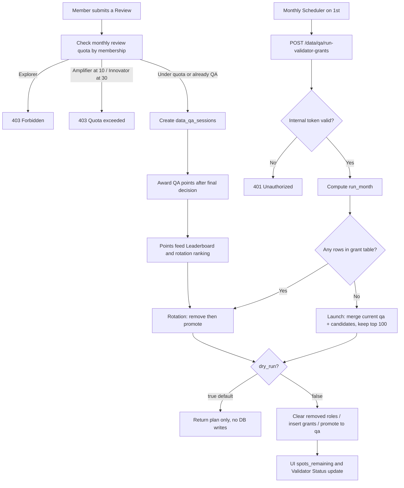
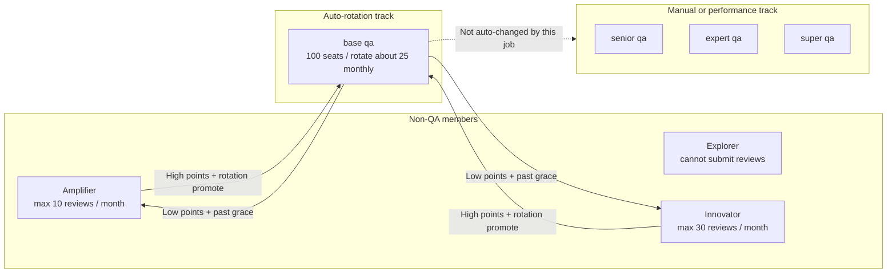
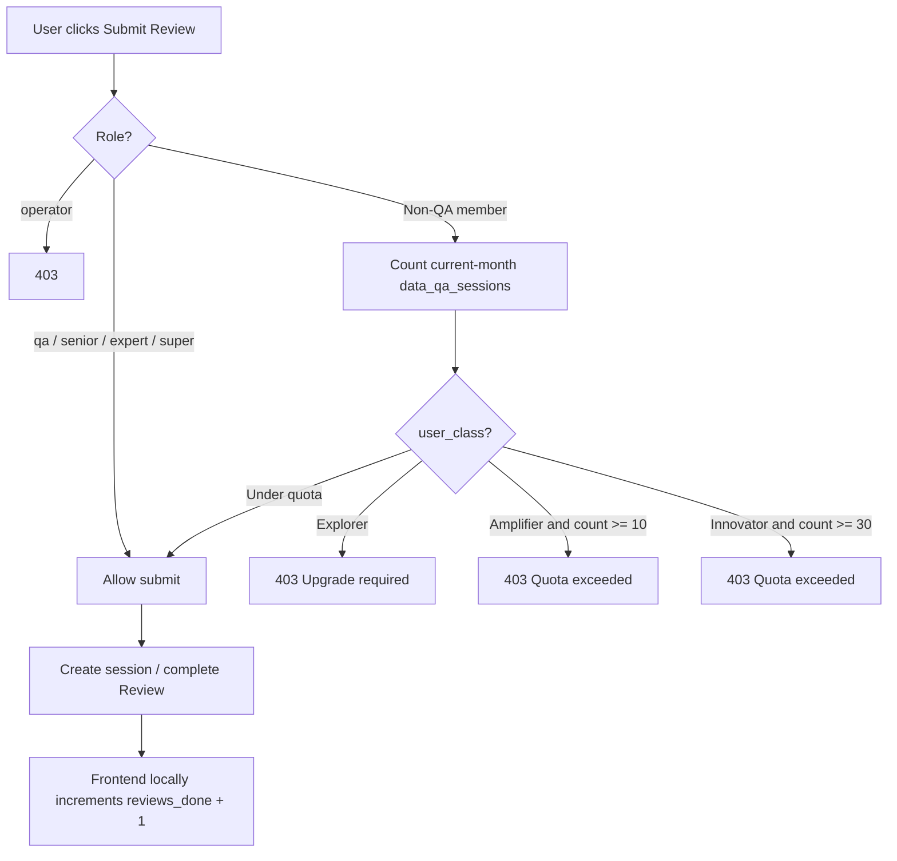
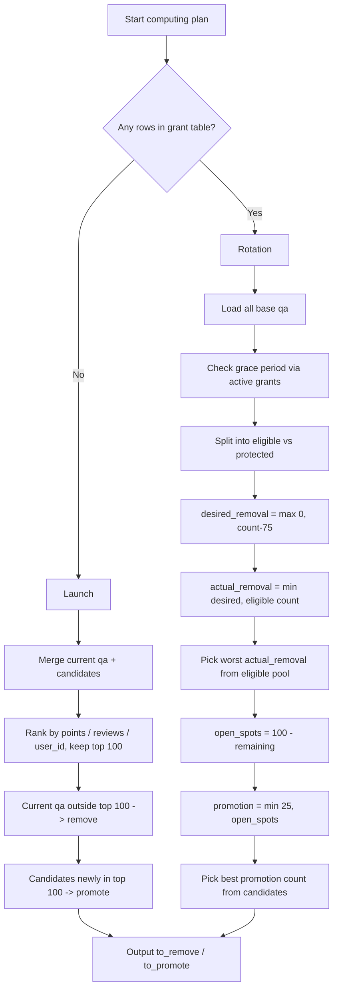

# Sprint 22 前后端 Commit Range 改动与测试分析

## 目录

1. 分析范围与 Commit list
2. 总体结论
3. Data Download 与 My Data
4. Leaderboard 与 Data Hub UI
5. Validator 月度选拔
6. QA Points
7. PRIS-311 Review History
8. 统一风险清单
9. 测试策略
10. E2E 测试用例
11. 自动测试现状
12. 可观测性建议
13. 上线建议
14. 代码质量备注

## 1. 分析范围

本次按用户指定的起始 Commit **包含起点** 分析，即使用 `起始 Commit^..HEAD`。两个仓库的 `testing` 均与当前 `origin/testing` 引用一致。

### 1.1 前端 `app-prismax-rp`

- 分支：`testing`
- 起始 Commit：`1ec1fbec361cbf69dbbcf99467477b9d18ba0fcd`
- HEAD：`59154819456c5649fb81a58398d56745c5f205af`
- Commit 数：5
- 变更规模：5 个文件，100 行新增、31 行删除

| Commit | 日期 | 作者 | Message |
|---|---|---|---|
| `1ec1fbec361cbf69dbbcf99467477b9d18ba0fcd` | 2026-07-30 | Aparna Rangamani | `PRIS-277: update top navbar styling` |
| `6fc77dbbd8a8ce3aaa1984001b9c79c56c1e18c7` | 2026-07-30 | Aparna Rangamani | `PRIS-277: add updated at to the leaderboard` |
| `8b4bad44bb6271190d784fc95789e754cd226239` | 2026-07-30 | aparna-prismax | Merge PR #71 |
| `c08909c7bdf65ff0b41fb699ae454ac1260b793e` | 2026-07-31 | Aparna Rangamani | `PRIS-277: update validator status section` |
| `59154819456c5649fb81a58398d56745c5f205af` | 2026-07-31 | aparna-prismax | Merge PR #72 |

变更文件：

- `src/components/Data/DataHub.js`
- `src/components/Data/DataHub.module.css`
- `src/components/Data/DataQAReview/DataQAReview.js`
- `src/components/Data/ReviewHome/ReviewUserProgress.js`
- `src/components/Data/ReviewHome/ReviewUserProgress.module.css`

### 1.2 后端 `app-prismax-rp-backend`

- 分支：`testing`
- 起始 Commit：`df1785b915e606669fe8e69eac94589198f13fd8`
- HEAD：`01dc298c484028a8d738eed52535a9a6588f38f3`
- Commit 数：9
- 变更规模：13 个文件，1847 行新增、615 行删除

| Commit | 日期 | 作者 | Message |
|---|---|---|---|
| `df1785b915e606669fe8e69eac94589198f13fd8` | 2026-07-30 | Aparna Rangamani | `PRIS-277: add updated at to the leaderboard` |
| `6a1297e602b23eebd0d3bf6064fd811db4494bdf` | 2026-07-30 | aparna-prismax | Merge PR #56 |
| `19e43ae916c44aac22f283d4c8b7258e9e476ec2` | 2026-07-30 | Aparna Rangamani | `PRIS-277: add api to automatically grant validator status` |
| `7dbc2c4f4247c4494a4206e6255a275ac5f92f1f` | 2026-07-30 | Aparna Rangamani | `PRIS-277: incorporate automatic monthly selection throughout code` |
| `6e44b469a6928e2e31bde46d53a24e77245e5016` | 2026-07-30 | lanmanc | `updated for new data download` |
| `d1854ffeb66d4a93c7dce7047e9e33a85af96ee3` | 2026-07-30 | lanmanc | Merge `testing` |
| `c62570df856bdd896f029a9f3338973e5090a2ea` | 2026-07-31 | Aparna Rangamani | `PRIS-277: improve qa points algorithm` |
| `3f61363781cfdf5cefcef6010951ee60aaf3cf57` | 2026-07-31 | aparna-prismax | Merge PR #57 |
| `01dc298c484028a8d738eed52535a9a6588f38f3` | 2026-07-31 | Aparna Rangamani | `PRIS-311: fix review-history api in production` |

变更文件分为四组：

1. Data Download/My Data：`app.py`、My Data migration、Hex 及测试。
2. Validator/QA：`qa_helper.py`、Validator migration、QA flow 文档及测试。
3. Leaderboard：`app.py`。
4. Review History：`app.py`。

### 1.3 功能范围

| 功能域 | 主要变化 | 风险等级 |
|---|---|---|
| Data Download/My Data | episode 所有权、月度额度、下载历史和 Package 模型重构 | P0 |
| Validator 月度轮换 | 自动授予/淘汰、grace period、会员 Review 限额 | P0 |
| QA Points | 奖励去重及统计关联口径变化 | P0/P1 |
| Leaderboard | 返回和展示最后更新时间 | P1 |
| Data Hub UI | 二级导航统一、Validator status 月度文案 | P1 |
| PRIS-311 | 恢复 `/data/review-history` | P1 |

## 2. 总体结论

该范围不是单一功能修复，而是同时包含两项后端模型重构和多项前端/API 契约变化：

1. 下载额度从“下载次数或 Package quota”改为“用户当月首次获得的 episode 数”。
2. Validator 从静态/人工角色转为每月自动选拔和轮换。
3. QA points 从按 transaction type 汇总改为通过 episode activity 关联汇总。
4. Leaderboard 增加刷新时间，Validator status 改为月度统计文案。
5. 恢复生产旧版 Review History API。

当前不建议直接启用生产发布，主要阻断项：

- My Data migration 会清空下载历史和 API Package 数据。
- Validator 同月重复执行和并发执行均缺少幂等保护。
- `INTERNAL_API_TOKEN` 存在源码默认值。
- QA points 新旧统计口径可能导致历史积分消失。
- Data Download 新 API 契约在本次前端范围内没有对应适配。

## 3. Data Download 与 My Data

### 3.1 数据模型

新增：

```text
data_user_library_episodes
```

核心字段：

- `user_id`
- `episode_id`
- `status`
- `download_count`
- `last_downloaded_at`
- `created_at`
- `updated_at`

主键为 `(user_id, episode_id)`；状态支持：

- `ACTIVE`
- `ARCHIVED`
- `REVOKED`
- `REFUNDED`

额度定义：

```text
当前 UTC 月新建的 My Data episode 记录数
```

因此额度代表“当月首次获得的 episode 数”，不是下载次数。已拥有 episode 可以重复下载，不重复扣额。

### 3.2 授权与计数

核心授权函数 `_ensure_user_library_episodes()`：

1. 标准化并去重 episode ID。
2. 获取用户级 PostgreSQL advisory transaction lock。
3. 读取 membership plan。
4. 查询已拥有 episode。
5. 只对缺失 episode 校验月度额度。
6. 插入 My Data 记录。
7. 将 `ARCHIVED` 恢复为 `ACTIVE`。

成功交付后 `_increment_user_library_download_counts()`：

- `download_count + 1`
- 更新 `last_downloaded_at`
- 仅 ACTIVE 记录计数

### 3.3 新增接口

| 接口 | 行为 |
|---|---|
| `POST /data/my-data` | 将 episode 加入 My Data；不创建下载历史、不增加下载次数 |
| `POST /data/my-data/check` | 返回已拥有/新增 episode、当前和预计额度、是否超额 |
| `GET /data/my-data/summary` | 返回总数及 task/robot 汇总 |
| `GET /data/my-data/episodes` | 分页、过滤、搜索和排序 |
| `GET /data/downloads/<download_id>` | 返回单条下载详情及精确 `selected_episode_ids` |

### 3.4 现有流程变化

| 流程 | 变化 |
|---|---|
| UI 下载 | 自动加入 My Data；响应改为 `selected_episode_ids`；支持 `Idempotency-Key` |
| Manifest | 使用 My Data 额度和 episode IDs；支持幂等键 |
| API Package | 创建前加入 My Data；允许 episode 跨 Package 复用；创建本身不生成下载历史 |
| API Download Session | 校验 Package 所有权；从当前 episode 读取路径；成功后创建历史并增加计数 |
| 下载历史 | 改为 episode 粒度并增加分页；列表不直接返回 episode IDs |
| Hex | 只对新 episode 预估额度；移除 Package duplicate conflict 逻辑 |

### 3.5 API 兼容性

破坏性变化：

- `selected_upload_ids` → `selected_episode_ids`
- 下载历史改为分页
- Package 详情不再返回 upload、bucket 和路径快照字段
- 移除旧 quota snapshot 字段
- Package 重复 episode 不再返回 409
- Admin unlimited quota 响应语义变化

本次前端 Commit range 没有 Data Download 契约适配，需确认实际发布前端是否来自其他范围。

### 3.6 Migration

迁移：

```text
app_prismax_data_pipeline/sql/20260730_data_user_library_episodes.sql
```

会执行：

```sql
TRUNCATE TABLE
    data_downloads,
    data_api_package_episodes,
    data_api_packages
RESTART IDENTITY;
```

结果：

- 下载历史被清空
- API Package 被清空
- Package 与 episode 映射被清空
- 没有历史 My Data backfill

生产必须先完成备份、数据处置批准、backfill 和回滚演练。

### 3.7 重点风险

1. `REVOKED/REFUNDED` 会被视为已拥有，但不会恢复 ACTIVE，下载授权和计数语义不完整。
2. API Session 幂等指纹没有包含 `package_id`；相同 episode、不同 Package 可能错误复用下载记录。
3. FAILED 下载占用幂等键后，原 key 无法重试。
4. 多事务流程中断可能遗留长期 PENDING。
5. 不提供幂等键时，网络重试可能重复创建历史并增加计数。
6. upload 选择会过滤非 READY 或不可见 episode，可能静默少下载。
7. Admin/unlimited plan 配置不完整时可能意外返回 403。

### 3.8 Hex 一致性问题

Hex 适配仍存在以下遗漏：

1. Agent 中保留了 `duplicate_episode_conflict` 和 “Create new package with all selected” 的旧 UI 分支，但新工具不会再产生该标志。这段逻辑已成为不可达分支，错误响应中的 `conflicting_episode_ids` 也无法触发旧冲突 UI。
2. 本地额度快照只有在 `new_episodes > 0` 且 projected 超限时才设置 `quota_exceeded=true`；Pipeline 402 payload 的转换逻辑只判断 `projected > limit`。套餐降级后 `used > limit`、但本次没有新增 episode 时，两条路径会给出相反结果。
3. Pipeline 402 payload 的 `remaining_episodes` fallback 使用 `limit - used`，本地快照使用 `limit - projected`。包含新增 episode 的失败请求可能显示错误的剩余额度。
4. `prepare_download_estimate` 的工具描述仍将月度额度描述为 API Package 限制，但实现会阻止 browser、manifest 和 API 三种方式，存在 Agent 文案与实际行为不一致。
5. “完整下载 upload”的判断要求单次下载覆盖该 upload 的全部可下载 episode；多次部分下载合计覆盖全部 episode 时仍不会将 upload 标记为完整下载。

## 4. PRIS-277：Leaderboard 与 Data Hub UI

### 4.1 二级导航

Upload 和 Review 二级导航统一为 `dataHubPageSubnav*`：

- 分隔线和 active 下划线改为白色系
- active/hover 样式统一
- 导航底部 padding 从 6px 增至 13px
- 小于 980px 时保持 sticky
- 移动端 scenario bar 的 top 从 168px 调整为 175px

需回归 Upload、Dashboard、Review & Earn、My Progress 和 Review Viewer，重点检查多层 sticky 重叠。

### 4.2 Leaderboard 更新时间

后端 `GET /data/qa/leaderboard` 新增：

```json
{
  "updated_at": "2026-07-30T20:00:00+00:00"
}
```

来源：

```sql
SELECT MAX(updated_at) FROM data_qa_leaderboard
```

前端行为：

- 使用浏览器本地时区显示 `Updated ...`
- tooltip 声明每日 12:00 UTC 刷新
- 下一次时间按实际更新时间 +24h 计算
- 超过 25 小时显示 amber 状态和圆点
- 每 5 分钟重新计算 delayed，不重新请求数据

风险：

1. “固定 12:00 UTC”与“实际时间 +24h”可能不一致。
2. delayed 依赖客户端时钟。
3. 窄屏和长本地化文本可能溢出。
4. 请求失败后旧 `updated_at` 不会清空。
5. 原生 `title` 位于不可聚焦的 `span`，键盘和触屏可访问性不足。
6. 空榜时 `updated_at=null`，无法表达最后一次成功任务时间。

长期建议使用独立 refresh metadata，记录：

- `last_started_at`
- `last_succeeded_at`
- `row_count`
- 失败原因

## 5. PRIS-277：Validator 月度选拔

这一节包含两层机制，不要混为一谈：

| 机制 | 作用对象 | 触发方式 | 作用 |
|---|---|---|---|
| 月度 Validator 轮换 | 仅 base `qa` 角色 | Scheduler 调用 `POST /data/qa/run-validator-grants` | 决定谁成为 / 失去 Validator |
| 月度 Review 限额 | 非 QA 会员提交 Review | 用户每次提交 Review 时检查 | 限制 Amplifier/Innovator 当月可提交次数 |

`senior qa` / `expert qa` / `super qa` 属于更高阶 track，**不会被自动轮换降级**。普通会员靠做 Review 攒 QA points，再靠月度轮换进入 base `qa`。

### 5.1 总览流程图



### 5.2 角色与限额关系



限额统计窗口统一使用 **UTC 自然月**：

```text
[当月 1 日 00:00:00 UTC, 下月 1 日 00:00:00 UTC)
```

计数来源是 `COUNT(*) FROM data_qa_sessions`，不是 distinct upload。QA 角色提交时跳过会员限额检查。

### 5.3 月度 Review 限额流程

用户提交 Review 时，后端在准入函数中检查：

1. Operator：直接 403。
2. 已是 QA 角色：通过，不受会员限额。
3. Explorer：403，提示升级会员。
4. Amplifier：当月 session 数 `>= 10` 则 403。
5. Innovator：当月 session 数 `>= 30` 则 403。

前端 Validator Status 调用 `GET /data/qa/get-validator-access-data` 展示：

- `reviews_done`：当前 UTC 月已完成次数
- `reviews_allowed.amplifier / innovator`
- `spots_remaining`：本月计划可提升名额（来自轮换计划的 `promotion_target`）
- `spots_total`：100

前端文案已改为 `N review(s) completed this month`，不再使用 `qa_launch_date`。提交成功后前端会本地 `reviews_done + 1`，不会立刻重新拉接口。



### 5.4 自动轮换接口

```text
POST /data/qa/run-validator-grants
```

请求：

```json
{
  "dry_run": true
}
```

- 鉴权：`Authorization` 必须等于 `INTERNAL_API_TOKEN`
- `dry_run` 默认 `true`；只有 JSON 布尔 `false` 才真实写库
- 文档约定由 Cloud Scheduler 每月 1 日调用；仓库内未见 Scheduler IaC
- 返回：`mode`、`run_month`、当前人数、可淘汰/保护人数、移除/提升名单、`warnings`

同一套计划计算函数也被 `GET /data/qa/get-validator-access-data` 复用，但 GET 只读 `promotion_target` 用于前端展示，不执行角色变更。

### 5.5 Launch vs Rotation 详细流程

判定条件很简单：**`data_qa_validator_grants` 是否已有任意一行**。

- 无记录 → `launch`：一次性重建 top 100
- 有记录 → `rotation`：增量淘汰 + 提升

#### Launch（首次 / grant 表为空）

1. 取出全部当前 base `qa`
2. 取出全部可提升候选人（排除 qa/senior/expert/super、operator、admin）
3. 两池合并，按排名取前 100（或更少）
4. 当前 qa 不在前 100 → 进入 `to_remove`
5. 候选人在前 100 且当前不是 qa → 进入 `to_promote`

#### Rotation（稳态）

参数：

- 总名额 `TOTAL = 100`
- 月轮换目标 `ROTATE = 25`
- 保底人数 `FLOOR = 75`

计算：

```text
desired_removal = max(0, current_count - 75)
actual_removal  = min(desired_removal, eligible_for_removal)
remaining       = current_count - actual_removal
open_spots      = max(0, 100 - remaining)
promotion_count = min(25, open_spots)
```

示例：

| 当前人数 | 可淘汰 | 淘汰 | 提升 | 最终约数 |
|---:|---:|---:|---:|---:|
| 50 | 任意 | 0 | 25 | 75 |
| 90 | 足够 | 15 | 25 | 100 |
| 100 | 足够 | 25 | 25 | 100 |
| 100 | 仅 6 | 6 | 6 | 100 |
| 110 | 足够 | 35 | 25 | 100 |



### 5.6 排名、Grace Period、落库

排名（提升最好优先，淘汰最差优先）：

1. 全量 QA points（经 `data_qa_episode_activity.point_transaction_id` 关联）
2. `COUNT(DISTINCT upload_id)` from `data_qa_sessions`
3. `user_id`：更老账号优先保留/提升

Grace period：

- 自动提升发生在月份 G
- G 月、G+1 月受保护
- G+2 月开始可被淘汰
- **手工授予的 qa 没有 grant 记录，因此没有保护期**

真实执行（`dry_run:false`）落库：

1. 被淘汰：`users.user_role = NULL`，对应 active grant 写 `removed_at/removed_month`
2. 被提升：`users.user_role = 'qa'`，插入新 `data_qa_validator_grants(user_id, grant_month)`

### 5.7 数据库

新增表：

```text
data_qa_validator_grants
```

字段：

- `user_id`
- `granted_at`
- `grant_month`
- `removed_at`
- `removed_month`

当前缺少：

- active grant partial unique constraint
- monthly run 表和 `run_month` unique constraint
- `(user_id, grant_month)` unique constraint
- removal 字段一致性 CHECK
- rollback migration

### 5.8 前端 Validator Status 注意点

- API 慢/失败时默认显示 0，可能把“未知”显示成确定值
- 乐观 `+1` 可能与后端异步入账或 UTC 月切换不一致
- UI 写 `this month`，实际按 UTC 切月
- 超额可能显示 `31 / 30 done`
- Super QA 可能错误落入会员视图
- `spots_remaining` 用的是计划 `promotion_target`，候选不足时可能高估

### 5.9 阻断风险与建议

风险：

1. 同月重复真实执行不是幂等操作，可能继续轮换第二批用户。
2. 并发执行没有 advisory lock 或 run-level lock。
3. grant 表无 active unique constraint。
4. `INTERNAL_API_TOKEN` 存在源码默认值。
5. 候选池未明确限制会员等级、账号状态或封禁状态。
6. 首次执行若未插入任何 grant，表仍为空，下次继续进入 launch。
7. 手工角色调整不会同步关闭 active grant。
8. GET access-data、dry-run 和 POST 都可能运行 `CREATE TABLE/INDEX IF NOT EXISTS`。
9. 仓库未发现 Cloud Scheduler IaC，无法验证时区、重试和超时策略。

建议：

- 增加 `data_qa_validator_grant_runs`，并对 `run_month` 建唯一约束
- 使用 PostgreSQL advisory transaction lock
- 同月重试返回 `already_executed` 或原结果
- active grant 建 partial unique index
- 业务请求禁止运行 DDL
- 增加受审计的 `force` 补偿模式

## 6. PRIS-277：QA Points

### 6.1 奖励条件

每个 sampled episode 奖励 100 points，需要：

1. Reviewer gate 与最终 gate 一致。
2. Reviewer score 与最终 score 差值不超过 8，包含 ±8。
3. episode 位于 sampled episode 集合。
4. `(user_id, episode_id)` 尚未关联 point transaction。

本次增加同批次 `(user_id, episode_id)` 去重，并通过 `point_transaction_id` 关联 transaction。

### 6.2 统计口径

旧口径：

```sql
point_transactions.transaction_type = 'data_qa_episode_review'
```

新口径：

```sql
data_qa_episode_activity
JOIN point_transactions
  ON point_transactions.transaction_id =
     data_qa_episode_activity.point_transaction_id
```

Leaderboard、个人累计/周积分和 Validator 排名均使用新口径。

### 6.3 风险

1. 无 activity 关联的历史 QA transaction 会从统计中消失。
2. 查询没有再次限制 `transaction_type`，错误关联可能计入非 QA 积分。
3. 一个 transaction 被多个 activity 引用时可能重复累计。
4. 奖励流程仍有“先查后插”的并发双发窗口。
5. `users.total_points` 按插入 transaction 数增量，可能与成功关联数不一致。
6. 文档仍存在旧 transaction-type 统计描述。

上线前必须执行生产数据 dry-run 对账，并决定是否 backfill 历史 activity。

## 7. PRIS-311：Review History

恢复：

```text
GET /data/review-history
```

响应：

- `upload_id`
- `scenario`
- `created_at`
- `upload_vote`
- `upload_score`
- `total`
- `page`
- `page_size`

风险：

1. 与 `/data/qa/progress-history` 形成两套相似接口。
2. `created_at` 未显式统一为 ISO 8601。
3. vote/score 来源于 JSON 文本，可能是字符串或 null。
4. total 只统计 session，但 data inner join upload/task，孤儿数据可能造成不一致。
5. 只按 `created_at DESC` 排序，同时间记录跨页不稳定。
6. `_extract_token()` 支持 query token，可能进入 URL、代理日志或浏览器历史。
7. 缺少 Flask 接口级自动测试。

## 8. 统一风险清单

| ID | 等级 | 功能域 | 风险 | 上线要求 |
|---|---|---|---|---|
| R-01 | P0 | Migration | My Data migration 清空下载历史和 Package | 备份、批准、backfill、回滚演练 |
| R-02 | P0 | Validator | 同月重复执行会再次轮换 | monthly run unique + 幂等响应 |
| R-03 | P0 | Validator | 并发执行及重复 active grant | advisory lock + unique constraint |
| R-04 | P0 | Security | 内部 API token 有源码默认值 | Secret 注入并禁止默认值启动 |
| R-05 | P0 | QA Points | 历史积分可能从新口径消失 | 生产对账和 backfill 决策 |
| R-06 | P0 | Download | REVOKED/REFUNDED 授权不完整 | 明确并实现状态策略 |
| R-07 | P0 | Idempotency | 相同 key、不同 Package 可能错误复用 | 指纹包含 package_id |
| R-08 | P1 | Download | FAILED key 无法重试、PENDING 无恢复 | 明确恢复和清理机制 |
| R-09 | P1 | Compatibility | 前端范围未适配 Data Download 新契约 | 确认候选前端版本 |
| R-10 | P1 | Validator | 候选资格过宽 | 明确会员、账号和封禁条件 |
| R-11 | P1 | Database | 业务 GET/POST 运行 DDL | 仅部署 migration 执行 |
| R-12 | P1 | QA Points | 并发双发积分和错误 transaction 关联 | DB 约束、事务及类型校验 |
| R-13 | P1 | Leaderboard | 时间语义、客户端时钟和可访问性 | 契约、响应式和无障碍测试 |
| R-14 | P1 | Review History | 双接口漂移和分页不稳定 | 统一契约及次级排序 |
| R-15 | P2 | Code Quality | 前后端各有一处新增 trailing whitespace | 后续提交清理 |
| R-16 | P1 | Hex | 本地 quota snapshot 与 Pipeline 402 的超额、remaining 计算不一致 | 统一额度计算和 payload normalization |
| R-17 | P2 | Hex Agent | 旧 duplicate Package UI 分支和工具描述未清理 | 删除不可达分支并同步提示词/工具 schema |

## 9. 测试策略

### 9.1 阶段一：部署与契约

1. 在旧 schema 和脱敏生产规模数据上演练两个 migration。
2. 检查新表、索引、约束、权限和重复执行。
3. 执行 API schema test，覆盖新增/删除字段和分页结构。
4. 确认发布前端已适配 `selected_episode_ids`。
5. 验证内部 token、用户 token 和无鉴权路径。

### 9.2 阶段二：核心业务

1. My Data 新增、重复、混合、额度边界和跨月。
2. Validator launch、rotation、grace period 和会员限额。
3. QA points ±8、去重、历史积分对账。
4. Leaderboard 时间、导航和 Validator status。
5. 两套 Review History 接口对账。

### 9.3 阶段三：并发与故障恢复

1. My Data 同 episode/不同 episode 并发。
2. 下载幂等 key 的相同/不同 payload。
3. Validator 同月重试、并发执行和 Scheduler 超时重试。
4. QA points 两个 worker 并发奖励。
5. PENDING、FAILED、服务重启和响应丢失。

### 9.4 阶段四：UI 与兼容性

1. UTC、UTC+8、UTC-7 和月切换。
2. 320px、375px、768px、980px、桌面和 200% zoom。
3. 键盘、触屏、hover、focus 和 tooltip。
4. 普通会员、QA、Senior/Expert/Super QA、Operator、Admin。
5. 旧数据、旧客户端及异常字段兼容。

## 10. E2E 测试用例

### 10.1 Leaderboard、导航与 Validator Status

| ID | P | 场景 | 步骤 | 预期 |
|---|---|---|---|---|
| UI-01 | P0 | Leaderboard 正常时间 | 查询 API 并进入 My Progress | 返回 ISO `updated_at`，页面显示正确本地时间 |
| UI-02 | P1 | 空榜 | 缓存表为空时加载 | `updated_at=null`，页面无异常 |
| UI-03 | P1 | 25h 边界 | 验证24h59m、25h、25h01m | 仅大于25h显示 amber |
| UI-04 | P1 | 多时区 | UTC/UTC+8/UTC-7 加载同一时间 | 表示同一时刻，无 Invalid Date |
| UI-05 | P1 | Tooltip 可访问性 | 鼠标、键盘、触屏读取说明 | 均可访问等价信息 |
| UI-06 | P1 | 窄屏和缩放 | 320/375px、200% zoom | 标题、时间和榜单不溢出 |
| UI-07 | P1 | Upload/Review 导航 | 切换四个二级路由 | active、hover 和白色下划线正确 |
| UI-08 | P1 | 移动端 sticky | 滚动 sidebar/subnav/scenario | 不重叠、不遮挡、不留异常间隙 |
| UI-09 | P1 | QA 单复数 | reviews_done=0/1/2 | 显示正确 this month 文案 |
| UI-10 | P1 | 普通会员进度 | Innovator=12、Amplifier=4 | 显示12/30和4/10，进度格正确 |
| UI-11 | P1 | 月切换 | UTC 月末达到上限后跨月 | 新月重置，UI 与接口一致 |
| UI-12 | P1 | 提交后计数 | reviews_done=5 后成功提交并刷新 | 立即变6，刷新仍为6，只增加一次 |
| UI-13 | P1 | Access API 失败 | 慢响应、401、500 | 不把未知永久显示成0，401正确退出 |
| UI-14 | P1 | Super QA | Super QA 打开状态区 | 显示高级 Validator 视图 |

### 10.2 My Data 与额度

| ID | P | 场景 | 步骤 | 预期 |
|---|---|---|---|---|
| MYD-01 | P0 | 首次加入 | POST `/data/my-data` | 新增ACTIVE；额度+1；无历史；count=0 |
| MYD-02 | P0 | 重复加入 | 再次加入ACTIVE episode | 不新增、不扣额、不计下载 |
| MYD-03 | P0 | 新旧混合 | check 后 add 一个旧、一个新 | 只对新 episode 计额 |
| MYD-04 | P1 | 重复 ID | payload 重复同一 ID | 去重后按唯一 episode 处理 |
| MYD-05 | P0 | 刚好达到上限 | remaining 等于新增数 | 成功且用量等于上限 |
| MYD-06 | P0 | 超额 | remaining 小于新增数 | 402，无部分插入或可用交付 |
| MYD-07 | P1 | UTC 跨月 | 上月已满，新月加入 | 新月用量重置；旧拥有项不扣额 |
| MYD-08 | P1 | ARCHIVED | 再次加入/下载 | 恢复ACTIVE，不新增主键 |
| MYD-09 | P0 | REVOKED/REFUNDED | 通过全部下载入口请求 | 按确认规则拒绝或重新授权，不得绕过 |
| MYD-10 | P0 | 并发同 episode | 10个并发 add | 一条记录、扣额一次、无死锁 |
| MYD-11 | P0 | 并发超额 | remaining=2，并发3个新项 | 最终不超过2，失败返回明确错误 |
| MYD-12 | P1 | Summary/List/Check | 多 task/robot/status 数据 | 总数、过滤、分页和可见性一致 |

### 10.3 下载、Package 与幂等

| ID | P | 场景 | 步骤 | 预期 |
|---|---|---|---|---|
| DL-01 | P0 | UI 新下载 | POST UI 下载 | 加入 My Data；返回 episode IDs；计数+1 |
| DL-02 | P0 | 重复下载 | 再下载已拥有 episode | 不扣额；计数再次+1 |
| DL-03 | P0 | Manifest | 下载多个 episode | IDs、路径、历史和计数一致 |
| DL-04 | P0 | 创建 Package | 创建包含新 episode 的 Package | 加入My Data；Package成功；无下载历史 |
| DL-05 | P1 | 跨 Package 复用 | B复用A的episode | 成功，不返回旧409 |
| DL-06 | P0 | API Session | owner 创建 Session | 当前路径、历史和计数正确 |
| DL-07 | P0 | 非 owner | 用户B请求用户A Package | 403/404，无数据泄露和副作用 |
| DL-08 | P0 | 同 key 同请求 | 连续/并发重试 | 同一结果，只交付和计数一次 |
| DL-09 | P0 | 同 key 不同 episode | 改变 episode 集合 | 幂等冲突，不复用旧结果 |
| DL-10 | P0 | 同 key 不同 Package | A成功后用同key请求B | 不得错误复用A的下载记录 |
| DL-11 | P1 | FAILED 重试 | 注入构建失败后重试 | 契约明确，新key可安全恢复 |
| DL-12 | P1 | PENDING 中断 | 创建PENDING后终止服务 | 可恢复/清理，不重复扣额 |
| DL-13 | P1 | 文件缺失 | 缺mcap/video后下载 | 不标READY、不计数、错误明确 |
| DL-14 | P1 | 混合状态 upload | READY/非READY/不可见混合 | 实际选择数明确，不静默误导 |
| DL-15 | P1 | 历史分页/详情 | 翻页并查询详情 | 无重复遗漏；episode IDs精确 |

### 10.4 Validator 轮换与限额

| ID | P | 场景 | 步骤 | 预期 |
|---|---|---|---|---|
| VG-01 | P0 | 错误内部 token | 调用轮换接口 | 401，无角色和grant变化 |
| VG-02 | P0 | 默认 dry-run | 无body调用 | dry_run=true，返回计划，无写入 |
| VG-03 | P0 | 首次 launch | grant表空且候选>100 | 最终base qa为排名前100 |
| VG-04 | P0 | 正常轮换 | 100个可淘汰用户 | 淘汰25、提升25、最终100 |
| VG-05 | P1 | 仅6人可淘汰 | 其余在保护期 | 只淘汰/提升6人 |
| VG-06 | P1 | 90/110人边界 | 分别执行 | 15/25和35/25，最终100 |
| VG-07 | P1 | 候选不足 | 仅3个合格候选 | 只提升3，warning和spots准确 |
| VG-08 | P0 | 同月重复执行 | 完成一次后再次执行 | no-op/already_executed |
| VG-09 | P0 | 并发执行 | 两实例同时apply | 仅一次生效，无重复active grant |
| VG-10 | P0 | Scheduler重试 | 首次响应丢失后重试 | 不重复轮换，可查原结果 |
| VG-11 | P1 | Grace period | G、G+1、G+2执行 | 前两月保护，G+2可淘汰 |
| VG-12 | P1 | 手工角色变更 | 手工移除/重授后执行 | grant状态同步，不继承错误保护 |
| VG-13 | P1 | 不合格候选 | Explorer/封禁/inactive高积分 | 不被提升 |
| VG-14 | P0 | 高级QA | senior/expert/super qa参与轮换 | 不被自动降级 |
| VG-15 | P0 | Amplifier限额 | 当月9次后提交两次 | 第10成功，第11拒绝 |
| VG-16 | P0 | Innovator限额 | 当月29次后提交两次 | 第30成功，第31拒绝 |
| VG-17 | P0 | Explorer | 尝试提交Review | 拒绝且无session/积分 |
| VG-18 | P1 | QA无限额 | QA已超过30次再提交 | 按QA权限成功 |

### 10.5 QA Points 与 Review History

| ID | P | 场景 | 步骤 | 预期 |
|---|---|---|---|---|
| QAP-01 | P0 | ±8边界 | score差8和9完成决定 | 差8奖励，差9不奖励 |
| QAP-02 | P0 | sampled去重 | 同episode重复出现 | 一次transaction和关联 |
| QAP-03 | P0 | 重复处理 | 重跑同一最终决定 | 不重复发分 |
| QAP-04 | P0 | 并发奖励 | 两worker同时处理 | 仅一次奖励，无orphan transaction |
| QAP-05 | P1 | 历史积分 | 旧transaction无activity | 差异符合backfill决策 |
| QAP-06 | P1 | 错误类型关联 | activity关联非QA transaction | 不计入QA points |
| RH-01 | P0 | 鉴权 | 无/错误token查询 | 4xx，无数据泄漏 |
| RH-02 | P1 | 稳定分页 | 多条同时间记录翻页 | total正确，无重复遗漏 |
| RH-03 | P1 | 参数边界 | page=0、size=200、非数字 | 合法归一，非法400 |
| RH-04 | P1 | JSON空值/类型 | vote/score为空和有值 | null可序列化，类型符合契约 |
| RH-05 | P1 | 两套历史对账 | 查询review-history和progress-history | 状态、顺序和字段差异有明确契约 |
| RH-06 | P1 | 孤儿数据 | session缺upload/task | total与data语义一致，无空页/500 |

### 10.6 Migration、权限与 Hex

| ID | P | 场景 | 步骤 | 预期 |
|---|---|---|---|---|
| SYS-01 | P0 | My Data migration | 在旧schema脱敏数据执行 | 数据处置符合批准方案，可回滚 |
| SYS-02 | P0 | Validator migration | migration账号执行，应用账号无DDL | 业务请求不运行DDL且正常 |
| SYS-03 | P1 | 重复 migration | 重复执行SQL | 符合部署幂等要求或流水线阻止 |
| SYS-04 | P0 | 无ACTIVE plan | 调用My Data/下载入口 | 一致的403，无部分数据 |
| SYS-05 | P0 | Admin/unlimited | 查询quota并下载 | 符合产品定义，不意外403 |
| SYS-06 | P1 | Hex额度 | 新旧episode混合 | 仅计算新episode，与后端一致 |
| SYS-07 | P1 | Hex完整下载 | upload仅部分episode下载 | 不标为完整 |
| SYS-08 | P1 | Hex重复Package | 创建复用episode的Package | 不发送旧参数，不提示旧409 |
| SYS-09 | P1 | Hex套餐降级 | used超过新limit，但请求均为已拥有episode | 本地预估与Pipeline结果一致，允许按产品规则重复下载 |
| SYS-10 | P1 | Hex 402映射 | Pipeline返回used/new/projected/remaining组合 | quota_exceeded和remaining与后端原始payload一致 |
| SYS-11 | P2 | Hex Agent旧分支 | API Package成功、普通失败及旧冲突字段响应 | 不展示不可达的duplicate conflict UI或旧操作文案 |

## 11. 自动测试现状

已确认新增 helper 测试覆盖：

- 50/90/100/110/115 人轮换
- grace period 和跨年
- 首次 seed
- points/review/user_id 排序
- UTC 月初、月末和跨年边界

执行结果：

```text
40 tests passed
```

未覆盖：

- Flask 接口鉴权和响应
- 真实 PostgreSQL SQL
- migration 权限和重复执行
- 同月重跑与并发
- QA points 实际插入/关联并发
- 历史积分兼容
- PRIS-311 Review History
- Scheduler 部署和重试
- 完整端到端流程

## 12. 可观测性建议

上线前建议增加：

- Leaderboard `last_succeeded_at` 超过25小时告警
- Validator monthly run 成功/失败/重复调用审计
- 当前 Validator 数、移除数、提升数异常告警
- PENDING 下载超时数量
- My Data 402 比例
- 幂等冲突和 FAILED 重试次数
- 下载选择数与实际交付数差异
- REVOKED/REFUNDED 下载审计
- QA points transaction/activity/total_points 对账
- Review History 4xx/5xx 和空页比例

## 13. 上线建议

### 13.1 必须完成

1. 为 Validator 增加同月幂等、并发锁和 active grant 唯一约束。
2. 移除或禁用源码默认内部 token，生产强制 Secret 注入。
3. 明确 Validator 候选资格、手工变更和 Super QA 规则。
4. 完成历史 QA points 对账和 backfill 决策。
5. 禁止业务请求运行 DDL，独立执行 migration。
6. 完成 My Data 清表迁移的备份、批准和回滚演练。
7. 修复或明确 REVOKED/REFUNDED 和 Package 幂等指纹。
8. 确认发布前端已适配 Data Download 新契约。
9. 完成所有 P0 E2E、UTC 月切换和核心并发测试。

### 13.2 发布判断

- Leaderboard 和导航可在独立完成契约、时区、响应式和可访问性测试后发布。
- Data Download/My Data 应按重大版本和数据迁移发布。
- Validator Scheduler 在幂等与并发问题修复前不得启用 `dry_run:false`。
- QA Points 在生产数据对账完成前不应作为正式排名和自动轮换依据。
- 当前整体版本不建议直接进入生产环境。

## 14. 代码质量备注

`git diff --check` 发现两处新增行尾空格：

- 前端 `src/components/Data/DataQAReview/DataQAReview.js`
- 后端 `app_prismax_data_pipeline/qa_helper.py`

不影响运行，但建议后续清理，避免 CI 或 pre-commit 检查失败。
