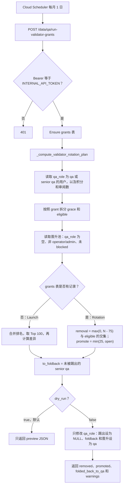

# QA Validator Rotate（月度 Validator 轮换）逻辑分析

> 后端仓库：`app-prismax-rp-backend`  
> 核心模块：`app_prismax_data_pipeline/qa_helper.py` + `app_prismax_data_pipeline/app.py`  
> DDL：`app_prismax_data_pipeline/sql/20260730_data_qa_validator_grants.sql`  
> 单测：`app_prismax_data_pipeline/test_qa_helper.py`  
>
> <span style="color:#2563eb">蓝色字体 = 2026-08-19 按最新代码修订（以 `qa_helper.py` / `app.py` 实现为准）。</span>

## 1. 总体结论

**QA Rotate** 指的是 <span style="color:#2563eb">`users.qa_role` 上 base `qa` + 手动升级的 `senior qa` 的月度名额轮换</span>，不是单次 Upload 的 QA 分配 / RoundRobin。


| 项    | 说明                                                                   |
| ---- | -------------------------------------------------------------------- |
| 触发   | Cloud Scheduler 每月 1 日调用 `POST /data/qa/run-validator-grants`        |
| <span style="color:#2563eb">作用范围</span> | <span style="color:#2563eb">读写 **`qa_role`**，不碰 `user_role`。池子 = `qa_role IN ('qa', 'senior qa')`。`expert qa` / `super qa` 不进池、不被踢、不 foldback。存活的 `senior qa` 会被 foldback 成 `'qa'`；被踢的 `senior qa` 与 base `qa` 一样直接 `qa_role = NULL`。</span> |
| 名额   | 总量 **100**，每月目标轮换 **25**                                             |
| 排名依据 | 全量 [QA 积分](#2-qa-积分定义) + 审过的 upload 数 + user_id 平局规则                 |
| 保护期  | 由本 Job 授予的 Validator 有约 1 个完整自然月的 grace period                       |
| 安全阀  | `dry_run` 默认 `true`，未显式传 `false` 时只预览不写库                             |
| <span style="color:#2563eb">预览月份</span> | <span style="color:#2563eb">`dry_run=true` 时可另传 `dry_run_month`（`YYYY-MM` / `YYYY-MM-DD`）覆盖 `run_month`；与 `dry_run=false` 同传 → 400</span> |


```text
Cloud Scheduler (每月 1 日)
  → POST /data/qa/run-validator-grants  (Bearer INTERNAL_API_TOKEN)
  → ensure data_qa_validator_grants
  → _compute_validator_rotation_plan(run_month=本月1号 或 dry_run_month)
      ├─ launch：grants 表为空 → 全量重排 Top 100
      └─ rotation：稳态 → 踢出最差 + 晋升最优（最多各约 25）
  → dry_run=false 时：
      ├─ 踢人：users.qa_role = NULL + 关 grants 行
      ├─ foldback：存活 senior qa → qa_role = 'qa'（无活跃 grant 才 INSERT）
      └─ 晋升：users.qa_role = 'qa' + INSERT grants
```

---

## 2. QA 积分定义

**QA 积分** = 审过的 episode 在 final decision 后发奖，写入 `point_transactions` 并累计的固定分。  
Rotate / Leaderboard 用的 `qa_points` 是同一套 **全量已发放** 口径（不是当月、也不是按 upload 数直接算）。

### 2.1 常量

```40:41:app-prismax-rp-backend/app_prismax_data_pipeline/qa_helper.py
QA_EPISODE_REVIEW_TRANSACTION_TYPE = "data_qa_episode_review"
QA_EPISODE_REVIEW_DEFAULT_POINTS = 100
```


| 项                | 值                                        |
| ---------------- | ---------------------------------------- |
| 单次发放             | 每个合格 `(user_id, episode_id)` → **100** 分 |
| transaction_type | `data_qa_episode_review`                 |
| 时间范围             | **全量**（非仅上月）                             |


### 2.2 何时发放

Upload 某轮审完并产出 `final_decision` 时调用 `_reward_final_decision_qa_points`（提交 review 后 `_resolve_round_outcome` 判定 round complete 且有 final decision）：

- 第 1 / 2 轮：无分歧 → 出 final decision 并发奖
- 第 3 轮：审完即出 final decision 并发奖
- 有分歧进入下一轮时：**不发**

### 2.3 发放条件（每个 reviewer session）

对 `data_qa_sessions` 中该 upload 的每位审阅者，需 **同时** 满足：

1. **Gate 一致**：其 `review_result` gate 与 `final_gate` 一致（只比对 final 里有值的 `QA_GATE_KEYS`）
2. **分数接近**：`|qa_score - final_quality_score| ≤ 8`
  - `final_quality_score` = 该决定轮次全体 `qa_score` 的中位数
3. 对其采样到的每个 `episode_id` 发一次；同一 `(user_id, episode_id)` 去重
4. 若 `data_qa_episode_activity` 上该对已有 `point_transaction_id`，跳过（防重跑重复发）

```517:563:app-prismax-rp-backend/app_prismax_data_pipeline/qa_helper.py
def _reward_final_decision_qa_points(conn, upload_id, final_decision):
    ...
    # Build list of (user_id, episode_id) pairs where reviewer gate matches final_gate
    # and qa_score is within ±8 points of final_score
    ...
        gate_match = all(
            reviewer_gate.get(k) == final_gate.get(k)
            for k in QA_GATE_KEYS
            if final_gate.get(k)
        )
        if not gate_match:
            continue

        if qa_score is None or abs(int(qa_score) - int(final_score)) > 8:
            continue
        ...
        for episode_id in episode_ids:
            reward_pairs.append((user_id, int(episode_id)))

    # Defensive de-dupe: collapse exact duplicate (user_id, episode_id) pairs
    reward_pairs = list(dict.fromkeys(reward_pairs))
```

### 2.4 落库副作用


| 动作                                | 说明                                                             |
| --------------------------------- | -------------------------------------------------------------- |
| `INSERT point_transactions`       | `points_change=100`, `transaction_type=data_qa_episode_review` |
| `UPDATE data_qa_episode_activity` | 回写 `point_transaction_id`                                      |
| `UPDATE users.total_points`       | `+= 100 * 该用户本次 episode 数`                                     |


### 2.5 排行榜 / Rotate 怎么读

```text
qa_points = SUM(pt.points_change)
            FROM data_qa_episode_activity ea
            JOIN point_transactions pt ON pt.transaction_id = ea.point_transaction_id
            GROUP BY ea.user_id
```

与 Leaderboard refresh SQL 同源。


| 状态                               | 是否计入 `qa_points`        |
| -------------------------------- | ----------------------- |
| **granted**（已有 transaction）      | ✅ 计入                    |
| **pending**（审了但 upload 尚未 final） | ❌ 不计入（UI 可单独显示 pending） |
| **missed**（final 了但 gate/分数未达标）  | ❌ = 0                   |


> 实现经 activity 关联求和，且未再 filter `transaction_type`。正常路径两者一致（activity 只挂 QA 发奖 transaction）。

---

## 3. 常量与角色边界

```10:14:app-prismax-rp-backend/app_prismax_data_pipeline/qa_helper.py
QA_ROLE_BASE = "qa"
QA_ROLE_SENIOR = "senior qa"
QA_ROLE_EXPERT = "expert qa"
QA_ROLE_SUPER = "super qa"
QA_ALLOWED_ROLES = {QA_ROLE_BASE, QA_ROLE_SENIOR, QA_ROLE_EXPERT, QA_ROLE_SUPER}
```

```46:53:app-prismax-rp-backend/app_prismax_data_pipeline/qa_helper.py
QA_VALIDATOR_TOTAL_SPOTS = 100
QA_VALIDATOR_SPOTS_TO_ROTATE = 25
QA_VALIDATOR_GRANTS_TABLE = "data_qa_validator_grants"
# Account roles that are never eligible to be promoted into the base "qa"
# validator role. Existing QA tiers are excluded separately through qa_role.
# Operators remain excluded from automatic promotion; an admin can still grant
# them qa_role explicitly, allowing the approved dual-role state.
QA_VALIDATOR_PROMOTION_EXCLUDED_ROLES = {"operator", "admin"}
```

<span style="color:#2563eb">注意：文件顶部 43–45 行注释仍写「只轮换 base `qa`，senior/expert/super 永不触碰」。这与 `_compute_validator_rotation_plan` 的实现不一致；本文以函数实现 / SQL 为准。</span>

要点：

- <span style="color:#2563eb">**在位池**（current）：`users.qa_role IN ('qa', 'senior qa')`。`senior qa` 不是独立赛道，只是同一池上的手动升级标签，按同一套积分排序，可被踢、可被保留。</span>
- <span style="color:#2563eb">**永不进池**：`expert qa` / `super qa`（有 `qa_role`，既不进 current，也不进晋升池）。</span>
- <span style="color:#2563eb">**晋升排除（账号角色）**：`user_role IN ('operator', 'admin')` 不会被自动晋升。Admin 可手工写 `qa_role`，形成 operator + QA 双角色；双角色一旦 `qa_role` 已是 `qa`/`senior qa`，就会进 current 池，可被踢（只清 `qa_role`，`user_role` 仍是 operator）。</span>
- <span style="color:#2563eb">**已有 QA 档位**靠 `qa_role IS NOT NULL` 排除出晋升池，不再靠 `QA_ALLOWED_ROLES` 并进排除常量。</span>
- Floor（稳态保底人数）= `100 - 25 = 75`。
- <span style="color:#2563eb">Rotate SQL **直接读 `u.qa_role`**，不用 `_resolve_user_qa_role` 的 legacy `user_role` fallback。仅旧列 `user_role='qa'`、`qa_role` 为空的历史账号：**不算 current**，且可能进晋升池。</span>

---

## 4. 触发入口：`POST /data/qa/run-validator-grants`

```9862:9962:app-prismax-rp-backend/app_prismax_data_pipeline/app.py
@app.route("/data/qa/run-validator-grants", methods=["POST"])
def run_qa_validator_grants():
    auth_header = request.headers.get("Authorization", "")
    token = auth_header.replace("Bearer ", "", 1).strip()
    if token != INTERNAL_API_TOKEN:
        return jsonify({"error": "Unauthorized"}), 401

    body = request.get_json(silent=True) or {}
    dry_run = body.get("dry_run", True) is not False
    dry_run_month_raw = body.get("dry_run_month")
    ...
            plan = _compute_validator_rotation_plan(conn, run_month)
            ...
            if not dry_run:
                if to_remove:
                    # users.qa_role = NULL
                    # grants.removed_at / removed_month 写回
                if to_foldback:
                    # users.qa_role = 'qa'
                    # 无活跃 grant 才 INSERT data_qa_validator_grants
                if to_promote:
                    # users.qa_role = 'qa'
                    # INSERT data_qa_validator_grants (user_id, grant_month)
```

### 调用约定


| 项           | 值                                            |
| ----------- | -------------------------------------------- |
| Auth        | `Authorization: Bearer <INTERNAL_API_TOKEN>` |
| Body        | `{ "dry_run": false }` 才真正落库；省略 / `true` 只预览 |
| `run_month` | 默认 UTC 当天所在月的 **1 号**                        |
| <span style="color:#2563eb">`dry_run_month`</span> | <span style="color:#2563eb">仅 `dry_run=true` 可用；`YYYY-MM` 或 `YYYY-MM-DD`，规范化成当月 1 号覆盖 `run_month`。与 `dry_run=false` 同传 → 400 `"dry_run_month can only be used together with dry_run."`；格式非法 → 400</span> |


### 落库动作

<span style="color:#2563eb">三步按代码顺序：remove → foldback → promote。全程只改 `qa_role`，不改 `user_role`。</span>


| 动作      | `users`            | `data_qa_validator_grants`                         |
| ------- | ------------------ | -------------------------------------------------- |
| <span style="color:#2563eb">Remove</span>  | <span style="color:#2563eb">`qa_role = NULL`</span> | 活跃行设 `removed_at=NOW()`, `removed_month=run_month` |
| <span style="color:#2563eb">Foldback</span> | <span style="color:#2563eb">`qa_role = 'qa'`</span> | <span style="color:#2563eb">**仅当该用户没有 `removed_at IS NULL` 的活跃 grant** 时 INSERT `(user_id, grant_month=run_month)`；已有活跃 grant 则沿用原 `grant_month`（grace 不重置）</span> |
| Promote | <span style="color:#2563eb">`qa_role = 'qa'`</span> | `INSERT (user_id, grant_month)`（**无**「已有活跃行则跳过」） |


响应字段含：`mode`、`removal_count` / `promotion_count`、<span style="color:#2563eb">`foldback_count`</span>、`removed` / `promoted` / <span style="color:#2563eb">`folded_back_to_qa`</span> 列表、`warnings`（人数不足时不报错，只 warning）。

---

## 5. 计划计算：`_compute_validator_rotation_plan`

核心在 `qa_helper.py`。

### 5.0 术语：`current` 与 `eligible`

<span style="color:#2563eb">Rotate 代码 / 响应里这两个词针对 **`qa_role IN ('qa', 'senior qa')`**，不含 `expert qa` / `super qa`。</span>


| 术语              | 代码字段                                                  | 定义                                                                                           |
| --------------- | ----------------------------------------------------- | -------------------------------------------------------------------------------------------- |
| **current**     | `validators` / `current_validator_count`              | <span style="color:#2563eb">当前 `users.qa_role IN ('qa', 'senior qa')` 的人数。**不管**是否有 grant、是否在 grace。即「现在在位的 validator 总数」（含未 foldback 的 senior）。</span> |
| **eligible**    | `eligible_for_removal` / `eligible_for_removal_count` | current 里 **不在 grace 保护期**、本月可被踢出的人。淘汰排序只在这个池里做。                                             |
| grace protected | `grace_protected` / `grace_protected_count`           | current 里仍在 grace 的人；本月 **不可** 进淘汰名单。                                                        |
| <span style="color:#2563eb">foldback</span> | <span style="color:#2563eb">`to_foldback` / `foldback_count`</span> | <span style="color:#2563eb">current 里 **本轮没被踢** 且 `qa_role == 'senior qa'` 的人。落库时降回 `'qa'`（「重新赢取席位」）。</span> |
| 关系              | —                                                     | `current = eligible + grace_protected`                                                       |


判定规则（对每个 current validator）：

```text
有活跃 grant（removed_at IS NULL）且 months(grant_month → run_month) ≤ 1
  → grace_protected（不可踢）
否则（无 grant / 手工授予 / 已过 G+1）
  → eligible（可踢）
```


| 例子               | current | eligible | grace |
| ---------------- | ------- | -------- | ----- |
| 100 人全是老资格、均可踢   | 100     | 100      | 0     |
| 100 人里 94 人上月刚晋升 | 100     | 6        | 94    |
| 80 人在位，全部 grace  | 80      | 0        | 80    |
| **现在只有 87 人在位** | **87**  | **≤87**  | **87 − eligible** |

#### 例：`current = 87` 时 Eligible 是什么？

**Eligible 不是「还差多少名额」**，也不是 `100 - 87 = 13`。

它仍是：这 **87 个在位** <span style="color:#2563eb">`qa` / `senior qa`</span> 里，**本月可以被踢** 的那一部分。

```text
current = 87
= 仍在 grace 的人数  +  已过 grace / 无 grant（eligible）的人数
```

要知道具体 eligible 人数，只能查这 87 人各自最新活跃 grant：

- 有活跃 grant 且 `grant_month` 距本月 `run_month` ≤ 1 → **grace**（不可踢）
- 否则 → **eligible**（可踢）

稳态下 `current=87` 时的人数演算（floor=75）：

```text
desired_removal = max(0, 87 - 75) = 12          # 理论上想踢到 75
actual_removed  = min(12, eligible)             # 实际踢人数被 eligible 封顶
remaining       = 87 - actual_removed
open_spots      = max(0, 100 - remaining)
promotion       = min(25, open_spots)
```

| 假设（current 恒为 87） | eligible | grace | removed | remaining | promoted | 跑完后约 |
|---|---:|---:|---:|---:|---:|---:|
| 87 人全可踢 | 87 | 0 | 12 | 75 | 25 | 100 |
| 例如 50 人仍在 grace | 37 | 50 | 12 | 75 | 25 | 100 |
| 只有 5 人可踢 | 5 | 82 | 5 | 82 | 18 | 100 |
| 全员 grace | 0 | 87 | 0 | 87 | 13 | 100 |

要点：

1. **名额缺口 13（=100−87）只影响晋升上限里的 `open_spots`，不定义 eligible。**
2. 即便未满 100，只要 `current > 75`，仍可能先踢人（最多踢到 75），再补到 100。
3. <span style="color:#2563eb">查库核对：`current = COUNT(qa_role IN ('qa','senior qa'))`；`eligible = current 中无活跃 grace grant 的人数`。</span>

稳态公式里：

```text
removal_target = min( max(0, current - 75), eligible )
```

- **current** 决定「理论上要踢多少才能回到 floor 75」
- **eligible** 决定「实际最多能踢多少」（grace 不够时封顶）

> 晋升侧「进候选池」语义见 [§5.2](#52-拉晋升候选池promotion_candidates)。文档里若不加前缀，**eligible 默认指可淘汰池**。

### 5.1 拉 current validators + 排名数据

对当前 <span style="color:#2563eb">`qa` + `senior qa`</span> 用户（即 **current**）拉积分 / 审阅数（晋升候选见 [§5.2](#52-拉晋升候选池promotion_candidates)）：

1. **qa_points**：见 [§2 QA 积分定义](#2-qa-积分定义)；实现为 `data_qa_episode_activity` ⋈ `point_transactions`，`SUM(points_change)`（全量）
2. **uploads_reviewed**：`data_qa_sessions` 的 `COUNT(DISTINCT upload_id)`

```938:960:app-prismax-rp-backend/app_prismax_data_pipeline/qa_helper.py
    validator_rows = conn.execute(sqlalchemy.text("""
        WITH review_counts AS (
            SELECT user_id, COUNT(DISTINCT upload_id) AS uploads_reviewed
            FROM data_qa_sessions
            GROUP BY user_id
        ),
        qa_points AS (
            SELECT ea.user_id, SUM(pt.points_change) AS qa_points
            FROM data_qa_episode_activity ea
            JOIN point_transactions pt ON pt.transaction_id = ea.point_transaction_id
            GROUP BY ea.user_id
        )
        SELECT u.userid AS user_id,
               u.qa_role AS qa_role,
               COALESCE(qp.qa_points, 0) AS qa_points,
               COALESCE(rc.uploads_reviewed, 0) AS uploads_reviewed
        FROM users u
        ...
        WHERE u.qa_role = ANY(CAST(:qa_roles AS text[]))
    """), {
        "qa_roles": [QA_ROLE_BASE, QA_ROLE_SENIOR],
    }).fetchall()
```

### 5.2 拉晋升候选池：`promotion_candidates`

<span style="color:#2563eb">从 `users` 全表拉人，三个条件 **同时** 满足才进池：</span>

1. <span style="color:#2563eb">`qa_role` 为空（`NULLIF(TRIM(COALESCE(u.qa_role, '')), '') IS NULL`）——已有任意 QA 档位都进不了</span>
2. <span style="color:#2563eb">`user_role` 不在排除集</span>
3. <span style="color:#2563eb">当前 **没有** `data_qa_blocklist.status = 'blocked'` 的行（避免本月刚被封、`qa_role` 已清空的人下轮被静默再晋升）</span>

**排除集**（账号角色）：

```53:53:app-prismax-rp-backend/app_prismax_data_pipeline/qa_helper.py
QA_VALIDATOR_PROMOTION_EXCLUDED_ROLES = {"operator", "admin"}
```

即：<span style="color:#2563eb">仅 `operator` / `admin`。QA 档位改由条件 1 排除。</span>

```990:1023:app-prismax-rp-backend/app_prismax_data_pipeline/qa_helper.py
    # Non-validator promotion pool, ranked the same way, excluding
    # operators/admins/any existing QA tier, and anyone currently blocklisted
    # (otherwise a user blocked this month -- qa_role already cleared --
    # would look like any other open candidate and could be silently
    # re-promoted next run, undoing the block).
    promotion_rows = conn.execute(sqlalchemy.text("""
        ...
        WHERE NULLIF(TRIM(COALESCE(u.qa_role, '')), '') IS NULL
          AND LOWER(TRIM(COALESCE(u.user_role, ''))) NOT IN :excluded_roles
          AND NOT EXISTS (
              SELECT 1 FROM data_qa_blocklist b
              WHERE b.user_id = u.userid AND b.status = 'blocked'
          )
    """).bindparams(sqlalchemy.bindparam("excluded_roles", expanding=True)), {
        "excluded_roles": list(QA_VALIDATOR_PROMOTION_EXCLUDED_ROLES),
    }).fetchall()
```


| 项         | 说明                                                                                        |
| --------- | ----------------------------------------------------------------------------------------- |
| 范围        | `qa_role` 为空、且账号角色不是 operator/admin、且未被 block 的人；`user_role` 为 `NULL` / 空字符串也会进池 |
| **没有的过滤** | 最低积分门槛、必须审过 upload、会员等级 / user_class 等                                                    |
| 指标缺失      | 无积分 / 无 session → `qa_points=0`、`uploads_reviewed=0`，**仍在池里**                             |
| <span style="color:#2563eb">封禁中</span> | <span style="color:#2563eb">`data_qa_blocklist.status='blocked'` → **不进池**。解封后（status 不再是 blocked）若 `qa_role` 仍为空，可以再进池</span> |
| 稳态截断      | `_select_validators_to_promote(candidates, promotion_target)`：按积分↓ → 审阅数↓ → user_id↑ 取前 N |
| Launch    | 与 current validators **合并** 后用同一晋升排序取 Top 100，再 diff                                      |


> 因此：`promotion_candidates` = 宽候选池；`to_promote` = 池内按排名截出的最终晋升名单（长度 ≤ `promotion_target`）。

### 5.3 Grace 拆分（current → eligible / grace_protected）

读每个 **current** validator 最新一条 `removed_at IS NULL` 的 grant，拆成 **eligible** vs grace：

```894:901:app-prismax-rp-backend/app_prismax_data_pipeline/qa_helper.py
def _is_validator_in_grace_period(grant_month, run_month):
    """Newly granted validators are exempt from elimination during their first
    full month; eligibility starts in month two. ...
    A user granted in month G is exempt from the run in
    month G+1, and becomes eligible starting the run in month G+2."""
    if grant_month is None:
        return False
    return _months_between(grant_month, run_month) <= 1
```


| grant_month              | run_month  | 结果                |
| ------------------------ | ---------- | ----------------- |
| 2026-07-01               | 2026-07-01 | 保护（同月）            |
| 2026-07-01               | 2026-08-01 | 保护（G+1）           |
| 2026-07-01               | 2026-09-01 | **可淘汰**（G+2）      |
| `None`（无 grant 行 / 手工授予） | 任意         | **无 grace，立刻可淘汰** |


### 5.4 Launch vs Rotation 分支

```1025:1050:app-prismax-rp-backend/app_prismax_data_pipeline/qa_helper.py
    has_prior_grants = bool(conn.execute(sqlalchemy.text("""
        SELECT 1 FROM data_qa_validator_grants LIMIT 1
    """)).fetchone())

    if not has_prior_grants:
        mode = "launch"
        seed_set = _select_validator_seed_set(
            validators, promotion_candidates, QA_VALIDATOR_TOTAL_SPOTS,
        )
        ...
        to_remove = [v for v in validators if v["user_id"] not in seed_ids]
        to_promote = [c for c in seed_set if c["user_id"] not in current_ids]
    else:
        mode = "rotation"
        removal_target, promotion_target = _compute_validator_rotation_counts(
            current_validator_count, len(eligible_for_removal),
        )
        to_remove = _select_validators_to_remove(eligible_for_removal, removal_target)
        to_promote = _select_validators_to_promote(promotion_candidates, promotion_target)
```

### <span style="color:#2563eb">5.5 Foldback：存活的 `senior qa` → `'qa'`</span>

<span style="color:#2563eb">Launch / Rotation 名单算完后，对 **没进 `to_remove`** 且 `qa_role == 'senior qa'` 的人生成 `to_foldback`：</span>

```1052:1071:app-prismax-rp-backend/app_prismax_data_pipeline/qa_helper.py
    # Any senior-qa validator who survives this run (i.e. was not removed)
    # "re-earns" their spot and is folded back down to plain 'qa'. One who
    # was removed above already lost QA status entirely -- no separate
    # handling needed here.
    remove_ids = {c["user_id"] for c in to_remove}
    to_foldback = [
        v for v in validators
        if v["user_id"] not in remove_ids and v.get("qa_role") == QA_ROLE_SENIOR
    ]
```

<span style="color:#2563eb">语义：</span>

- <span style="color:#2563eb">**被踢的 senior**：与 base `qa` 一样 `qa_role = NULL`，不再单独处理。</span>
- <span style="color:#2563eb">**留下的 senior**：本月「重新赢取」席位，标签降回 `'qa'`。已有活跃 grant 时 **不** 改 `grant_month`；没有活跃 grant（纯手工升 senior）时才 INSERT 本月 grant → 会进入 grace。</span>
- <span style="color:#2563eb">`expert qa` / `super qa` 不在 `validators` 里，不会 foldback。</span>

---

## 6. 稳态 Rotation 数学

```856:878:app-prismax-rp-backend/app_prismax_data_pipeline/qa_helper.py
def _compute_validator_rotation_counts(current_validator_count, eligible_removal_count):
    floor_count = QA_VALIDATOR_TOTAL_SPOTS - QA_VALIDATOR_SPOTS_TO_ROTATE
    desired_removal = max(0, current_validator_count - floor_count)
    actual_removed = min(desired_removal, max(0, eligible_removal_count))

    remaining_after_removal = current_validator_count - actual_removed
    open_spots = max(0, QA_VALIDATOR_TOTAL_SPOTS - remaining_after_removal)
    promotion_count = min(QA_VALIDATOR_SPOTS_TO_ROTATE, open_spots)

    return actual_removed, promotion_count
```

公式（`current` / `eligible` 定义见 [§5.0](#50-术语current-与-eligible)）：

```text
floor = 100 - 25 = 75
removal_target = min( max(0, current - 75), eligible )
open_spots     = max(0, 100 - (current - removed) )
promotion_target = min(25, open_spots)
```

<span style="color:#2563eb">`current` 含 `senior qa`。foldback **不改变人数**，只改标签，因此不进入这组 count 公式。</span>

### 典型场景


| current（在位 qa+senior 数） | eligible（可踢数） | removed | promoted | 说明                    |
| ---------------- | ------------- | ------- | -------- | --------------------- |
| 100              | 100           | 25      | 25       | 标准满员轮换                |
| **87**           | **87**        | **12**  | **25**   | **未满员但仍 >75：先踢到 75，再补到 100** |
| **87**           | **5**         | **5**   | **18**   | **可踢不够 12：只踢 5，再补 open_spots** |
| **87**           | **0**         | **0**   | **13**   | **全员 grace：不踢，只补 100−87** |
| 50               | 50            | 0       | 25       | 低于 floor，只补人          |
| 110              | 110           | 35      | 25       | 超员先压到 75，再补到 100      |
| 100              | 6             | 6       | 6        | grace 卡住大部分人，按可踢人数对称补 |
| 100              | 0             | 0       | 0        | 全员 grace，本月不动         |
| 100              | 30，但晋升池只有 10  | 25      | 10       | 不足时部分执行 + warnings    |
| <span style="color:#2563eb">100（含 8 个 senior，均未被踢）</span> | <span style="color:#2563eb">—</span> | <span style="color:#2563eb">按公式</span> | <span style="color:#2563eb">按公式</span> | <span style="color:#2563eb">另有 `foldback_count=8`：8 人 `qa_role` 从 `senior qa` → `qa`，人数仍 100</span> |


---

## 7. 排序规则（踢出 / 晋升）

```799:818:app-prismax-rp-backend/app_prismax_data_pipeline/qa_helper.py
def _validator_removal_sort_key(candidate):
    """Ascending order = worst first (removed first). Tie-break: fewer
    uploads_reviewed is worse; among equal uploads_reviewed, a higher user_id
    (newer account) is worse."""
    return (
        int(candidate["qa_points"]),
        int(candidate["uploads_reviewed"]),
        -int(candidate["user_id"]),
    )


def _validator_promotion_sort_key(candidate):
    """Ascending order = best first (promoted first). Tie-break: more
    uploads_reviewed is better; among equal uploads_reviewed, a lower user_id
    (older account) is better."""
    return (
        -int(candidate["qa_points"]),
        -int(candidate["uploads_reviewed"]),
        int(candidate["user_id"]),
    )
```


| 维度          | 踢出（差的先走） | 晋升（好的先进） |
| ----------- | -------- | -------- |
| QA 积分       | 低优先踢     | 高优先升     |
| 审过 upload 数 | 少优先踢     | 多优先升     |
| user_id     | 大（新号）优先踢 | 小（老号）优先升 |


Launch 模式：当前 validator + 晋升候选合并后，用 **晋升排序** 取 Top 100，再 diff 出加减名单。<span style="color:#2563eb">`senior qa` 与 `qa` 用同一套 key，没有「senior 优先留任」。</span>

---

## 8. 表结构：`data_qa_validator_grants`

```1:21:app-prismax-rp-backend/app_prismax_data_pipeline/sql/20260730_data_qa_validator_grants.sql
-- One row per base-"qa" validator grant issued by the monthly rotation job
-- (POST /data/qa/run-validator-grants). Used only to determine whether a
-- validator is still within their grace-period month; manual grants/removals
-- made outside the job simply have no row here and are treated as having no
-- grace period.
CREATE TABLE IF NOT EXISTS data_qa_validator_grants (
    id BIGSERIAL PRIMARY KEY,
    user_id BIGINT NOT NULL REFERENCES users(userid),
    granted_at TIMESTAMPTZ NOT NULL DEFAULT NOW(),
    grant_month DATE NOT NULL,
    removed_at TIMESTAMPTZ,
    removed_month DATE
);
```


| 列                              | 用途                                     |
| ------------------------------ | -------------------------------------- |
| `user_id`                      | 被本 Job 授予 base `qa` 的用户                |
| `granted_at` / `grant_month`   | 授予时间；`grant_month` 为当月 1 号，用于 grace 计算 |
| `removed_at` / `removed_month` | 被轮换踢出时写入；`NULL` 表示仍在位                  |


**手工改角色不会写这张表** → 无 grace。

运行时 `_ensure_data_qa_validator_grants_table()` 也会 ensure DDL，避免 Scheduler 撞空表。

<span style="color:#2563eb">封禁路径（`POST /data/admin/qa-review/blocklist/add`）只 `SET qa_role = NULL`，**不**关 grants 行。被封用户因 `qa_role` 已空而不在 current 池；晋升池又被 blocklist 挡住。解封 SQL 不写回 `qa_role`。</span>

---

## 9. 前端可读：剩余名额

`GET /data/qa/get-validator-access-data` 用轻量版 `_compute_validator_open_spots`（不做全员积分排序），把本月可晋升数暴露为 `spots_remaining`：

```9205:9221:app-prismax-rp-backend/app_prismax_data_pipeline/app.py
        run_month = _validator_grant_month(datetime.now(timezone.utc).date())
        plan = _compute_validator_open_spots(conn, run_month)

    effective_qa_role = _resolve_user_qa_role(user.get("qa_role"), user.get("user_role"))
    response_data = {
        "spots_remaining": plan["promotion_target"],
        "spots_total": QA_VALIDATOR_TOTAL_SPOTS,
        ...
        "qa_role": effective_qa_role,
        # Compatibility alias for clients deployed before qa_role was split.
        "user_role": effective_qa_role,
```

注意：

- open-spots 路径**固定按 rotation 模式**估算，不再处理 launch（假定 grants 表已有历史行）。
- <span style="color:#2563eb">`_compute_validator_open_spots` 的在位人数同样是 `qa_role IN ('qa', 'senior qa')`，与 plan 一致。</span>
- <span style="color:#2563eb">该 GET **不**查 blocklist（`_require_qa_eligible_user(should_check_blocklist=False)`）。响应里的 `user_role` 是 QA 档位兼容别名，不是账号角色。</span>

---

## 10. 端到端流程图




---

## 11. QA 关注点 / 用例建议


| #   | 场景                             | 期望                                                          |
| --- | ------------------------------ | ----------------------------------------------------------- |
| 1   | `dry_run` 省略或 true             | 角色与 grants 无变更，响应仍有名单                                       |
| 2   | 满员 100 且均可淘汰                   | 踢 25、升 25；<span style="color:#2563eb">被踢 `qa_role=NULL`（`user_role` 不变），被升 `qa_role=qa`</span> |
| 3   | 7 月授予，8 月跑 job                 | 仍在 grace，不被踢                                                |
| 4   | 7 月授予，9 月跑 job                 | 可被踢                                                         |
| 5   | 手工授予无 grant 行                  | 无 grace，下月可踢                                                |
| 6   | <span style="color:#2563eb">senior qa 未被踢</span>            | <span style="color:#2563eb">进 `folded_back_to_qa`；`qa_role` 从 `senior qa` → `qa`；已有活跃 grant 则 `grant_month` 不刷新</span> |
| 7   | <span style="color:#2563eb">senior qa 被踢</span>              | <span style="color:#2563eb">与 base qa 一样 `qa_role=NULL`，不单独 foldback</span> |
| 8   | <span style="color:#2563eb">expert qa / super qa</span>     | <span style="color:#2563eb">不在踢出/晋升/foldback 名单，`qa_role` 保持原值</span> |
| 9   | operator/admin                 | <span style="color:#2563eb">不进自动晋升池；operator 若已被手工写上 `qa_role=qa`，会进 current，可被踢（只清 `qa_role`）</span> |
| 10  | 人数不足 / 全员 grace                | 部分执行或 0；`warnings` 有说明，HTTP 仍 200                           |
| 11  | grants 空表首次跑                   | `mode=launch`，按 Top 100 重排                                  |
| 12  | `get-validator-access-data`    | `spots_remaining` ≈ 本月 `promotion_target`，`spots_total=100`；<span style="color:#2563eb">响应含 `qa_role`，`user_role` 为兼容别名</span> |
| 13  | Auth 错误 token                  | 401                                                         |
| 14  | Gate 一致且 `|score - final| ≤ 8` | 每个采样 episode 发 100；activity 挂上 transaction                  |
| 15  | Gate 不一致或分数差 > 8               | 该 reviewer 该 upload **0 分**（missed）                         |
| 16  | Upload 尚未 final / 有分歧进下一轮      | 不发分；pending 不进 `qa_points`                                  |
| 17  | 同一 `(user, episode)` 重跑 reward | 不重复发                                                        |
| 18  | <span style="color:#2563eb">`dry_run_month` + `dry_run=false`</span> | <span style="color:#2563eb">400</span> |
| 19  | <span style="color:#2563eb">`dry_run=true` + `dry_run_month=2026-09`</span> | <span style="color:#2563eb">按 9 月 1 日算 grace / 名单，不写库；`run_month=2026-09-01`</span> |
| 20  | <span style="color:#2563eb">`data_qa_blocklist.status='blocked'` 且 `qa_role` 已空</span> | <span style="color:#2563eb">不进晋升池，不会被本 Job 再写成 `qa`</span> |
| 21  | <span style="color:#2563eb">仅 legacy `user_role='qa'`、`qa_role` 为空</span> | <span style="color:#2563eb">Rotate SQL 不认 current；可能出现在晋升池</span> |


---

## 12. 相关文件清单


| 路径                                                                    | 角色                                                   |
| --------------------------------------------------------------------- | ---------------------------------------------------- |
| `app_prismax_data_pipeline/qa_helper.py`                              | 常量、排序、grace、count、plan、open spots、<span style="color:#2563eb">foldback</span> |
| `app_prismax_data_pipeline/app.py`                                    | `run-validator-grants` / `get-validator-access-data` |
| `app_prismax_data_pipeline/sql/20260730_data_qa_validator_grants.sql` | grants DDL                                           |
| <span style="color:#2563eb">`app_prismax_data_pipeline/sql/20260817_data_qa_blocklist.sql`</span> | <span style="color:#2563eb">晋升池排除 `status='blocked'`</span> |
| `app_prismax_data_pipeline/test_qa_helper.py`                         | rotation counts / sort / grace 单测                    |


**易混淆（不是本逻辑）：**

- Hex 侧 `RoundRobin`（episode similarity basket）
- `app_prismax_user_management` 里 token `hash_code` rotate
