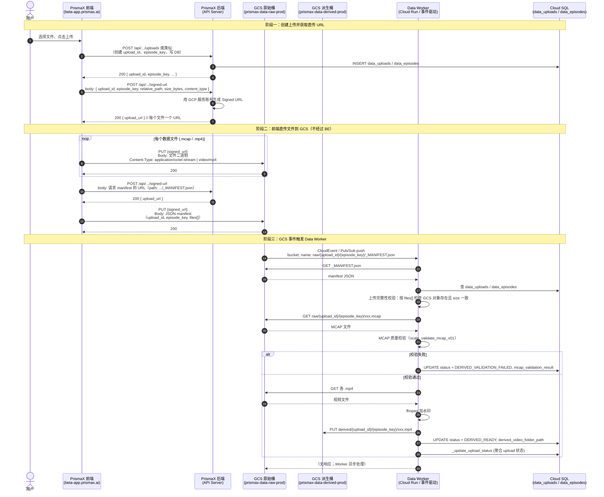

## Data Worker 功能说明与测试策略

### 背景概述

`app_prismax_data_worker/worker.py` 是 PrismaX 数据处理流程中的 **Data Worker**，主要在 GCS 收到某个 episode 的 `_MANIFEST.json` 文件时被触发。  
这个 Worker 会针对该 episode 执行三类关键操作：

- **上传完整性校验（Upload completeness validation）**
- **MCAP 质量校验（MCAP quality validation）**
- **派生视频生成（Derived video generation）**

三个步骤是串行依赖关系：**只有前一步成功，才会进入下一步**。

### PrismaX FE / BE / GCS 与 Data Worker 流程总览

下图描述一次 episode 数据从「用户上传」到「派生视频就绪」的完整链路：前端（FE）、后端（BE）、GCS（原始桶与派生桶）、Data Worker 及数据库之间的调用关系与涉及的 API/操作。



**流程要点简述**

| 阶段 | 参与方 | 主要 API / 操作 |
|------|--------|------------------|
| 1. 创建上传 | FE → BE | 后端提供「创建上传」类 API（具体路径以实际代码为准），返回 `upload_id`、`episode_key`，并写入 DB。 |
| 2. 获取直传 URL | FE → BE | 前端多次请求「获取某路径的 Signed URL」；后端用 GCP 生成 Signed URL 返回，**不接收文件内容**。 |
| 3. 直传数据文件 | FE → GCS | 前端对每个文件向 `storage.googleapis.com` 发 **PUT**（URL 带 `X-Goog-*` 参数），Body 为文件二进制。 |
| 4. 直传 manifest | FE → GCS | 前端最后一次 PUT 到 `raw/{upload_id}/{episode_key}/_MANIFEST.json`，Body 为 manifest JSON（含 `files` 列表）。 |
| 5. 触发 Worker | GCS → Worker | GCS 对象创建事件（CloudEvent 或 Pub/Sub）推送到 Data Worker，事件体含 `bucket`、`name`（manifest 路径）。 |
| 6. 完整性校验 | Worker ↔ GCS / DB | Worker 下载 manifest，按 `files` 检查 GCS 对象存在与大小，更新 `data_episodes.status`（UPLOADED / FAILED）。 |
| 7. MCAP 校验与派生 | Worker ↔ GCS / DB | Worker 下载 .mcap 做质量校验；通过则下载 .mp4、加水印、上传到派生桶，并更新 `DERIVED_READY` 等状态。 |

以上为基于当前文档与常见实现的流程归纳；实际 API 路径与请求格式以 PrismaX 前端/后端代码为准。

---

## 一、Upload completeness validation（上传完整性校验）

### 1. 业务目标

保证某次上传（`upload_id` + `episode_key`）在 GCS 上的原始数据 **文件齐全、大小正确**，从而判断该 episode 的「上传是否完整」。  
只有在文件完整的前提下，后续的 MCAP 质量校验和派生视频生成才有意义。

### 2. 触发入口

- 事件源：GCS 中生成对象 `raw/{upload_id}/{episode_key}/_MANIFEST.json` 后，通过 CloudEvent 或 Pub/Sub push 触发 Data Worker。
- `worker.py` 中的 `/` 路由通过 `_parse_event()` 解析请求体，得到：
  - `bucket_name`
  - `object_name`（例如 `raw/12345/episode_001/_MANIFEST.json`）
- 仅在以下条件都满足时才继续处理：
  - `bucket_name == DATA_RAW_BUCKET`
  - `object_name` 以 `/_MANIFEST.json` 结尾

### 3. 实际做的事情

**（1）解析 manifest 内容**

- 从 `DATA_RAW_BUCKET` 下载 `_MANIFEST.json`，解析出：
  - `upload_id`
  - `episode_key`
  - `files` 列表：每个元素包含 `relative_path`、`size_bytes` 等字段。

**（2）检查文件存在性与大小匹配**

- 遍历 `files` 列表，对每个项：
  - 通过 `raw/{upload_id}/{relative_path}` 构造 GCS 路径，检查 blob 是否存在：
    - 若不存在 → 加入 `missing` 列表。
  - 若存在，比较 `manifest.size_bytes` 与 `blob.size`：
    - 不一致 → 加入 `size_mismatch` 列表。
- 在遍历过程中顺便统计：
  - 所有 `.mp4` 的 `total_video_size`。
  - 第一个 `.mcap` 文件的 `mcap_size`。

**（3）更新数据库状态**

- 在 `data_uploads` / `data_episodes` 中查询该 `upload_id`、`episode_key` 对应记录。
- 若发现 **缺失文件或大小不匹配**：
  - 将对应 `data_episodes.status` 更新为 `'FAILED'`。
  - 返回 JSON：`{"ok": False, "missing": [...], "size_mismatch": [...]}`（HTTP 200）。
- 若文件完整：
  - 更新 `data_episodes`：
    - `status = 'UPLOADED'`
    - `mcap_size_bytes = mcap_size`
    - `video_size_bytes = total_video_size`
  - 调用 `_update_upload_status(conn, upload_id)` 对 `data_uploads.status` 做聚合更新：
    - 若有任一 episode 状态为 `DERIVED_VALIDATION_FAILED` → 整个 upload 标记为 `DERIVED_VALIDATION_FAILED`。
    - 若所有 episode 均为 `DERIVED_READY` → 标记为 `DERIVED_READY`。
    - 否则，若所有 episode 状态均在 `('UPLOADED', 'DERIVING', 'DERIVED_READY')` 中 → 统一标记为 `UPLOADED`。

### 4. 小结

上传完整性校验通过 `_MANIFEST.json` 这个「真值来源」，系统性地检查 GCS 中实际文件集合是否与 manifest 描述一致，并将结果写入 `data_episodes` / `data_uploads`，是后续一切校验和派生计算的基础门槛。

---

## 二、MCAP quality validation（MCAP 质量校验）

### 1. 业务目标

在文件完整的前提下，对 episode 中的 **MCAP 机器人遥操作数据** 做严格质量评估，确保：

- 相机帧率稳定，无明显丢帧。
- 相机分辨率达到最低要求。
- 多个相机之间、相机与关节状态之间时间同步误差在可接受范围内。
- 关节状态采样频率足够高。

只有通过质量门槛的 episode 才能被标记为可用于后续算法训练或分析。

### 2. 触发入口

- 上传完整性校验通过后，Worker 在临时目录下载该 episode 对应的 `.mcap` 文件：
  - 遍历 `files`，找到第一个以 `.mcap` 结尾的 `relative_path`。
  - 从 `DATA_RAW_BUCKET` 下载到 `local_mcap_path`。
- 然后调用 `_run_mcap_validation(local_mcap_path)`：
  - 内部通过 `read_mcap_data_standalone(mcap_path)` 读取 MCAP 数据。
  - 再调用 `create_validation_results(analysis_results)` 产出质量评估结果。
  - 质量逻辑定义在 `scale_validate_mcap_v01.py` 中。

### 3. 质量检查内容（来自 `scale_validate_mcap_v01.py`）

#### （1）Topic 识别约定

- **相机 topic：**
  - 名称中包含任一关键词：`camera`、`image`、`color`、`depth`、`rgb`（大小写不敏感）。
  - `*_camera_info` topic 用于读取分辨率（`width` / `height`）。
- **关节 topic：**
  - 名称中包含 `joint`，但不包含 `gripper`。

#### （2）必选检查（必须通过）

这些检查全部通过时，`output_mcap_passed` 才为 `True`：

- **Camera 平均 FPS 误差 ≤ 0.5 FPS**
  - 自动识别目标帧率（15 / 30 / 60 FPS），要求平均帧率在该目标帧率 ±0.5 范围内。
- **Camera 最大帧间隔 ≤ 69ms**
  - 任意两帧之间最大 gap 不得超过 69ms，以避免严重丢帧。
- **Camera 分辨率 ≥ 640×480**
  - 从 `camera_info` topic 中读取 `width`、`height`，所有相机必须满足最小分辨率。
- **Camera–Camera 同步偏差 < 34ms**
  - 对所有相机两两配对，用「互为最近邻」的配对策略计算时间差。
  - 多相机 setup 要求任意相机对间同步误差 < 34ms。
- **Joint–Camera 同步偏差 < 34ms**
  - 对每个相机帧，寻找最近的关节状态时间戳，要求误差 < 34ms。
  - 未被任何关节状态覆盖的相机帧视为同步缺失。
- **Joint 平均频率 > 45 Hz**
  - 所有关节状态 topic 的平均频率需高于 45 Hz。

#### （3）信息性检查（仅产生 warning）

这些检查失败不会导致 `output_mcap_passed` 为 False，但会被记录为 warning：

- **Camera 1 秒滚动窗口平均 FPS 误差 ≤ 0.5 FPS**
  - 对时间轴做 1 秒滚动窗口统计，检测短时间内的帧率波动是否过大。
- **Joint 1 秒滚动窗口频率 > 45 Hz**
  - 在任何 1 秒滚动窗口内，关节状态频率都应保持在 45 Hz 以上。

### 4. Worker 中对结果的处理逻辑

- 若 `_run_mcap_validation()` 抛异常（解析失败、依赖缺失等）：
  - 调用 `_mark_validation_failed()`：
    - `data_episodes.status = 'DERIVED_VALIDATION_FAILED'`。
    - `data_uploads.status = 'DERIVED_VALIDATION_FAILED'`。
    - `data_uploads.mcap_validation_result` 中记录错误信息。
- 若返回结果中 `validation_results["output_mcap_passed"]` 为 `False`：
  - 仍调用 `_mark_validation_failed()`，但这次会携带：
    - `failed_checks` 列表。
    - 每个失败检查对应的统计数据。
    - 通过/总数统计、摘要等。
- 只有当 `output_mcap_passed` 为 `True` 时，才会：
  - 将 episode 状态更新为 `'DERIVING'`。
  - 继续执行派生视频生成逻辑。

### 5. 小结

MCAP 质量校验是一个覆盖 **时间轴、帧率、分辨率、多源同步、关节采样** 的多维度质量门槛。  
任何 MCAP 质量不达标的 episode 都会被标记为 `DERIVED_VALIDATION_FAILED`，并终止后续派生视频处理，确保下游只见到满足标准的数据集。

---

## 三、Derived video generation（派生视频生成）

### 1. 业务目标

在 MCAP 数据质量通过后，对原始视频做统一的水印处理，生成可对外使用/分发的 **派生视频（derived video）**，并在数据库中记录派生视频的存储位置和处理状态。

### 2. 触发入口

- 前提：该 episode 对应的 MCAP 质量检查通过：
  - `_run_mcap_validation()` 未抛异常。
  - `validation_results["output_mcap_passed"] == True`。
- Worker 将 episode 状态更新为 `'DERIVING'`，然后开始处理视频文件。

### 3. 实际做的事情

**（1）遍历 manifest 中所有 `.mp4`**

- 再次遍历 `_MANIFEST.json` 中的 `files`：
  - 对所有以 `.mp4` 结尾的 `relative_path`：
    - 从 `raw/{upload_id}/{relative_path}` 下载到本地临时目录。
    - 构造输出文件名 `derived_{原文件名}`。

**（2）调用 `_watermark_video()` 添加水印**

`_watermark_video(input_path, output_path)` 内部调用 `ffmpeg`，核心参数包括：

- 输入：原始 mp4 文件。
- 输出：带水印的 mp4 文件。
- 视频滤镜 `drawtext`：
  - 文本内容：环境变量 `WATERMARK_TEXT`（默认 `PrismaX`）。
  - 位置：左下角（`x=10`, `y=H-th-10`）。
  - 文本样式：白色文字，带透明度。
  - 背景样式：半透明黑色 box，带一定边距和边框宽度，以提高可读性。
- 编码参数：
  - 视频：`libx264`，`preset=veryfast`，`crf=24`。
  - 音频：`-c:a copy`，直接拷贝原始音轨。

**（3）上传派生视频到派生桶**

- 构造派生对象路径：`derived/{upload_id}/{episode_key}/{output_rel}`：
  - 其中 `output_rel` 为去掉前置一段路径后的相对路径。
- 上传目标 bucket：`DATA_DERIVED_BUCKET`。
- Content-Type：`video/mp4`。

**（4）最终更新数据库**

- 在 `data_episodes` 中更新该 episode：
  - `status = 'DERIVED_READY'`。
  - `derived_bucket = DATA_DERIVED_BUCKET`。
  - `derived_video_folder_path = f"derived/{upload_id}/{episode_key}/"`。
- 调用 `_update_upload_status(conn, upload_id)`：
  - 若该 upload 下所有 episode 都为 `DERIVED_READY`，则 `data_uploads.status` 更新为 `DERIVED_READY`。

### 4. 小结

派生视频生成在 MCAP 质量通过后，对原始视频做统一的水印处理并存入派生 bucket，是从「原始采数」到「可分发数据产品」的关键一步。  
同时通过 `DERIVING` → `DERIVED_READY` 状态流转，使前端或下游系统可以感知派生处理进度与结果。

---

## 四、端到端流程串联

以单个 episode 为例，从事件触发到处理完成端到端流程如下：

1. `raw/{upload_id}/{episode_key}/_MANIFEST.json` 写入 `DATA_RAW_BUCKET`。
2. Data Worker 收到事件，解析出 `bucket`、`object`，确认是目标 manifest 文件。
3. **上传完整性校验：**
   - 解析 manifest，逐一检查所有声明文件是否存在、大小是否吻合。
   - 若缺失或大小不匹配：`data_episodes.status = 'FAILED'`，流程结束。
   - 若全部匹配：`data_episodes.status = 'UPLOADED'`，进入下一步。
4. **MCAP 质量校验：**
   - 下载 `.mcap` 文件，调用 `scale_validate_mcap_v01.py` 执行质量检查。
   - 若脚本异常 / 质量不达标：`data_episodes.status = 'DERIVED_VALIDATION_FAILED'`，`data_uploads.mcap_validation_result` 记录失败原因，流程结束。
   - 若通过：`data_episodes.status = 'DERIVING'`，进入下一步。
5. **派生视频生成：**
   - 下载所有 `.mp4`，用 `ffmpeg` 加水印，上传到 `DATA_DERIVED_BUCKET`。
   - 更新 `data_episodes.status = 'DERIVED_READY'`，并记录派生存储路径。
6. 调用 `_update_upload_status` 聚合 upload 级状态，当所有 episode 均 `DERIVED_READY` 时，将 `data_uploads.status` 标为 `DERIVED_READY`。

---

## 五、原始数据上传方式：GCS Signed URL 直传

Data Worker 处理的是已经落在 GCS `DATA_RAW_BUCKET` 里的文件。这些原始文件（如 `.mcap`、`.mp4`）并非先上传到 PrismaX 后端再转发，而是由 **前端通过 Google Cloud Storage 的签名 URL（Signed URL）直传到 GCS**。下面说明这种上传方式是什么、以及和 Worker 的关系。

### 1. 这不是业务 API，而是 GCS 的直传地址

前端请求的 URL 形如：

```text
https://storage.googleapis.com/prismax-data-raw-prod/raw/27/piper_sample_20260309.mcap?X-Goog-Algorithm=...&X-Goog-Credential=...&X-Goog-Date=...&X-Goog-Expires=900&X-Goog-SignedHeaders=...&X-Goog-Signature=...
```

- **请求发往谁：** `storage.googleapis.com` → 请求直接发到 **Google Cloud Storage**，不经过 PrismaX 应用后端。
- **HTTP 方法：** `PUT` → 表示「向该 URL 所代表的 GCS 对象写入内容」。
- **路径含义：**
  - `prismax-data-raw-prod`：GCS 桶名，即 Data Worker 使用的 `DATA_RAW_BUCKET`。
  - `raw/27/piper_sample_20260309.mcap`：桶内对象路径，对应某次上传（如 `upload_id=27`）下某 episode 的 MCAP 文件名。

因此，这个 URL 的「API」含义是：**在限定时间内，允许向 GCS 的指定路径执行一次 PUT 上传**。

### 2. 查询参数中的 `X-Goog-*` 是什么

这些是 **GCS 签名 URL（Signed URL）** 的组成部分：

| 参数 | 含义 |
|------|------|
| `X-Goog-Algorithm=GOOG4-RSA-SHA256` | 签名算法 |
| `X-Goog-Credential=...` | 签名身份（如某 Compute 默认服务账号）、日期、权限范围 |
| `X-Goog-Date=...` | 签名时间（如 `20260316T014120Z`） |
| `X-Goog-Expires=900` | 链接有效期（秒），例如 900 即 15 分钟内有效 |
| `X-Goog-SignedHeaders=...` | 参与签名的请求头（如 `content-type;host`） |
| `X-Goog-Signature=...` | 对「方法 + URL + 指定头」的签名，供 GCS 校验请求未被篡改且在有效期内 |

也就是说：**这是由 PrismaX 后端（或具备 GCP 权限的服务）生成的一个「临时上传链接」；拿到该链接的客户端（如浏览器）在有效期内可以向 `raw/{upload_id}/{episode_key}/xxx.mcap` 执行一次 PUT 上传。**

### 3. 实际发生的业务流程

- 请求来自 `origin` / `referer`：`https://beta-app.prismax.ai` → 来自 PrismaX 前端。
- 请求头中 `Content-Length`（如 796698）、`Content-Type: application/octet-stream` → 上传的是二进制文件（此处为 MCAP）。
- **PUT** 到 `raw/27/piper_sample_20260309.mcap` → 相当于把「某次上传、某 episode 的 MCAP」直接写入 GCS。

典型流程是：

1. 用户在前端选择要上传的 MCAP（或整次上传中的文件）。
2. 前端向 **PrismaX 后端** 请求「给我一个可上传该文件的 URL」。
3. 后端用 GCP 服务账号私钥生成 **Signed URL**（即上述带 `X-Goog-*` 的 URL），并返回给前端。
4. 前端使用该 URL 发起 **PUT**，将文件从浏览器直传到 GCS，**不经过 PrismaX 服务器**。
5. 所有原始文件上传完成后，再上传 `_MANIFEST.json` 到对应路径；GCS 产生对象创建事件，触发 Data Worker，执行上传完整性校验、MCAP 质量校验与派生视频生成。

### 4. 上传顺序与 _MANIFEST.json 的作用

上传链路里除了每个数据文件各用一条 Signed URL 做 PUT，还有 **专门上传 manifest 的一次 PUT**，目标路径为 `raw/{upload_id}/{episode_key}/_MANIFEST.json`，请求体即为 manifest 的 JSON 内容。例如：

```text
PUT https://storage.googleapis.com/prismax-data-raw-prod/raw/27/piper_sample_20260309/_MANIFEST.json?X-Goog-...
Content-Type: application/json

{
  "manifest_version": 1,
  "upload_id": 27,
  "episode_key": "piper_sample_20260309",
  "machine_id": "...",
  "task_id": 11,
  "created_at_utc": "2026-03-16T01:41:24.385Z",
  "files": [
    { "relative_path": "piper_sample_20260309.mcap", "size_bytes": 796698, "content_type": "application/octet-stream" },
    { "relative_path": "piper_sample_20260309/cam_left.mp4", "size_bytes": 17410865, "content_type": "video/mp4" },
    { "relative_path": "piper_sample_20260309/cam_high.mp4", "size_bytes": 20583500, "content_type": "video/mp4" },
    { "relative_path": "piper_sample_20260309/cam_right.mp4", "size_bytes": 25766808, "content_type": "video/mp4" }
  ]
}
```

**业务逻辑：为什么先传文件、最后传 manifest**

- **Manifest 是「本 episode 已上传文件清单」**：只有当前端把所有数据文件（.mcap、.mp4 等）都 PUT 到 GCS 后，才能准确写出每项的 `relative_path` 和 `size_bytes`。
- **Manifest 的「出现」即触发下游**：GCS 在对象创建/更新时会发事件，Data Worker 只监听「对象名为 `_MANIFEST.json`」的事件。因此：**一旦 `_MANIFEST.json` 被 PUT 上去，就表示「这一集传完了，请开始校验与派生」**，Worker 才会被触发。
- 若先写 manifest 再传文件，Worker 被触发时会发现文件缺失或大小不对，完整性校验会失败。

所以：**先传完所有数据文件，最后用一次 PUT 把 manifest 写上去，从而触发 Data Worker 的完整流程（上传完整性校验 → MCAP 质量校验 → 派生视频生成）。**

**Manifest 内容与 Worker 的对应关系**

Worker 的「上传完整性校验」会：

1. 从 GCS 下载 `raw/{upload_id}/{episode_key}/_MANIFEST.json`（即这次 PUT 上去的 JSON）。
2. 解析出 `upload_id`、`episode_key` 和 `files` 列表。
3. 对 `files` 里每一项，到 GCS 检查对象 `raw/{upload_id}/{relative_path}` 是否存在，且 `blob.size` 是否等于该项的 `size_bytes`。
4. 全部存在且大小一致 → 标记为 UPLOADED，继续 MCAP 校验和派生视频；否则标记 FAILED。

因此，**上传 manifest 时请求体里的 `files` 必须与前面各次 PUT 上去的文件路径、大小完全一致**，否则 Worker 会报 missing 或 size_mismatch。

**本条（上传 _MANIFEST.json）逻辑小结**

| 项目 | 说明 |
|------|------|
| **是什么** | 仍是 GCS Signed URL 直传：向 `raw/{upload_id}/{episode_key}/_MANIFEST.json` 做一次 PUT。 |
| **请求体** | 本 episode 的 manifest JSON：`upload_id`、`episode_key`、`files`（relative_path、size_bytes、content_type）等。 |
| **何时发生** | 在同一次上传中，所有数据文件（.mcap、.mp4 等）都传完之后，**最后一步**上传 manifest。 |
| **触发效果** | GCS 产生对象创建事件 → Data Worker 被触发 → 用这份 manifest 做完整性校验，再 MCAP 校验与派生视频。 |
| **设计目的** | 用「manifest 最后出现」作为「本 episode 上传完成」的信号，避免 Worker 在文件还没传完时就被触发。 |

**小结：** 数据文件与 manifest 的 curl 对应的都不是 PrismaX 自定义的业务 API，而是 **GCS 提供的、基于签名 URL 的直传上传**；理解「先传文件、最后传 _MANIFEST.json」有助于区分上传链路与 Data Worker 处理链路，并便于做上传与 Worker 的分别测试与排障。

---

## 六、Data Worker 本地测试的三种方式（从最轻量到最接近线上）

下面三种方式按「依赖从少到多、环境从本机到接近线上」排列，便于按需选用。

### 方式一：只测 MCAP 校验脚本（纯本地单机）

**适用场景：** 只想验证 MCAP 质量校验逻辑是否正确，不依赖数据库、GCS、Flask 等。

**步骤：**

```bash
cd /path/to/app-prismax-rp-backend/app_prismax_data_worker
pip install -r requirements.txt
python scale_validate_mcap_v01.py /path/to/your.mcap --standalone
```

- **作用：** 仅执行 MCAP 数据分析与校验规则，不连任何云资源。
- **结果判断：** 进程退出码 `0` 表示校验通过，非 `0` 表示校验失败。

---

### 方式二：本地起 Data Worker Flask 服务（不走 Docker）

**适用场景：** 在本地跑完整 Worker 服务，手工用 HTTP 请求触发逻辑（需自行 mock 或配置 GCS/DB）。

**步骤：**

```bash
cd /path/to/app-prismax-rp-backend/app_prismax_data_worker
pip install -r requirements.txt

# 环境变量（可先用占位值，若不连真实云资源则会在访问 GCS/DB 时报错）
export DATA_RAW_BUCKET=prismax-data-raw-prod
export DATA_DERIVED_BUCKET=prismax-data-derived-prod
export WATERMARK_TEXT=PrismaX
export PORT=8080

python worker.py
```

服务会在本机监听 `http://127.0.0.1:8080/`。

**触发方式：** 向 `POST /` 发送事件 body。Worker 支持两种格式：

1. **CloudEvent 风格（直接 JSON）：**

```bash
curl -X POST http://127.0.0.1:8080/ \
  -H 'Content-Type: application/json' \
  -d '{
    "bucket": "prismax-data-raw-prod",
    "name": "raw/12345/episode_001/_MANIFEST.json"
  }'
```

2. **Pub/Sub push 风格（message.data 为 base64 编码的 JSON）：**

先用下面命令生成 body，再对输出做 `curl -d @-` 或写入文件后 `-d @file.json`：

```bash
python3 -c "
import base64, json
payload = {\"bucket\": \"prismax-data-raw-prod\", \"name\": \"raw/12345/episode_001/_MANIFEST.json\"}
data = base64.b64encode(json.dumps(payload).encode()).decode()
print(json.dumps({\"message\": {\"data\": data}}))
"
```

**注意：** 路由会去 GCS 拉取 `raw/{upload_id}/{episode_key}/_MANIFEST.json`，并根据 manifest 拉取对应 `.mp4` / `.mcap`，同时会连 Cloud SQL（通过 Secret Manager 取 DB 配置）。若本地未配置这些资源，请求会在访问 GCS 或 DB 时失败。若要本地跑通整条链路，需要配置好 GCP 凭证与相应 secret，或对 `get_db_connection`、`storage.Client` 等做 mock（例如在 pytest 里 patch）。

---

### 方式三：用 Docker 按线上方式测试（最接近真实环境）

**适用场景：** 希望用与线上一致的镜像和启动方式做验证（仍需配置 GCP 凭证与 secret 才能完整跑通）。

**步骤：**

```bash
cd /path/to/app-prismax-rp-backend/app_prismax_data_worker

docker build -t prismax-data-worker .
docker run --rm -p 8080:8080 \
  -e DATA_RAW_BUCKET=prismax-data-raw-prod \
  -e DATA_DERIVED_BUCKET=prismax-data-derived-prod \
  -e WATERMARK_TEXT=PrismaX \
  prismax-data-worker
```

然后用「方式二」中的 `curl` 或 Pub/Sub 风格 body 请求 `http://127.0.0.1:8080/` 即可。

若要真正跑通（访问 GCS + Cloud SQL + Secret Manager），容器内需具备有效的 GCP 凭证（如挂载 `GOOGLE_APPLICATION_CREDENTIALS`），且对应项目里已配置好相关 secret；否则可仅用于验证服务能否启动、接口是否按预期解析请求。

---

## 七、测试策略分析

为了验证上述三个功能的正确性和健壮性，建议从以下几个层次设计测试用例与执行策略。

### 1. 单元测试（Unit Test）层

**目标：** 对核心纯逻辑函数做隔离测试，快速、稳定、不依赖外部服务。

- **上传完整性逻辑：**
  - 将与 GCS 交互的逻辑抽象为可注入接口（或在测试中用 mock 对象替代 `storage.Client`）。
  - 构造不同的 manifest 场景：
    - 所有文件存在且大小匹配 → 期望 `missing`、`size_mismatch` 为空，`status` 变为 `UPLOADED`。
    - 缺失某些文件 → 期望 `missing` 列表包含该文件，`status` 变为 `FAILED`。
    - 大小不匹配 → 期望 `size_mismatch` 中有对应记录，`status` 变为 `FAILED`。
  - 重点验证数据库更新 SQL 是否按预期被调用（使用 SQLAlchemy 的 mock / spy）。

- **MCAP 质量逻辑：**
  - 在 `scale_validate_mcap_v01.py` 中，针对 `create_validation_results` 设计输入样本：
    - 构造时间戳序列模拟不同帧率、丢帧、同步偏差等情况。
    - 构造包含/不包含 `camera_info` 的 topic 集合，验证分辨率检查。
  - 断言：
    - `output_mcap_passed` 的 True/False。
    - `failed_checks` 内容是否符合预期。
    - 每个检查项的统计数值是否正确。

- **派生视频生成逻辑：**
  - 对 `_watermark_video` 可做最小化测试：
    - 在 CI 环境中运行精简版 ffmpeg 测试（或在单元测试层对 `subprocess.run` 进行 mock，只校验命令参数是否构造正确）。
  - 对 GCS 上传逻辑，用 mock `storage.Client` 验证：
    - 上传路径（`derived/{upload_id}/{episode_key}/...`）是否符合预期。
    - Content-Type 是否正确配置为 `video/mp4`。

### 2. 集成测试（Integration Test）层

**目标：** 验证 Data Worker 在「部分依赖真实、部分 mock」的情况下，能够按预期串联完成端到端流程。

#### （1）本地 Flask 服务 + mock 外部依赖

- 使用 Flask 的 `app.test_client()`：
  - 直接向 `/` 发送 JSON 请求，模拟 CloudEvent 或 Pub/Sub push 事件。
- 使用 monkeypatch 或类似机制替换：
  - `storage.Client`：返回一个本地内存实现，或文件系统模拟 GCS。
  - `get_db_connection`：替换为本地 PostgreSQL / SQLite / 内存 DB，或 SQLAlchemy mock。
  - `_run_mcap_validation`：在集成测试中可直接返回构造好的结果（通过/失败），减少对真实 MCAP 文件的依赖。
- 针对不同场景设计用例：
  - **完整 + 质量通过 → 生成派生视频，状态 DERIVED_READY。**
  - **上传缺失 → 状态 FAILED，不触发 MCAP 校验与派生视频。**
  - **上传完整但 MCAP 质量不通过 → 状态 DERIVED_VALIDATION_FAILED，不触发派生视频。**

#### （2）真实 MCAP 文件的集成验证（可选）

- 准备一小批标注好的 MCAP 测试样本：
  - 明确知道哪些应该通过、哪些应该在某个具体检查项失败。
- 使用真实 `scale_validate_mcap_v01.py`，在隔离环境中执行：
  - 验证生成的 `validation_results` 是否符合预期。
  - 在 Worker 集成测试中，使用这些真实文件，跑一小条端到端流程（建议在独立测试项目或专用 GCP 项目中执行）。

### 3. 端到端（E2E）测试层

**目标：** 在与线上环境尽量接近的条件下，从 GCS 上传、事件触发，到数据库与派生 bucket 更新，验证整个链路。

#### （1）GCP 测试环境（推荐）

- 准备一个专用的 GCP 测试项目或测试环境：
  - 单独的 `DATA_RAW_BUCKET_TEST`、`DATA_DERIVED_BUCKET_TEST`。
  - 测试版的 Cloud SQL 实例与数据库 schema。
  - 测试版的 Secret Manager 中配置与 prod 同名的 secret，但内容指向测试资源。
- 部署 Data Worker 到 Cloud Run / Cloud Functions（test 版），使用测试环境的配置。
- 测试步骤：
  1. 将一组测试 episode 的原始 `.mp4`、`.mcap` 上传到 `DATA_RAW_BUCKET_TEST`。
  2. 写入 `_MANIFEST.json` 到相应路径，触发 Data Worker。
  3. 观察：
     - `data_episodes`、`data_uploads` 表中的状态流转是否符合预期。
     - `mcap_validation_result` 字段是否包含正确的检查详情。
     - `DATA_DERIVED_BUCKET_TEST` 中是否生成带水印的派生视频，路径是否符合规范。

#### （2）异常与边界场景 E2E

重点覆盖以下异常情况：

- manifest 中声明了 `.mcap`，但文件实际上缺失。
- manifest 不包含任何 `.mcap` 文件。
- `.mcap` 文件存在但严重损坏，导致解析失败。
- 相机 topic 名称异常（例如不包含任何关键字），导致识别不到相机 → 分辨率检查必然失败。
- 单相机 vs 多相机 setup，同步检查逻辑是否能正确区分。

### 4. 回归与监控建议

- 每次修改 `scale_validate_mcap_v01.py` 中的规则或阈值时：
  - 必须运行一整套 MCAP 质量相关的单测与集成测试。
  - 记录版本号与变更内容，用于数据质量门槛的历史追踪。
- 在生产环境中，可以对 `DERIVED_VALIDATION_FAILED` 的比例及其 `failed_checks` 进行监控：
  - 若某一类失败（例如 `Camera Max Gap` 或 `Joint Avg Freq`）突然显著升高，可能反映上游采数或设备问题，需要报警与排查。

---

## 八、MCAP Data QA Review 功能说明

### 1. 角色与入口概览

- **QA 角色体系（后端）**：
  - `qa` / `senior qa` / `expert qa` 三种角色，统一用 `_normalize_user_role` 进行小写 + 空格归一。
  - 仅当用户角色在 `{qa, senior qa, expert qa}` 内时，才允许访问 QA 相关接口（`_require_qa_user`）。
- **核心 API**：
  - `GET /data/qa/uploads`：按当前 QA 角色返回可审的 `upload` 队列。
  - `GET /data/qa/uploads/<upload_id>/episodes`：返回该 upload 在当前 QA 轮次的 **固定抽样 episode 列表** 及派生视频访问 URL。
  - `POST /data/qa/uploads/<upload_id>/review`：提交当前 QA 轮的 **upload 级综合 review 结果**。

### 2. QA 队列与轮次（与 Data Worker 的衔接）

- **与 Data Worker 的关系**：
  - QA 系统只对 `DERIVED_READY` 的 episode 做抽样和 review。
  - Data Worker 把 episode 从 `UPLOADED` → `DERIVING` → `DERIVED_READY` 后，upload 才会在 QA 队列中对应角色可见。
- **轮次与状态映射（简要）**：
  - Round 1：`DERIVED_READY` → `REVIEW_FIRST_ROUND_SUCCEEDED` / `REVIEW_FIRST_ROUND_FAILED`
  - Round 2：`REVIEW_FIRST_ROUND_FAILED` → `REVIEW_SECOND_ROUND_SUCCEEDED` / `REVIEW_SECOND_ROUND_FAILED`
  - Round 3：`REVIEW_SECOND_ROUND_FAILED` → `REVIEW_THIRD_ROUND_SUCCEEDED`
- **不同 QA 角色看到的 upload 队列**：
  - Base QA：只看 `DERIVED_READY`（Round 1）。
  - Senior QA：优先看 Round1 失败的 upload（Round 2），其次看未进入 QA 的 `DERIVED_READY`（Round 1）。
  - Expert QA：优先 Round2 失败（Round 3），其次 Round1 失败（Round 2），最后 `DERIVED_READY`（Round 1）。

### 3. Episode 抽样与派生视频获取

- **抽样固定性**：
  - `GET /data/qa/uploads/<upload_id>/episodes` 会：
    - 只选该 `upload_id` 下 `status = 'DERIVED_READY'` 的 episode。
    - 若当前轮已存在任一 `data_qa_sessions`，复用其 `review_result.sampled_episode_id` 作为整轮的参考样本；
    - 否则用 `_pick_deterministic_sample` 在全量 DERIVED_READY episode 中通过固定种子抽样（当前策略为 **全量抽样**）。
  - 同一 `upload + round` 的所有 reviewer 都会看到 **同一组 `sampled_episode_id`**。
- **派生视频访问**：
  - 后端根据 `derived_bucket` 与 `derived_video_folder_path`（或从 `raw_video_folder_path` 推导）列出该 episode 的派生 .mp4 对象。
  - 使用 `_generate_signed_url` 为每个派生视频生成带 TTL 的 `GET` Signed URL，前端可以直接播放。

### 4. Review payload 结构关键点

- **`review_result`**：
  - 类型：object，必填。
  - 字段：
    - `upload_id`：可选，若存在必须等于 URL `upload_id`。
    - `result`：**长度必须为 1 的数组**，只接受一个 upload 级共享条目：
      - `result[0].gate`：六个布尔 gate（`prohibited_data`、`complete_task`、`misalignment`、`fov_compliance`、`non_robot_actions`、`language_compliance`），值需标准化为 `"pass"` / `"fail"`。
      - `result[0].score`：五个 1–5 分的打分项（`operator_skill`、`trajectory_smoothness`、`demonstration_efficiency`、`demonstration_completeness`、`episode_diversity`）。
    - `upload_vote`：`"pass"` / `"fail"`。
    - `upload_score`：0–100 整数。
    - `sampled_episode_id`：本轮参考样本的 episode_id 列表，必须与后端当前轮的参考样本完全一致。
- **顶层字段**：
  - `qa_score`：0–100 整数，可与 `review_result.upload_score` 二选一提供；最终两者必须相等。
  - `qa_round`：可选，若提供必须等于后端根据 `upload_status + user_role` 推断出的当前轮次。
  - `note`：自由文本备注。

### 5. Review 提交流程与幂等性

- **校验顺序（简要）**：
  1. `token` → `_require_qa_user`（角色必须在 QA 角色集合中）。
  2. `review_result` 基础结构与 `upload_id` 一致性。
  3. `qa_score` / `review_result.upload_score` 的存在性、一致性与范围。
  4. `review_result.sampled_episode_id` 必须非空。
  5. 根据 DB 中 upload 状态与当前角色推断 `qa_round`，校验与 payload 中 `qa_round` 是否匹配。
  6. 检查当前 `upload_id + user_id` 是否已有 QA session：
     - 若已有：
       - 有 `qa_round`：拒绝并提示「你已在某轮提交过该 upload 的 review」。
       - 无 `qa_round`：拒绝并提示已提交过 review。
  7. 尝试从当前轮已存在 session 中提取参考样本列表，若无则用 `_pick_deterministic_sample` 生成；与前端传入的 `sampled_episode_id` 做全等比较。
  8. 用 `_validate_review_result_payload` 做详细结构校验（gate、score、vote、score 范围等）。
- **写入与聚合**：
  - 校验通过后插入一条 `data_qa_sessions` 记录。
  - 再拉取该轮全部 session：
    - 计算人数是否达到 `QA_REVIEWER_COUNT_BY_ROUND[qa_round]`。
    - 用 `_detect_round_disagreement` 判断是否有分歧（gate 不一致或 `qa_score` 差值 ≥30）。
    - 若人数足够：
      - Round 1 / 2：无分歧 → 轮次成功并产出 `final_decision`；有分歧 → 轮次失败进入下一轮。
      - Round 3：人数够即直接成功，并产出 `final_decision`。

---

## 九、QA Review 测试策略（补充）

### 1. 单元测试建议

- **`qa_helper` 纯逻辑函数**：
  - `_normalize_user_role`：覆盖大小写、空格、特殊字符等不同输入。
  - `_get_qa_queue_rules` / `_resolve_upload_qa_round`：验证不同状态与角色的轮次映射是否符合预期。
  - `_extract_sampled_episode_ids_from_review_result`：验证对混合类型、重复值的处理（去重、转 int、过滤非法）。
  - `_validate_review_result_payload`：
    - 缺失 `result`、`gate`、`score` 的错误信息。
    - gate 值非 pass/fail、score 不在 1–5 范围的错误信息。
    - `upload_vote`、`upload_score` 的取值范围。
  - `_detect_round_disagreement`：
    - 构造「gate 一致但分数差 <30」的 case → 无分歧。
    - 构造「gate 一致但分数差 ≥30」的 case → 仅因分数差产生分歧。
    - 构造「某个 gate pass/fail 混合」的 case → gate 分歧。
  - `_build_final_decision`：
    - 覆盖所有 gate 均 pass、存在 fail、部分缺失等情况，验证最终 gate 合成逻辑与中位数分数计算。

### 2. 接口层集成测试（Flask + 本地 DB）

- **场景 1：正常提交流程（单轮、无分歧）**
  - 准备：
    - `data_uploads` 中插入一个 `DERIVED_READY` 的 upload。
    - `data_episodes` 中插入若干 `DERIVED_READY` episode。
  - 步骤：
    1. 用 QA 角色 token 调 `GET /data/qa/uploads`，确认该 upload 出现在队列中，记录 `upload_id` 与 `qa_round`。
    2. 调 `GET /data/qa/uploads/<upload_id>/episodes`，获取 `sampled_episode_id` 列表。
    3. 构造合法的 `review_result`：
       - `result` 长度为 1，gate/score 全部合法。
       - `sampled_episode_id` 使用步骤 2 返回的列表。
       - `upload_score` 与 body 中 `qa_score` 一致。
    4. 调 `POST /data/qa/uploads/<upload_id>/review`，断言：
       - 返回 200 `success=True`。
       - `round_review_count`、`round_complete`、`disagreement`、`final_decision`、`upload_status` 符合预期。
- **场景 2：防重复提交流程**
  - 复用场景 1 的准备数据，同一 `user_id`：
    - 第一次提交成功。
    - 第二次使用相同 token 和 upload 调用 `POST /review`：
      - 期望返回 409 且错误信息为「you already submitted a review for this upload in round X」。
- **场景 3：样本不一致与轮次不匹配**
  - 样本不一致：
    - 使用与步骤 2 不同的 `sampled_episode_id`（如打乱加删一个），断言返回 400 且附带 `expected_sampled_episode_id`。
  - 轮次不匹配：
    - 在 payload 中手工传入与后端推断不同的 `qa_round`，断言返回 400，错误信息包含预期轮次。

### 3. 与 Data Worker 联合的端到端场景

- **目标：从「原始数据上传」到「QA Review 完成」串联验证**：
  1. 按本文前半部分流程，准备一条 MCAP + 视频的测试 episode，并通过 GCS Signed URL 与 `_MANIFEST.json` 触发 Data Worker。
  2. 等待 episode 状态进入 `DERIVED_READY`，upload 聚合状态更新完毕。
  3. 使用 QA 角色登录前端或直接调用：
     - `GET /data/qa/uploads` → 获取待审 upload。
     - `GET /data/qa/uploads/<upload_id>/episodes` → 验证 sampled episodes 与派生视频 URL。
     - `POST /data/qa/uploads/<upload_id>/review` → 验证成功提交流程与聚合决策。
  4. 检查 DB 中：
     - `data_qa_sessions` 是否写入正确的 review_result / qa_round / qa_score。
     - `data_uploads.status` 是否按轮次和分歧情况更新。

### 4. 回归与监控补充建议

- **回归测试**：
  - 每次调整 QA gate/score 规则、轮次人数配置或分歧阈值时：
    - 需回归 QA 相关单元测试与接口集成测试。
    - 建议保存一小批「黄金上传样本 + 标准 QA 结论」，用于自动对比 QA 聚合结果是否发生预期外变化。
- **监控指标**：
  - 各任务/时间窗口内：
    - upload 在不同 QA 状态（Round1/2/3 成功/失败）的分布。
    - 单轮内分歧率（`disagreement.has_disagreement` 为 True 的比例）。
    - QA session 数量与活跃 QA 人数。

---

## 十、小结

- **上传完整性校验** 保证文件集合与 manifest 一致，是「数据是否完整到达」的门槛。
- **MCAP 质量校验** 保证时间轴、分辨率与同步等维度的采数质量，是「数据是否可用」的门槛。
- **派生视频生成** 在前两道门槛通过后，为下游提供带水印的视频产品，并通过状态机形式对处理进度进行可见化。
- **MCAP Data QA Review** 在 Data Worker 之后，对 upload 级别进行多轮、多 reviewer 的质量复核与争议仲裁，并给出最终的综合 gate/score 决策与通过/拒绝结论。

结合单元测试、集成测试与端到端测试多层次验证，以及必要的生产监控，可以较系统地保障 Data Worker 与 QA Review 在采数与质量控制链路中的稳定性与可靠性。

