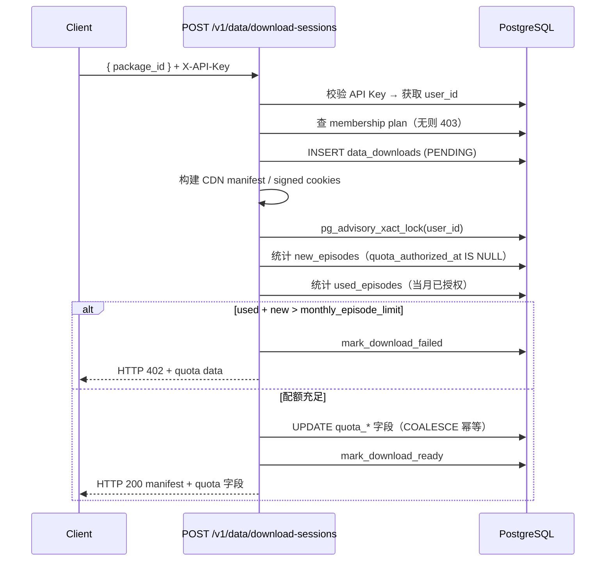
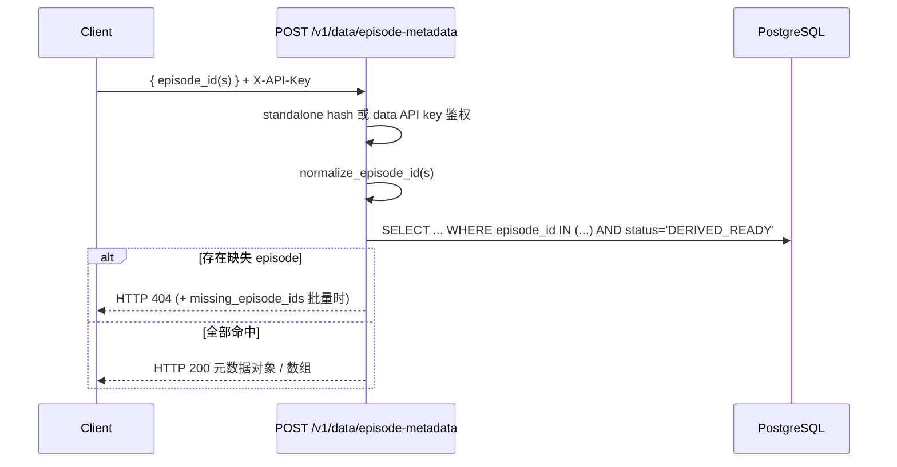

# Data API 配额（Quota）— 功能分析与测试文档

> **提交版本对照**
>
> | 标记 | 提交 | 说明 | 日期 |
> |------|------|------|------|
> | *(无标记)* | `ac5bc1c`（`added quota limit`） | 初版配额体系，download-sessions 路径 | 2026-05-15 |
> | <span style="color:#FF6D00">橙色文字</span> | `0e6b07e`（`fixing issue`） | Package 创建补齐配额 + API Key 数量上限 | 2026-05-19 |
> | <span style="color:#16A34A">绿色文字</span> | `78af2e4`（`added api for mcap size`） | Episode 元数据 API + 下载限额查询 + admin 无限 manifest | 2026-06-12 |

---

## 一、功能概述

**Data API 程序化下载** 引入了基于会员档位的**按月 episode 配额管控**，同时新增查询当前配额的接口。核心逻辑全部在 `app_prismax_data_pipeline/app.py`。

### 1.1 会员档位与配额

用户的下载档位存于 `users.user_data_download_membership`，配额详情从 `data_api_download_membership_plans` 读取（`status = 'ACTIVE'`）。该字段**与 TeleOp 的 `user_class`（Explorer / Amplifier / Innovator）完全独立**，需单独赋值。

当前环境配置（入库时间：2026-05-15T17:37:16Z）：

| 档位（`user_data_download_membership`） | 月 episode 上限 | 月费（USD） |
|-------------------------------------|---:|---:|
| **starter**                         | 100 | $9.00 |
| **pro**                             | 1,500 | $89.00 |
| **enterprise**                      | 18,000 | $899.00 |
| <span style="color:#16A34A">**admin**</span>                        | <span style="color:#16A34A">—（不走 plan 表配额）</span> | <span style="color:#16A34A">—</span> |

<span style="color:#16A34A">**`78af2e4` 补充**：`admin` 档位存于同一字段 `user_data_download_membership`，用于 manifest 批量下载无限文件数（`unlimited_manifest_download`），**不参与** `data_api_download_membership_plans` 的月 episode 配额计费。</span>

**计费规则**：
- 计费单位为 **episode**（非文件数）
- 账单月按 **UTC** 自然月（`YYYY-MM`）
- 同一 episode 在当月**首次**创建 Package 或下载会话时消耗 1 个配额；重复操作**不重复扣减**
- 用量统计涵盖：<span style="color:#FF6D00">Package 创建路径</span>（`quota_authorized_at IS NOT NULL`）+ API Key 下载路径（`quota_authorized_by_api_key_id` 关联）

### 1.2 新增 / 变更 API

| API | 方法 | 说明 | 鉴权 | 来源 |
|---|---|---|---|---|
| `/data/api-download-membership/current` | GET | 查询当前用户档位及月用量 | operator / admin Cookie | `ac5bc1c` |
| `/v1/data/download-sessions` | POST | 创建下载会话（新增配额校验） | API Key | `ac5bc1c` |
| `/data/api-packages` | POST | 创建 Package（重复 episode → 409） | operator / admin Cookie | `ac5bc1c` |
| <span style="color:#FF6D00">`/data/api-packages`</span> | <span style="color:#FF6D00">POST</span> | <span style="color:#FF6D00">**新增**：创建时校验月配额，写入 `quota_*`，201 含 `quota` 对象</span> | <span style="color:#FF6D00">operator / admin Cookie</span> | <span style="color:#FF6D00">`0e6b07e`</span> |
| <span style="color:#FF6D00">`/data/api-keys`</span> | <span style="color:#FF6D00">POST</span> | <span style="color:#FF6D00">**新增**：每用户最多 5 个 ACTIVE Key，超限 409</span> | <span style="color:#FF6D00">operator / admin Cookie</span> | <span style="color:#FF6D00">`0e6b07e`</span> |
| <span style="color:#16A34A">`/v1/data/episode-metadata`</span> | <span style="color:#16A34A">POST</span> | <span style="color:#16A34A">**新增**：查询 episode 时长、大小、机型、QA 分数（单条或批量）</span> | <span style="color:#16A34A">Standalone Key 或 Data API Key</span> | <span style="color:#16A34A">`78af2e4`</span> |
| <span style="color:#16A34A">`/data/downloads/limits`</span> | <span style="color:#16A34A">GET</span> | <span style="color:#16A34A">**新增**：查询用户下载档位及 manifest 文件数上限</span> | <span style="color:#16A34A">operator / admin Bearer Token</span> | <span style="color:#16A34A">`78af2e4`</span> |
| <span style="color:#16A34A">`/data/downloads/manifest`</span> | <span style="color:#16A34A">POST</span> | <span style="color:#16A34A">**变更**：`admin` 档位用户不受 `MANIFEST_DOWNLOAD_MAX_FILES`（默认 800）限制</span> | <span style="color:#16A34A">operator / admin Bearer Token</span> | <span style="color:#16A34A">`78af2e4`</span> |

### 1.3 HTTP 状态码

| 场景 | 接口 | 状态码 | 说明 | 来源 |
|---|---|---|---|---|
| 无 `user_data_download_membership` | 多个 | 403 | `data download membership is required` | `ac5bc1c` |
| 档位对应 plan 非 ACTIVE | 多个 | 403 | `data download membership plan is not active` | `ac5bc1c` |
| 月配额超限 | `POST /v1/data/download-sessions` | **402** | body 含完整 `data` 配额详情 | `ac5bc1c` |
| episode 已在该用户其他 package | `POST /data/api-packages` | 409 | `some selected episodes are already in an API package` | `ac5bc1c` |
| package / episode 无效 | 多个 | 400 | 通用参数错误 | — |
| <span style="color:#FF6D00">月配额超限</span> | <span style="color:#FF6D00">`POST /data/api-packages`</span> | <span style="color:#FF6D00">**402**</span> | <span style="color:#FF6D00">同 download-sessions，body 含完整配额 `data`</span> | <span style="color:#FF6D00">`0e6b07e`</span> |
| <span style="color:#FF6D00">无 membership / plan 无效</span> | <span style="color:#FF6D00">`POST /data/api-packages`</span> | <span style="color:#FF6D00">**403**</span> | <span style="color:#FF6D00">与 download-sessions 一致</span> | <span style="color:#FF6D00">`0e6b07e`</span> |
| <span style="color:#FF6D00">ACTIVE API Key 已达 5 个</span> | <span style="color:#FF6D00">`POST /data/api-keys`</span> | <span style="color:#FF6D00">**409**</span> | <span style="color:#FF6D00">`data.active_key_count` / `data.max_active_keys`</span> | <span style="color:#FF6D00">`0e6b07e`</span> |
| <span style="color:#16A34A">缺少 `X-API-Key`</span> | <span style="color:#16A34A">`POST /v1/data/episode-metadata`</span> | <span style="color:#16A34A">**401**</span> | <span style="color:#16A34A">`X-API-Key is required`</span> | <span style="color:#16A34A">`78af2e4`</span> |
| <span style="color:#16A34A">无效 API Key</span> | <span style="color:#16A34A">`POST /v1/data/episode-metadata`</span> | <span style="color:#16A34A">**401**</span> | <span style="color:#16A34A">`invalid API key`（非 standalone 且 data key 无效时）</span> | <span style="color:#16A34A">`78af2e4`</span> |
| <span style="color:#16A34A">请求体非法</span> | <span style="color:#16A34A">`POST /v1/data/episode-metadata`</span> | <span style="color:#16A34A">**400**</span> | <span style="color:#16A34A">JSON 缺失、`episode_id` / `episode_ids` 格式错误、批量超 200 条</span> | <span style="color:#16A34A">`78af2e4`</span> |
| <span style="color:#16A34A">episode 不存在或非 DERIVED_READY</span> | <span style="color:#16A34A">`POST /v1/data/episode-metadata`</span> | <span style="color:#16A34A">**404**</span> | <span style="color:#16A34A">单条：`episode not found`；批量：`missing_episode_ids` 列表</span> | <span style="color:#16A34A">`78af2e4`</span> |
| 服务端异常 | — | 500 | — | — |

### 1.4 402 响应结构（配额超限，两条路径一致）

```json
{
  "success": false,
  "msg": "Monthly data download quota exceeded: Pro allows 1,500 episodes per month. You have used 1,450; this package adds 100.",
  "data": {
    "membership": "Pro",
    "billing_month": "2026-05",
    "monthly_episode_limit": 1500,
    "monthly_price_usd": 89.0,
    "used_episodes": 1450,
    "new_episodes": 100,
    "projected_episodes": 1550,
    "remaining_episodes": 0
  }
}
```

---

## 二、技术实现

### 2.1 核心函数 / 常量

| 函数 / 常量 | 作用 | 来源 |
|---|---|---|
| `_get_data_api_billing_month()` | 返回 UTC 当前月字符串 `YYYY-MM` | `ac5bc1c` |
| `_get_data_api_download_membership_plan(conn, user_id)` | 从 `users` + `data_api_download_membership_plans` 读档位及配额 | `ac5bc1c` |
| `_get_data_api_monthly_episode_usage(conn, user_id, billing_month)` | 统计当月已授权 episode 数（含 Package 创建 + API Key 下载） | `ac5bc1c` |
| `DataApiQuotaError` | 异常类，携带 `data` 配额详情，触发 HTTP 402 | `ac5bc1c` |
| <span style="color:#FF6D00">`DATA_API_MAX_ACTIVE_KEYS_PER_USER = 5`</span> | <span style="color:#FF6D00">每用户最多 5 个 ACTIVE API Key</span> | <span style="color:#FF6D00">`0e6b07e`</span> |
| <span style="color:#FF6D00">`DATA_API_KEY_LIMIT_MESSAGE`</span> | <span style="color:#FF6D00">超限时的 409 提示文案</span> | <span style="color:#FF6D00">`0e6b07e`</span> |
| <span style="color:#16A34A">`MANIFEST_DOWNLOAD_MAX_FILES`</span> | <span style="color:#16A34A">manifest 批量下载默认文件数上限（env `DATA_MANIFEST_DOWNLOAD_MAX_FILES`，默认 800）；`admin` 档位为 `None`</span> | <span style="color:#16A34A">`78af2e4`</span> |
| <span style="color:#16A34A">`_get_user_data_download_membership(user_id)`</span> | <span style="color:#16A34A">从 `users` 表读取 `user_data_download_membership`</span> | <span style="color:#16A34A">`78af2e4`</span> |
| <span style="color:#16A34A">`_has_unlimited_manifest_membership(membership)`</span> | <span style="color:#16A34A">判断是否为 `admin` 档位（大小写不敏感），用于放开 manifest 文件数限制</span> | <span style="color:#16A34A">`78af2e4`</span> |
| <span style="color:#16A34A">`_require_episode_metadata_api_key()`</span> | <span style="color:#16A34A">双轨鉴权：standalone hash key 优先，否则走 `_require_data_api_key()`</span> | <span style="color:#16A34A">`78af2e4`</span> |
| <span style="color:#16A34A">`is_standalone_episode_metadata_api_key()`</span> | <span style="color:#16A34A">SHA256 hash + `hmac.compare_digest` 比对；支持 env `EPISODE_METADATA_API_KEY_HASHES`</span> | <span style="color:#16A34A">`78af2e4`</span> |
| <span style="color:#16A34A">`normalize_episode_id()` / `normalize_episode_ids()`</span> | <span style="color:#16A34A">校验正整数 episode ID；批量去重保序，上限 200</span> | <span style="color:#16A34A">`78af2e4`</span> |
| <span style="color:#16A34A">`build_episode_metadata_payload()`</span> | <span style="color:#16A34A">DB 行 → `{ length, size, embodiment, score }` 响应对象</span> | <span style="color:#16A34A">`78af2e4`</span> |

---

### <span style="color:#FF6D00">2.2 API Key 数量限制（`create_data_api_key`）</span>

> <span style="color:#FF6D00">**[0e6b07e 新增]** `POST /data/api-keys`，鉴权：operator / admin Cookie</span>

<span style="color:#FF6D00">**背景**：原实现无 Key 数量上限，用户可无限创建 ACTIVE Key。本次修复新增每用户最多 5 个限制。</span>

<span style="color:#FF6D00">新增模块级常量：</span>

```python
DATA_API_MAX_ACTIVE_KEYS_PER_USER = 5
DATA_API_KEY_LIMIT_MESSAGE = (
    "Each user may have up to five active API keys at a time. "
    "Please revoke an existing key before creating a new one."
)
```

<span style="color:#FF6D00">创建 Key 前，在同一数据库事务内执行：</span>

| <span style="color:#FF6D00">步骤</span> | <span style="color:#FF6D00">SQL / 逻辑</span> | <span style="color:#FF6D00">说明</span> |
|------|-----------|------|
| <span style="color:#FF6D00">1</span> | <span style="color:#FF6D00">`SELECT pg_advisory_xact_lock(:user_id)`</span> | <span style="color:#FF6D00">事务级行锁，防并发超限</span> |
| <span style="color:#FF6D00">2</span> | <span style="color:#FF6D00">`COUNT(*) WHERE status='ACTIVE' AND revoked_at IS NULL`</span> | <span style="color:#FF6D00">统计当前 ACTIVE Key 数</span> |
| <span style="color:#FF6D00">3</span> | <span style="color:#FF6D00">`active_key_count >= 5` → HTTP **409**</span> | <span style="color:#FF6D00">不插入，返回错误</span> |
| <span style="color:#FF6D00">4</span> | <span style="color:#FF6D00">否则 `INSERT INTO data_api_keys` → HTTP **201**</span> | <span style="color:#FF6D00">正常创建，返回 `api_key`（明文，仅此一次）</span> |

<span style="color:#FF6D00">**409 响应**：</span>

```json
{
  "success": false,
  "msg": "Each user may have up to five active API keys at a time. Please revoke an existing key before creating a new one.",
  "data": {
    "active_key_count": 5,
    "max_active_keys": 5
  }
}
```

---

### <span style="color:#FF6D00">2.3 Package 创建路径补齐配额（`create_data_api_package`）</span>

> <span style="color:#FF6D00">**[0e6b07e 新增]** `POST /data/api-packages`，鉴权：operator / admin Cookie</span>

<span style="color:#FF6D00">**背景**：`ac5bc1c` 仅在 `POST /v1/data/download-sessions` 做配额校验；`POST /data/api-packages` 未校验，用户可通过 UI 无限创建 Package 绕过月 episode 上限，且 `quota_authorized_at = NULL` 导致这些 episode 不被用量统计计入。</span>

<span style="color:#FF6D00">**修复**：在重复 episode 校验（409）之后、GCS 体积估算与 INSERT 之前插入配额逻辑：</span>

| <span style="color:#FF6D00">步骤</span> | <span style="color:#FF6D00">行为</span> | <span style="color:#FF6D00">失败时状态码</span> |
|------|------|------------|
| <span style="color:#FF6D00">1. 查档位</span> | <span style="color:#FF6D00">`_get_data_api_download_membership_plan(conn, user_id)`</span> | <span style="color:#FF6D00">无 membership → 403；plan 非 ACTIVE → 403</span> |
| <span style="color:#FF6D00">2. 加锁</span> | <span style="color:#FF6D00">`pg_advisory_xact_lock(user_id)`</span> | <span style="color:#FF6D00">—</span> |
| <span style="color:#FF6D00">3. 计算用量</span> | <span style="color:#FF6D00">`used = _get_data_api_monthly_episode_usage(conn, user_id, billing_month)`</span> | <span style="color:#FF6D00">—</span> |
| <span style="color:#FF6D00">4. 预估</span> | <span style="color:#FF6D00">`projected = used + len(rows)`</span> | <span style="color:#FF6D00">—</span> |
| <span style="color:#FF6D00">5. 校验</span> | <span style="color:#FF6D00">`projected > monthly_episode_limit`</span> | <span style="color:#FF6D00">→ 402（Package 和 episode 均不写入）</span> |
| <span style="color:#FF6D00">6. 写入</span> | <span style="color:#FF6D00">INSERT 时同步写 `quota_authorized_at=NOW(), quota_authorized_membership, quota_billing_month`</span> | <span style="color:#FF6D00">—</span> |
| <span style="color:#FF6D00">7. 响应</span> | <span style="color:#FF6D00">HTTP **201**，`data` 含 `quota` 对象</span> | <span style="color:#FF6D00">—</span> |

<span style="color:#FF6D00">**201 成功响应新增 `quota` 字段**：</span>

```json
{
  "success": true,
  "data": {
    "package_id": "...",
    "status": "ACTIVE",
    "episode_count": 10,
    "total_bytes_estimated": 123456,
    "quota": {
      "membership": "Pro",
      "billing_month": "2026-05",
      "monthly_episode_limit": 1500,
      "monthly_price_usd": 89.0,
      "used_episodes": 100,
      "new_episodes": 10,
      "projected_episodes": 110,
      "remaining_episodes": 1390
    },
    "created_at": "..."
  }
}
```

<span style="color:#FF6D00">**防重复扣减**：Package 创建时已写入 `quota_authorized_at`，后续 `download-sessions` 仅对 `quota_authorized_at IS NULL` 的 episode 计数，**不会二次扣减**。</span>

---

### 2.4 download-sessions 配额扣减流程（`ac5bc1c` 初版）

`POST /v1/data/download-sessions`，鉴权：API Key



> <span style="color:#FF6D00">**`0e6b07e` 影响**：通过 `POST /data/api-packages` 创建的 Package，其 episode 的 `quota_authorized_at` 在创建时已写入，download-sessions 调用时 `new_episodes = 0`，不重复扣配额。</span>

**关键设计决策**：
- `pg_advisory_xact_lock(user_id)`：用户级行锁，防止并发超卖
- `COALESCE(quota_authorized_at, NOW())`：写入幂等，重复会话不重复扣减
- 超限时 manifest/CDN 已构建完毕才报错，属于前置成本；download 记录标为 FAILED

配额公式：
```
projected = used_episodes + new_episodes
IF projected > monthly_episode_limit → 拒绝（402）
```

---

### 2.5 数据库依赖

`ac5bc1c` 未包含 DDL migration，以下字段需提前上线：

| 表 | 新增字段 |
|---|---|
| `users` | `user_data_download_membership` |
| `data_api_download_membership_plans` | 新表（含 `user_data_download_membership`, `monthly_episode_limit`, `monthly_price_usd`, `status`, `display_order`） |
| `data_api_package_episodes` | `user_id`, `quota_authorized_at`, `quota_authorized_by_api_key_id`, `quota_authorized_download_id`, `quota_authorized_membership`, `quota_billing_month` |

---

### <span style="color:#16A34A">2.6 Episode 元数据 API（`get_data_api_episode_metadata`）</span>

> <span style="color:#16A34A">**[78af2e4 新增]** `POST /v1/data/episode-metadata`，鉴权：Standalone Key 或 Data API Key</span>

<span style="color:#16A34A">**背景**：在正式创建 manifest / 下载会话之前，外部系统需要轻量查询 episode 的时长、文件大小、机型（embodiment）、QA 分数，用于带宽预估、配额规划或 UI 展示。commit message 为 "mcap size"，但实现中 `size` 取自 `video_size_bytes`，**不含** `mcap_size_bytes`（完整下载体积 = mcap + video，见 §5.4）。</span>

<span style="color:#16A34A">**鉴权双轨**（`_require_episode_metadata_api_key`）：</span>

| <span style="color:#16A34A">路径</span> | <span style="color:#16A34A">条件</span> | <span style="color:#16A34A">行为</span> |
|------|------|------|
| <span style="color:#16A34A">Standalone Key</span> | <span style="color:#16A34A">`hash_api_key(raw_key)` 命中 `EPISODE_METADATA_API_KEY_HASHES` 或 env 配置</span> | <span style="color:#16A34A">直接放行，不查 `data_api_keys` 表</span> |
| <span style="color:#16A34A">Data API Key</span> | <span style="color:#16A34A">standalone 未命中</span> | <span style="color:#16A34A">走 `_require_data_api_key()`，需 ACTIVE 且未撤销</span> |

<span style="color:#16A34A">**请求格式**（二选一）：</span>

```json
// 单条
{ "episode_id": 123 }

// 批量（最多 200，去重保序）
{ "episode_ids": [3, "1", 3, 2] }
```

<span style="color:#16A34A">**数据查询条件**：</span>

- 仅返回 `data_episodes.status = 'DERIVED_READY'` 的 episode
- JOIN `data_uploads` → `data_machines`，取 `product_name` 作为 `embodiment`
- LATERAL 子查询 `data_qa_sessions` 最新记录，分数优先 `review_result.upload_score`，否则 `qa_score`

<span style="color:#16A34A">**响应结构**（`build_episode_metadata_payload`）：</span>

```json
// 单条 — HTTP 200
{
  "length": 90.0,
  "size": 987654,
  "embodiment": "YAM",
  "score": 92
}

// 批量 — HTTP 200，数组
[
  {
    "episode_id": 3,
    "length": 90.0,
    "size": 987654,
    "embodiment": "YAM",
    "score": 92
  }
]
```

| <span style="color:#16A34A">字段</span> | <span style="color:#16A34A">来源</span> | <span style="color:#16A34A">说明</span> |
|------|------|------|
| <span style="color:#16A34A">`length`</span> | <span style="color:#16A34A">`video_duration_hours × 3600`</span> | <span style="color:#16A34A">秒，保留 3 位小数；无时长则为 `null`</span> |
| <span style="color:#16A34A">`size`</span> | <span style="color:#16A34A">`video_size_bytes`</span> | <span style="color:#16A34A">视频文件字节数；**不含 mcap**；无数据则为 `null`</span> |
| <span style="color:#16A34A">`embodiment`</span> | <span style="color:#16A34A">`data_machines.product_name`</span> | <span style="color:#16A34A">机器人机型名称</span> |
| <span style="color:#16A34A">`score`</span> | <span style="color:#16A34A">最新 QA session</span> | <span style="color:#16A34A">质量分数；无 QA 则为 `null`</span> |



---

### <span style="color:#16A34A">2.7 下载限额查询与 admin 无限 manifest（`78af2e4`）</span>

> <span style="color:#16A34A">**[78af2e4 新增/变更]** `GET /data/downloads/limits` + `POST /data/downloads/manifest` admin 豁免</span>

<span style="color:#16A34A">**`GET /data/downloads/limits`**（鉴权：`_require_robotic_data_user()`，Bearer Token）：</span>

```json
{
  "success": true,
  "data": {
    "membership": "pro",
    "manifest_max_files": 800,
    "unlimited_manifest_download": false
  }
}
```

| <span style="color:#16A34A">字段</span> | <span style="color:#16A34A">逻辑</span> |
|------|------|
| <span style="color:#16A34A">`membership`</span> | <span style="color:#16A34A">`users.user_data_download_membership`（与 Data API 配额档位同源字段）</span> |
| <span style="color:#16A34A">`manifest_max_files`</span> | <span style="color:#16A34A">非 admin → `MANIFEST_DOWNLOAD_MAX_FILES`（默认 800）；admin → `null`</span> |
| <span style="color:#16A34A">`unlimited_manifest_download`</span> | <span style="color:#16A34A">`membership == 'admin'`（大小写不敏感）时为 `true`</span> |

<span style="color:#16A34A">前端 `RoboticDataWorkspace.js` 已对接该接口，用于加载用户下载档位展示。</span>

<span style="color:#16A34A">**`POST /data/downloads/manifest` 变更**：创建 manifest 前读取用户 membership，`admin` 档位传 `max_files=None` 给 `_prepare_download_payload()`，绕过默认 800 文件上限；非 admin 行为不变。</span>

<span style="color:#16A34A">**与 Data API 配额的关系**：上述两条路径均**不计入**月 episode 配额（见 §5.1），仅控制 manifest 文件数上限。</span>

---

## 三、测试策略

### 3.1 测试范围

| 优先级 | 模块 | 测试类型 | 来源 |
|--------|------|----------|------|
| P0 | 配额超限 — download-sessions（402） | E2E + API | `ac5bc1c` |
| P0 | 无会员/计划无效（403） | API | `ac5bc1c` |
| P0 | 首次下载扣配额 + quota 字段写入 | E2E + DB 验证 | `ac5bc1c` |
| P1 | 重复 episode 不重复扣配额 | API + DB 验证 | `ac5bc1c` |
| P1 | 查询接口 /membership/current | API | `ac5bc1c` |
| P1 | 创建 Package 重复 episode 409 | API | `ac5bc1c` |
| P2 | 并发防超卖（download-sessions） | 并发测试 | `ac5bc1c` |
| P2 | UTC 月份切换边界 | API（Mock 时间） | `ac5bc1c` |
| P2 | SDK 层 402 错误处理 | SDK 集成 | `ac5bc1c` |
| P0 | API Key 数量上限（409） | API | `0e6b07e` |
| P0 | Package 创建配额校验（402 / 403） | API + DB 验证 | `0e6b07e` |
| P0 | Package 创建写入 quota_* 字段 | DB 验证 | `0e6b07e` |
| P1 | Package 后 download-session 不重复扣 | E2E | `0e6b07e` |
| P2 | 并发创建 Key 不超限 | 并发测试 | `0e6b07e` |
| P2 | 并发创建 Package 不超卖配额 | 并发测试 | `0e6b07e` |
| <span style="color:#16A34A">P0</span> | <span style="color:#16A34A">Episode 元数据 — 单条/批量正常返回</span> | <span style="color:#16A34A">API</span> | <span style="color:#16A34A">`78af2e4`</span> |
| <span style="color:#16A34A">P0</span> | <span style="color:#16A34A">Episode 元数据 — 鉴权（standalone / data key）</span> | <span style="color:#16A34A">API</span> | <span style="color:#16A34A">`78af2e4`</span> |
| <span style="color:#16A34A">P0</span> | <span style="color:#16A34A">Episode 元数据 — 404 / 400 边界</span> | <span style="color:#16A34A">API</span> | <span style="color:#16A34A">`78af2e4`</span> |
| <span style="color:#16A34A">P1</span> | <span style="color:#16A34A">`GET /data/downloads/limits` 各档位返回</span> | <span style="color:#16A34A">API</span> | <span style="color:#16A34A">`78af2e4`</span> |
| <span style="color:#16A34A">P1</span> | <span style="color:#16A34A">admin manifest 下载不受 800 文件限制</span> | <span style="color:#16A34A">API + E2E</span> | <span style="color:#16A34A">`78af2e4`</span> |
| <span style="color:#16A34A">P2</span> | <span style="color:#16A34A">`size` 与 DB `video_size_bytes` 一致性</span> | <span style="color:#16A34A">API + DB 验证</span> | <span style="color:#16A34A">`78af2e4`</span> |
| <span style="color:#16A34A">P2</span> | <span style="color:#16A34A">helper 单元测试（`test_data_api_helper.py`）</span> | <span style="color:#16A34A">单元测试</span> | <span style="color:#16A34A">`78af2e4`</span> |

### 3.2 测试前置条件

| 项 | 要求 |
|---|---|
| DB schema | `data_api_download_membership_plans` 表已创建；`data_api_package_episodes` 新列已迁移 |
| 测试账号 | 至少准备 Starter / Pro / Enterprise 三种档位各一个 operator 账号 |
| API Key | 每个测试账号有已激活的 Data API Key |
| Package | 每个账号有若干包含可下载 episode 的 ACTIVE package |
| 环境 | Beta / Staging 环境，CDN 已配置 |
| <span style="color:#16A34A">Episode 样本</span> | <span style="color:#16A34A">至少 1 个 `DERIVED_READY` episode（含 `video_size_bytes`、`video_duration_hours`、关联 machine）</span> |
| <span style="color:#16A34A">Standalone Key</span> | <span style="color:#16A34A">配置 `EPISODE_METADATA_API_KEY_HASHES` 或使用内置 hash 对应明文 Key</span> |
| <span style="color:#16A34A">admin 账号</span> | <span style="color:#16A34A">`user_data_download_membership = 'admin'`，用于 manifest 无限下载测试</span> |

---

## 四、E2E 测试用例

### 模块 A：GET /data/api-download-membership/current

| ID | 用例名称 | 前置条件 | 操作步骤 | 预期结果 | 优先级 |
|---|---|---|---|---|---|
| A-01 | 正常查询 Starter 档位 | 用户 `user_data_download_membership = 'Starter'`，当月已下载 10 个 episode | 以 operator 身份调用 `GET /data/api-download-membership/current` | HTTP 200；`membership=Starter`，`monthly_episode_limit=100`，`used_episodes=10`，`remaining_episodes=90`，`monthly_price_usd=9.0` | P1 |
| A-02 | 查询 Pro 档位零用量 | 用户为 Pro，当月无下载记录 | 调用接口 | `used_episodes=0`，`remaining_episodes=1500` | P1 |
| A-03 | 无 membership 字段 | `users.user_data_download_membership` 为 NULL 或空字符串 | 调用接口 | HTTP 403，`msg: "data download membership is required"` | P0 |
| A-04 | 档位存在但 plan INACTIVE | `user_data_download_membership = 'Starter'`，但 plans 表该行 `status = 'INACTIVE'` | 调用接口 | HTTP 403，`msg: "data download membership plan is not active"` | P1 |
| A-05 | 非 operator/admin 角色 | Explorer 或普通用户 | 调用接口 | HTTP 403（鉴权失败） | P1 |
| A-06 | `used_episodes` 含 API Key 下载记录 | 用户本月通过 API Key 下载了 5 个 episode | 调用接口 | `used_episodes` 包含这 5 个（通过 `quota_authorized_by_api_key_id` 关联） | P1 |

---

### <span style="color:#FF6D00">模块 B：POST /data/api-keys — API Key 数量限制</span>

> <span style="color:#FF6D00">**[0e6b07e 新增]** 每用户最多 5 个 ACTIVE Key，超限返回 409。</span>

| <span style="color:#FF6D00">ID</span> | <span style="color:#FF6D00">用例名称</span> | <span style="color:#FF6D00">前置条件</span> | <span style="color:#FF6D00">操作步骤</span> | <span style="color:#FF6D00">预期结果</span> | <span style="color:#FF6D00">优先级</span> |
|---|---|---|---|---|---|
| <span style="color:#FF6D00">B-01</span> | <span style="color:#FF6D00">正常创建首个 Key</span> | <span style="color:#FF6D00">用户当前无 ACTIVE Key</span> | <span style="color:#FF6D00">`POST /data/api-keys`</span> | <span style="color:#FF6D00">HTTP 201；返回 `api_key_id`、`key_prefix`、`api_key`（明文，仅此一次）、`status=ACTIVE`</span> | <span style="color:#FF6D00">P1</span> |
| <span style="color:#FF6D00">B-02</span> | <span style="color:#FF6D00">已有 4 个 Key，创建第 5 个</span> | <span style="color:#FF6D00">用户有 4 个 ACTIVE Key</span> | <span style="color:#FF6D00">`POST /data/api-keys`</span> | <span style="color:#FF6D00">HTTP 201；DB 中 ACTIVE Key 变为 5 个</span> | <span style="color:#FF6D00">P1</span> |
| <span style="color:#FF6D00">B-03</span> | <span style="color:#FF6D00">已有 5 个 Key，创建第 6 个</span> | <span style="color:#FF6D00">用户有 5 个 ACTIVE Key</span> | <span style="color:#FF6D00">`POST /data/api-keys`</span> | <span style="color:#FF6D00">HTTP 409；`msg` 含 "five active API keys"；`data.active_key_count=5`，`data.max_active_keys=5`</span> | <span style="color:#FF6D00">P0</span> |
| <span style="color:#FF6D00">B-04</span> | <span style="color:#FF6D00">撤销 1 个后可再创建</span> | <span style="color:#FF6D00">用户有 5 个 ACTIVE Key</span> | <span style="color:#FF6D00">1. `DELETE /data/api-keys/{id}` 撤销一个；2. `POST /data/api-keys`</span> | <span style="color:#FF6D00">步骤 2 返回 HTTP 201；DB ACTIVE Key 为 5 个</span> | <span style="color:#FF6D00">P0</span> |
| <span style="color:#FF6D00">B-05</span> | <span style="color:#FF6D00">REVOKED Key 不计入上限</span> | <span style="color:#FF6D00">用户有 3 个 ACTIVE + 2 个 REVOKED Key</span> | <span style="color:#FF6D00">`POST /data/api-keys`</span> | <span style="color:#FF6D00">HTTP 201；仅统计 `status='ACTIVE' AND revoked_at IS NULL`</span> | <span style="color:#FF6D00">P1</span> |
| <span style="color:#FF6D00">B-06</span> | <span style="color:#FF6D00">并发创建（same user，边界值）</span> | <span style="color:#FF6D00">用户有 4 个 ACTIVE Key</span> | <span style="color:#FF6D00">同时发起 2 个 `POST /data/api-keys`</span> | <span style="color:#FF6D00">恰好 1 个 201、1 个 409；DB 中最终 5 个 ACTIVE Key，不超出</span> | <span style="color:#FF6D00">P2</span> |

---

### <span style="color:#FF6D00">模块 C：POST /data/api-packages — 配额校验</span>

> <span style="color:#FF6D00">**[0e6b07e 新增]** Package 创建时校验月 episode 配额，超限 402，成功时写入 `quota_*` 并在 201 响应中返回 `quota` 对象。</span>

| <span style="color:#FF6D00">ID</span> | <span style="color:#FF6D00">用例名称</span> | <span style="color:#FF6D00">前置条件</span> | <span style="color:#FF6D00">操作步骤</span> | <span style="color:#FF6D00">预期结果</span> | <span style="color:#FF6D00">优先级</span> |
|---|---|---|---|---|---|
| <span style="color:#FF6D00">C-01</span> | <span style="color:#FF6D00">创建 Package，配额充足</span> | <span style="color:#FF6D00">Pro 用户，当月 used=100，选 10 个新 episode</span> | <span style="color:#FF6D00">`POST /data/api-packages`</span> | <span style="color:#FF6D00">HTTP 201；`data.quota.used_episodes=100`，`data.quota.new_episodes=10`，`data.quota.projected_episodes=110`，`data.quota.remaining_episodes=1390`</span> | <span style="color:#FF6D00">P0</span> |
| <span style="color:#FF6D00">C-02</span> | <span style="color:#FF6D00">201 响应 `quota` 字段完整</span> | <span style="color:#FF6D00">同 C-01</span> | <span style="color:#FF6D00">同 C-01</span> | <span style="color:#FF6D00">`data.quota` 含：`membership`, `billing_month`, `monthly_episode_limit`, `monthly_price_usd`, `used_episodes`, `new_episodes`, `projected_episodes`, `remaining_episodes` 全部字段</span> | <span style="color:#FF6D00">P0</span> |
| <span style="color:#FF6D00">C-03</span> | <span style="color:#FF6D00">DB 写入 `quota_authorized_at`</span> | <span style="color:#FF6D00">同 C-01</span> | <span style="color:#FF6D00">查询 `data_api_package_episodes`</span> | <span style="color:#FF6D00">所有新增 episode 行：`quota_authorized_at IS NOT NULL`，`quota_authorized_membership='Pro'`，`quota_billing_month='2026-05'`</span> | <span style="color:#FF6D00">P0</span> |
| <span style="color:#FF6D00">C-04</span> | <span style="color:#FF6D00">精确达到上限（Starter used=99，新增 1）</span> | <span style="color:#FF6D00">Starter 用户，used=99</span> | <span style="color:#FF6D00">`POST /data/api-packages`，1 个 episode</span> | <span style="color:#FF6D00">HTTP 201；`projected_episodes=100`，`remaining_episodes=0`</span> | <span style="color:#FF6D00">P0</span> |
| <span style="color:#FF6D00">C-05</span> | <span style="color:#FF6D00">刚好超出上限（Starter used=100，新增 1）</span> | <span style="color:#FF6D00">Starter 用户，used=100</span> | <span style="color:#FF6D00">`POST /data/api-packages`，1 个 episode</span> | <span style="color:#FF6D00">HTTP 402；`data.remaining_episodes=0`</span> | <span style="color:#FF6D00">P0</span> |
| <span style="color:#FF6D00">C-06</span> | <span style="color:#FF6D00">超限时 Package 和 episode 均未写入</span> | <span style="color:#FF6D00">同 C-05</span> | <span style="color:#FF6D00">查询 `data_api_packages` 与 `data_api_package_episodes`</span> | <span style="color:#FF6D00">DB 中无新增行，事务完整回滚</span> | <span style="color:#FF6D00">P0</span> |
| <span style="color:#FF6D00">C-07</span> | <span style="color:#FF6D00">无 membership</span> | <span style="color:#FF6D00">`user_data_download_membership` 为 NULL</span> | <span style="color:#FF6D00">`POST /data/api-packages`</span> | <span style="color:#FF6D00">HTTP 403，`msg: "data download membership is required"`</span> | <span style="color:#FF6D00">P0</span> |
| <span style="color:#FF6D00">C-08</span> | <span style="color:#FF6D00">plan INACTIVE</span> | <span style="color:#FF6D00">membership 存在但 plan `status='INACTIVE'`</span> | <span style="color:#FF6D00">`POST /data/api-packages`</span> | <span style="color:#FF6D00">HTTP 403，`msg: "data download membership plan is not active"`</span> | <span style="color:#FF6D00">P1</span> |
| <span style="color:#FF6D00">C-09</span> | <span style="color:#FF6D00">Package 创建后 download-session 不重复扣配额</span> | <span style="color:#FF6D00">C-01 成功后，剩余配额充足</span> | <span style="color:#FF6D00">用 API Key 调用 `POST /v1/data/download-sessions`，传同一 `package_id`</span> | <span style="color:#FF6D00">HTTP 200；`new_episodes=0`（所有 episode 已有 `quota_authorized_at`）；`used_episodes` 不变</span> | <span style="color:#FF6D00">P1</span> |
| <span style="color:#FF6D00">C-10</span> | <span style="color:#FF6D00">并发创建 Package（Starter 配额只够 1 个）</span> | <span style="color:#FF6D00">Starter used=95，两个请求各含 5 个新 episode</span> | <span style="color:#FF6D00">同时发起 2 个 `POST /data/api-packages`</span> | <span style="color:#FF6D00">1 个 201，1 个 402；DB 中最终 `used_episodes` ≤ 100，不超卖</span> | <span style="color:#FF6D00">P2</span> |

---

### 模块 D：POST /data/api-packages — 重复 episode 校验

| ID | 用例名称 | 前置条件 | 操作步骤 | 预期结果 | 优先级 |
|---|---|---|---|---|---|
| D-01 | 包含已有 Package 中的 episode | 用户已有 package_A，含 episode_id=[100, 101] | 创建新 package，选中 [101, 102] | HTTP 409；`episode_ids=[101]`；新 package 未创建 | P1 |
| D-02 | 所有 episode 均为新 | 用户无历史 package | 正常创建 | HTTP 201 | P1 |
| D-03 | 不同用户的 package 含相同 episode | user_A 和 user_B 各自建 package，含同一 episode_id | 两用户分别创建 | 均成功（409 仅按 user_id 去重）；两用户各自计配额 | P2 |

---

### 模块 E：POST /v1/data/download-sessions — 正常下载与配额扣减

| ID | 用例名称 | 前置条件 | 操作步骤 | 预期结果 | 优先级 |
|---|---|---|---|---|---|
| E-01 | 首次创建下载会话，配额足够 | Starter 用户，当月 used=0，package 含 5 个未授权 episode | 用 API Key 调用 `POST /v1/data/download-sessions` | HTTP 200；`new_episodes=5`，`remaining_episodes=95`；DB 中 5 条 episode 的 `quota_authorized_at` 已写入 | P0 |
| E-02 | manifest 中 quota 字段完整 | 同 E-01 | 同 E-01 | 响应 `data.quota` 含：`membership`, `billing_month`, `monthly_episode_limit`, `monthly_price_usd`, `used_episodes`, `new_episodes`, `projected_episodes`, `remaining_episodes` | P0 |
| E-03 | 重复对同一 package 创建会话（已授权） | E-01 完成后 | 再次调用同一 `package_id` | HTTP 200；`new_episodes=0`；`used_episodes` 不变；DB `quota_*` 字段无变化 | P1 |
| <span style="color:#FF6D00">E-04</span> | <span style="color:#FF6D00">Package 由 api-packages 创建后调用 download-session</span> | <span style="color:#FF6D00">用 Cookie 通过 `POST /data/api-packages` 创建 package（episode 已有 `quota_authorized_at`）</span> | <span style="color:#FF6D00">用 API Key 调用 `POST /v1/data/download-sessions`</span> | <span style="color:#FF6D00">HTTP 200；`new_episodes=0`；`used_episodes` 无变化（Package 创建时已扣减）</span> | <span style="color:#FF6D00">P1</span> |

---

### 模块 F：POST /v1/data/download-sessions — 配额超限

| ID | 用例名称 | 前置条件 | 操作步骤 | 预期结果 | 优先级 |
|---|---|---|---|---|---|
| F-01 | Starter 超限（used=95，含 10 个未授权 episode） | Starter 用户，当月已授权 95 个 | 创建下载会话 | HTTP 402；`data.used_episodes=95`，`data.new_episodes=10`，`data.projected_episodes=105`，`data.remaining_episodes=0`；download 记录 `status=FAILED` | P0 |
| F-02 | 精确达到上限（used=99，1 个未授权 episode） | used=99 | 创建下载会话 | HTTP 200；`projected_episodes=100`，`remaining_episodes=0` | P0 |
| F-03 | 刚好超出（used=100，1 个未授权 episode） | used=100 | 创建下载会话 | HTTP 402 | P0 |
| F-04 | Pro 超限边界（used=1499，2 个新 episode） | Pro 用户 | 创建下载会话 | HTTP 402；`data.monthly_episode_limit=1500` | P1 |
| F-05 | Enterprise 正常大 package（used=0，500 个 episode） | Enterprise 用户 | 创建下载会话 | HTTP 200；`new_episodes=500`，`remaining_episodes=17500` | P1 |
| F-06 | 超限时 download 记录为 FAILED | 同 F-01 | 查询 `data_downloads` 表 | 对应 download `status = 'FAILED'`，`error_message` 含配额信息 | P0 |
| F-07 | 超限时未授权 episode 的 `quota_authorized_at` 不写入 | 同 F-01 | 查询 `data_api_package_episodes` | 超限 episode 的 `quota_authorized_at` 仍为 NULL | P1 |

---

### 模块 G：并发与一致性

| ID | 用例名称 | 前置条件 | 操作步骤 | 预期结果 | 优先级 |
|---|---|---|---|---|---|
| G-01 | 并发发起 2 个 download-sessions，配额只够 1 个 | Starter used=95，两个 package 各含 5 个未授权 episode | 同时发起 2 个 `POST /v1/data/download-sessions` | 1 个 200，1 个 402；DB 中 used ≤ 100 | P2 |
| G-02 | 同一 package 并发下载两次（配额充足） | 配额充足，package 有未授权 episode | 同时发起 2 次相同 `package_id` 的会话 | 两次均 200；配额只扣一次（COALESCE 幂等） | P2 |
| <span style="color:#FF6D00">G-03</span> | <span style="color:#FF6D00">并发创建 API Key（同一用户，边界值）</span> | <span style="color:#FF6D00">用户有 4 个 ACTIVE Key</span> | <span style="color:#FF6D00">同时发起 2 个 `POST /data/api-keys`</span> | <span style="color:#FF6D00">1 个 201，1 个 409；DB 最终 5 个 ACTIVE Key</span> | <span style="color:#FF6D00">P2</span> |
| <span style="color:#FF6D00">G-04</span> | <span style="color:#FF6D00">并发创建 Package（Starter，配额边界）</span> | <span style="color:#FF6D00">Starter used=95，两请求各含 5 个 episode</span> | <span style="color:#FF6D00">同时发起 2 个 `POST /data/api-packages`</span> | <span style="color:#FF6D00">1 个 201，1 个 402；DB 中 used ≤ 100，不超卖</span> | <span style="color:#FF6D00">P2</span> |

---

### 模块 H：账单月边界

| ID | 用例名称 | 前置条件 | 操作步骤 | 预期结果 | 优先级 |
|---|---|---|---|---|---|
| H-01 | 上月授权的 episode 不计入本月配额 | 5 个 episode 的 `quota_billing_month = '2026-04'` | 在 2026-05 查询 `GET /data/api-download-membership/current` | `used_episodes` 不含上月授权的 5 个 | P2 |
| H-02 | 月初首次下载 | Starter 用户，上月已用满 100，新的 UTC 月份开始 | 新月首次创建下载会话 | HTTP 200，`used_episodes=0`（新月从零计） | P2 |

---

### 模块 I：SDK 集成（prismax-cli / prismax-python）

| ID | 用例名称 | 操作步骤 | 预期结果 | 优先级 |
|---|---|---|---|---|
| I-01 | SDK 下载触发 402 时的错误提示 | CLI：`prismax-cli download <package_id>`，账号配额已耗尽 | 报错含可读信息（如 "Monthly data download quota exceeded"），不抛裸 HTTP 错误 | P1 |
| I-02 | SDK 下载成功后 quota 字段可访问 | 配额充足时正常下载 | manifest 对象中可读取 `quota.remaining_episodes` 等字段 | P2 |

---

### <span style="color:#16A34A">模块 J：POST /v1/data/episode-metadata — Episode 元数据</span>

> <span style="color:#16A34A">**[78af2e4 新增]** 查询 episode 时长、大小、机型、QA 分数；仅 `DERIVED_READY` episode 可返回。</span>

| <span style="color:#16A34A">ID</span> | <span style="color:#16A34A">用例名称</span> | <span style="color:#16A34A">前置条件</span> | <span style="color:#16A34A">操作步骤</span> | <span style="color:#16A34A">预期结果</span> | <span style="color:#16A34A">优先级</span> |
|---|---|---|---|---|---|
| <span style="color:#16A34A">J-01</span> | <span style="color:#16A34A">单条查询 — Data API Key</span> | <span style="color:#16A34A">episode_id=123，`DERIVED_READY`，有 video/QA 数据</span> | <span style="color:#16A34A">`POST /v1/data/episode-metadata`，body `{"episode_id": 123}`，Header `X-API-Key`</span> | <span style="color:#16A34A">HTTP 200；含 `length`、`size`、`embodiment`、`score`；`length = video_duration_hours × 3600`</span> | <span style="color:#16A34A">P0</span> |
| <span style="color:#16A34A">J-02</span> | <span style="color:#16A34A">单条查询 — Standalone Key</span> | <span style="color:#16A34A">env 已配置对应 hash 的 standalone key</span> | <span style="color:#16A34A">同 J-01，使用 standalone key</span> | <span style="color:#16A34A">HTTP 200；无需 `data_api_keys` 表记录</span> | <span style="color:#16A34A">P0</span> |
| <span style="color:#16A34A">J-03</span> | <span style="color:#16A34A">批量查询 — 去重保序</span> | <span style="color:#16A34A">episode 3、1、2 均为 `DERIVED_READY`</span> | <span style="color:#16A34A">body `{"episode_ids": [3, "1", 3, 2]}`</span> | <span style="color:#16A34A">HTTP 200；数组顺序为 [3, 1, 2]；每项含 `episode_id` + 元数据字段</span> | <span style="color:#16A34A">P0</span> |
| <span style="color:#16A34A">J-04</span> | <span style="color:#16A34A">`size` 映射 `video_size_bytes`</span> | <span style="color:#16A34A">DB 中 `video_size_bytes=987654`，`mcap_size_bytes` 不同</span> | <span style="color:#16A34A">单条查询</span> | <span style="color:#16A34A">`size=987654`（仅 video，不含 mcap）</span> | <span style="color:#16A34A">P2</span> |
| <span style="color:#16A34A">J-05</span> | <span style="color:#16A34A">缺少 API Key</span> | <span style="color:#16A34A">—</span> | <span style="color:#16A34A">不传 `X-API-Key`</span> | <span style="color:#16A34A">HTTP 401，`msg: "X-API-Key is required"`</span> | <span style="color:#16A34A">P0</span> |
| <span style="color:#16A34A">J-06</span> | <span style="color:#16A34A">无效 API Key</span> | <span style="color:#16A34A">—</span> | <span style="color:#16A34A">传错误 key（非 standalone 且非 ACTIVE data key）</span> | <span style="color:#16A34A">HTTP 401，`msg: "invalid API key"`</span> | <span style="color:#16A34A">P0</span> |
| <span style="color:#16A34A">J-07</span> | <span style="color:#16A34A">非法 `episode_id`</span> | <span style="color:#16A34A">—</span> | <span style="color:#16A34A">传 `0`、`-1`、`"abc"`、`null`</span> | <span style="color:#16A34A">HTTP 400，msg 含 `positive integer`</span> | <span style="color:#16A34A">P0</span> |
| <span style="color:#16A34A">J-08</span> | <span style="color:#16A34A">批量超 200 条</span> | <span style="color:#16A34A">—</span> | <span style="color:#16A34A">`episode_ids` 含 201 个 ID</span> | <span style="color:#16A34A">HTTP 400，`limited to 200`</span> | <span style="color:#16A34A">P1</span> |
| <span style="color:#16A34A">J-09</span> | <span style="color:#16A34A">单条 — episode 不存在</span> | <span style="color:#16A34A">episode_id 不在 DB 或非 `DERIVED_READY`</span> | <span style="color:#16A34A">`{"episode_id": 999999}`</span> | <span style="color:#16A34A">HTTP 404，`msg: "episode not found"`</span> | <span style="color:#16A34A">P0</span> |
| <span style="color:#16A34A">J-10</span> | <span style="color:#16A34A">批量 — 部分缺失</span> | <span style="color:#16A34A">[1, 2] 中 2 不存在或非 READY</span> | <span style="color:#16A34A">`{"episode_ids": [1, 2]}`</span> | <span style="color:#16A34A">HTTP 404；`missing_episode_ids` 含缺失 ID</span> | <span style="color:#16A34A">P0</span> |
| <span style="color:#16A34A">J-11</span> | <span style="color:#16A34A">无 JSON body</span> | <span style="color:#16A34A">—</span> | <span style="color:#16A34A">空 body 或非 JSON</span> | <span style="color:#16A34A">HTTP 400，`JSON request body is required`</span> | <span style="color:#16A34A">P1</span> |
| <span style="color:#16A34A">J-12</span> | <span style="color:#16A34A">QA 分数 — 优先 upload_score</span> | <span style="color:#16A34A">最新 QA `review_result.upload_score='95'`，`qa_score=80`</span> | <span style="color:#16A34A">单条查询</span> | <span style="color:#16A34A">`score=95`</span> | <span style="color:#16A34A">P1</span> |

---

### <span style="color:#16A34A">模块 K：GET /data/downloads/limits — 下载限额查询</span>

> <span style="color:#16A34A">**[78af2e4 新增]** UI 侧查询 manifest 文件数上限及 admin 无限下载标识。</span>

| <span style="color:#16A34A">ID</span> | <span style="color:#16A34A">用例名称</span> | <span style="color:#16A34A">前置条件</span> | <span style="color:#16A34A">操作步骤</span> | <span style="color:#16A34A">预期结果</span> | <span style="color:#16A34A">优先级</span> |
|---|---|---|---|---|---|
| <span style="color:#16A34A">K-01</span> | <span style="color:#16A34A">Pro 用户查询限额</span> | <span style="color:#16A34A">`user_data_download_membership='pro'`</span> | <span style="color:#16A34A">`GET /data/downloads/limits`，Bearer Token</span> | <span style="color:#16A34A">HTTP 200；`membership='pro'`，`manifest_max_files=800`，`unlimited_manifest_download=false`</span> | <span style="color:#16A34A">P1</span> |
| <span style="color:#16A34A">K-02</span> | <span style="color:#16A34A">admin 用户无限 manifest</span> | <span style="color:#16A34A">`user_data_download_membership='admin'`</span> | <span style="color:#16A34A">同 K-01</span> | <span style="color:#16A34A">`manifest_max_files=null`，`unlimited_manifest_download=true`</span> | <span style="color:#16A34A">P1</span> |
| <span style="color:#16A34A">K-03</span> | <span style="color:#16A34A">membership 大小写不敏感</span> | <span style="color:#16A34A">DB 存 `Admin` 或 `ADMIN`</span> | <span style="color:#16A34A">同 K-01</span> | <span style="color:#16A34A">`unlimited_manifest_download=true`</span> | <span style="color:#16A34A">P2</span> |
| <span style="color:#16A34A">K-04</span> | <span style="color:#16A34A">未登录 / 无权限</span> | <span style="color:#16A34A">无 Token 或非 robotic data 用户</span> | <span style="color:#16A34A">调用接口</span> | <span style="color:#16A34A">HTTP 401 或 403（与 `_require_robotic_data_user` 一致）</span> | <span style="color:#16A34A">P1</span> |

---

### <span style="color:#16A34A">模块 L：POST /data/downloads/manifest — admin 无限文件数</span>

> <span style="color:#16A34A">**[78af2e4 变更]** `admin` 档位绕过 `MANIFEST_DOWNLOAD_MAX_FILES`（默认 800）。</span>

| <span style="color:#16A34A">ID</span> | <span style="color:#16A34A">用例名称</span> | <span style="color:#16A34A">前置条件</span> | <span style="color:#16A34A">操作步骤</span> | <span style="color:#16A34A">预期结果</span> | <span style="color:#16A34A">优先级</span> |
|---|---|---|---|---|---|
| <span style="color:#16A34A">L-01</span> | <span style="color:#16A34A">非 admin — 超 800 文件被拒</span> | <span style="color:#16A34A">pro 用户，选中 episode 合计 >800 文件</span> | <span style="color:#16A34A">`POST /data/downloads/manifest`</span> | <span style="color:#16A34A">HTTP 4xx（与 `_prepare_download_payload` 超限行为一致）</span> | <span style="color:#16A34A">P1</span> |
| <span style="color:#16A34A">L-02</span> | <span style="color:#16A34A">admin — 超 800 文件成功</span> | <span style="color:#16A34A">admin 用户，选中 episode 合计 >800 文件</span> | <span style="color:#16A34A">同 L-01</span> | <span style="color:#16A34A">HTTP 200；manifest 正常返回，不因 800 上限失败</span> | <span style="color:#16A34A">P1</span> |
| <span style="color:#16A34A">L-03</span> | <span style="color:#16A34A">admin manifest 不计入 episode 配额</span> | <span style="color:#16A34A">admin 成功下载大量 episode</span> | <span style="color:#16A34A">查询 `GET /data/api-download-membership/current`</span> | <span style="color:#16A34A">`used_episodes` 不变（manifest 路径不写 `quota_authorized_at`）</span> | <span style="color:#16A34A">P1</span> |

---

## 五、UI 下载与配额的关系

### 5.1 结论：UI 下载不影响配额

配额管控**仅作用于 Data API 程序化下载**（API Key + package_id 链路）。UI 下载、manifest 批量下载均独立于配额体系之外。

### 5.2 两套下载路径对比

| 对比项 | UI 下载（`POST /data/downloads/ui`） | API 下载（`POST /v1/data/download-sessions`） |
|---|---|---|
| 核心函数 | `_prepare_download_payload()` | `_create_api_download_session()` |
| 配额检查 | ❌ 无 | ✅ 有 |
| membership plan 查询 | ❌ 无 | ✅ 有 |
| `quota_authorized_at` 写入 | ❌ 不写 | ✅ 写入 |
| 操作的表 | `data_downloads` | `data_downloads` + `data_api_package_episodes`（quota 字段） |
| 鉴权方式 | `Authorization: Bearer <token>`（operator/admin） | `X-API-Key` |
| <span style="color:#16A34A">manifest 文件数上限</span> | <span style="color:#16A34A">默认 800；`admin` 无上限（`78af2e4`）</span> | <span style="color:#16A34A">—</span> |
| episode 来源 | 直接选 upload_id / episode_id | 从 Data API Package 读取 |
| 文件鉴权 | GCS Signed URL | Cloud CDN Signed Cookie |

同理，`POST /data/downloads/manifest`（批量下载 manifest.json）也走 `_prepare_download_payload()`，**同样不影响配额**。<span style="color:#16A34A">`78af2e4` 起，非 `admin` 用户受 `MANIFEST_DOWNLOAD_MAX_FILES`（默认 800）文件数限制；`admin` 用户 `max_files=None`，无此上限。</span>

### 5.3 不计入配额的下载类型汇总

| 下载方式 | 接口 | 计入 Data API 配额 |
|---|---|---|
| 前端 UI 直接下载 | `POST /data/downloads/ui` | ❌ |
| 前端批量 manifest 下载 | `POST /data/downloads/manifest` | ❌ |
| <span style="color:#16A34A">下载限额查询</span> | <span style="color:#16A34A">`GET /data/downloads/limits`</span> | <span style="color:#16A34A">❌（只读查询）</span> |
| <span style="color:#16A34A">Episode 元数据查询</span> | <span style="color:#16A34A">`POST /v1/data/episode-metadata`</span> | <span style="color:#16A34A">❌（只读查询）</span> |
| prisma-cli（manifest.json 模式） | — | ❌ |
| **Data API 程序化下载** | `POST /v1/data/download-sessions` | ✅ |

### <span style="color:#16A34A">5.4 Episode 元数据 `size` 与完整下载体积（`78af2e4`）</span>

<span style="color:#16A34A">`POST /v1/data/episode-metadata` 返回的 `size` 取自 `data_episodes.video_size_bytes`（视频文件），**不包含** `mcap_size_bytes`。</span>

<span style="color:#16A34A">UI 侧 episode 分组统计中，完整下载体积计算方式为：</span>

```
total_bytes = mcap_size_bytes + video_size_bytes
```

<span style="color:#16A34A">若调用方需估算完整 episode 下载大小，当前 API **不能**仅用 `size` 字段；需另行获取 mcap 大小或扩展 API 字段。commit message "mcap size" 与实现存在命名偏差，测试与对接时以 `video_size_bytes` 为准。</span>

---

## 六、`data_api_package_episodes` 表详解

这张表同时承担**两个职责**：原始数据索引 + 配额账本。

### 6.1 完整字段说明

| 字段 | 写入时机 | 说明 | 来源 |
|---|---|---|---|
| `package_id` | 创建 package | 外键 → `data_api_packages`，CASCADE DELETE | `ac5bc1c` |
| `episode_id` | 创建 package | 具体 episode | `ac5bc1c` |
| `upload_id` | 创建 package | 所属 upload | `ac5bc1c` |
| `raw_bucket` | 创建 package | GCS bucket 名 | `ac5bc1c` |
| `raw_mcap_path` | 创建 package | mcap 文件路径 | `ac5bc1c` |
| `raw_video_folder_path` | 创建 package | 视频文件夹路径 | `ac5bc1c` |
| `created_at` | 创建 package | 行创建时间 | `ac5bc1c` |
| `user_id` | 创建 package | 归属用户 | `ac5bc1c` |
| <span style="color:#FF6D00">`quota_authorized_at`</span> | <span style="color:#FF6D00">创建 Package（`0e6b07e`）</span>或首次 API 下载会话 | <span style="color:#FF6D00">**配额核心标志**；`NULL` = 未扣配额</span> | <span style="color:#FF6D00">`ac5bc1c` / `0e6b07e`</span> |
| `quota_authorized_by_api_key_id` | 首次 API 下载会话 | 触发扣配额的 API Key；<span style="color:#FF6D00">Package 创建路径不写，为 NULL</span> | `ac5bc1c` |
| `quota_authorized_download_id` | 首次 API 下载会话 | 触发扣配额的 download 记录；<span style="color:#FF6D00">Package 创建路径不写，为 NULL</span> | `ac5bc1c` |
| <span style="color:#FF6D00">`quota_authorized_membership`</span> | <span style="color:#FF6D00">创建 Package 或</span>首次 API 下载 | <span style="color:#FF6D00">扣配额时用户的档位快照</span> | <span style="color:#FF6D00">`ac5bc1c` / `0e6b07e`</span> |
| <span style="color:#FF6D00">`quota_billing_month`</span> | <span style="color:#FF6D00">创建 Package 或</span>首次 API 下载 | <span style="color:#FF6D00">计入哪个账单月（`YYYY-MM`）</span> | <span style="color:#FF6D00">`ac5bc1c` / `0e6b07e`</span> |

**主键**：`(package_id, episode_id)` — 同一 package 内 episode 唯一。

### 6.2 一行数据的完整生命周期

```
【阶段 1】创建 Package（POST /data/api-packages）— 0e6b07e 起

INSERT 写入：
  package_id, user_id, episode_id, upload_id,
  raw_bucket, raw_mcap_path, raw_video_folder_path
  quota_authorized_at          = NOW()        ← 创建时即扣配额
  quota_authorized_membership  = 'Pro'        ← 档位快照
  quota_billing_month          = '2026-05'    ← 当月账单
  quota_authorized_by_api_key_id = NULL       ← Package 路径不写
  quota_authorized_download_id   = NULL       ← Package 路径不写


【阶段 2A】API Key 创建下载会话（POST /v1/data/download-sessions）

  quota_authorized_at IS NOT NULL → new_episodes = 0
  → 不重复扣配额，正常返回 200


【阶段 2B — 仅适用于 0e6b07e 前创建的旧 Package（quota_authorized_at = NULL）】

UPDATE（COALESCE 幂等，仅对 quota_authorized_at IS NULL 的行）：
  quota_authorized_at              = NOW()
  quota_billing_month              = '2026-05'
  quota_authorized_by_api_key_id   = <api_key_id>
  quota_authorized_download_id     = <download_id>
  quota_authorized_membership      = 'Pro'


【阶段 2C】配额超限（HTTP 402）

  → 行不变（quota_authorized_at 仍为 NULL）
  → data_downloads 对应记录标为 FAILED


【阶段 3】再次对同一 package 创建下载会话

  → quota_authorized_at IS NOT NULL → new_episodes = 0
  → 不重复扣配额，正常返回 200
```

### 6.3 两个职责的分工

**职责 1 — 数据索引**（构建下载 manifest 时）

```sql
SELECT pe.episode_id, pe.raw_bucket, pe.raw_mcap_path, pe.raw_video_folder_path,
       e.task_id, t.scenario, t.data_format
FROM data_api_package_episodes pe
JOIN data_episodes e ON e.episode_id = pe.episode_id
LEFT JOIN data_tasks t ON t.task_id = e.task_id
WHERE pe.package_id = :package_id
```

**职责 2 — 配额账本**（quota 管控时）

```
used_episodes = COUNT(*) WHERE quota_authorized_at IS NOT NULL AND quota_billing_month = 当月
new_episodes  = COUNT(*) WHERE quota_authorized_at IS NULL     AND episode_id IN 本次 samples
```

`quota_authorized_at` 是核心标志位：`NULL` → 未扣过；`NOT NULL` → 已扣，重复操作不再计费。

### 6.4 关键约束

| 约束 | 实现方式 |
|---|---|
| 同一用户同一 episode 只能在一个 package | 创建 package 时查 `WHERE user_id = ? AND episode_id IN (?)` → 409 |
| 并发不超卖 | `pg_advisory_xact_lock(user_id)` 保证同一用户配额事务串行执行 |
| 写入幂等 | `COALESCE(quota_authorized_at, NOW())` + `WHERE quota_authorized_at IS NULL` |
| Package 删除级联清理 | `REFERENCES data_api_packages ON DELETE CASCADE` |

---

## 七、已知风险与回归注意点

| # | 风险 | 影响 | 建议 | 来源 |
|---|---|---|---|---|
| 1 | **超限时前置成本已产生**（GCS、CDN 签名已执行）才判配额 | 超限请求对服务端有资源消耗 | 监控超限请求量，必要时前移配额预检 | `ac5bc1c` |
| 2 | **账单月 UTC**，用户本地 0 点与 UTC 0 点不一致 | 用户感知「月初」与系统不一致 | 接口响应中明确返回 `billing_month`，前端展示时做时区说明 | `ac5bc1c` |
| 3 | **同 episode 跨用户可进多个 package** | 不同用户各自计配额，配额隔离 OK | 确认是否业务上允许 | `ac5bc1c` |
| 4 | **`monthly_episode_limit = 0` 的 plan** | 该档位用户任何操作均 402 | 确认 plan 表不会有 0 限额的活跃档位 | `ac5bc1c` |
| 5 | **DB migration 不在本 commit 内** | 未提前迁移 schema 则上线即 500 | 部署前检查所有新列及新表均已存在 | `ac5bc1c` |
| <span style="color:#FF6D00">6</span> | <span style="color:#FF6D00">**advisory lock 在 GCS 体积估算之后获取**</span> | <span style="color:#FF6D00">lock 期间 GCS 调用占用锁持有时间，可能影响并发吞吐</span> | <span style="color:#FF6D00">考虑将体积估算移至 lock 外；监控 lock 持有时长</span> | <span style="color:#FF6D00">`0e6b07e`</span> |
| <span style="color:#FF6D00">7</span> | <span style="color:#FF6D00">**旧 Package（`0e6b07e` 前创建）的 `quota_authorized_at = NULL`**</span> | <span style="color:#FF6D00">download-session 仍会走旧逻辑扣配额，数据口径与新 Package 不一致</span> | <span style="color:#FF6D00">确认历史数据是否需要回填 `quota_authorized_at`</span> | <span style="color:#FF6D00">`0e6b07e`</span> |
| <span style="color:#16A34A">8</span> | <span style="color:#16A34A">**`size` 仅含 video，不含 mcap**</span> | <span style="color:#16A34A">调用方按 `size` 估算完整下载体积会偏低</span> | <span style="color:#16A34A">文档与对接明确字段语义；必要时后续扩展 `mcap_size` 或 `total_size`</span> | <span style="color:#16A34A">`78af2e4`</span> |
| <span style="color:#16A34A">9</span> | <span style="color:#16A34A">**Standalone Key 以 hash 存储，无明文轮换机制**</span> | <span style="color:#16A34A">Key 泄露后需更新 env `EPISODE_METADATA_API_KEY_HASHES` 并重启</span> | <span style="color:#16A34A">定期轮换；监控异常调用量</span> | <span style="color:#16A34A">`78af2e4`</span> |
| <span style="color:#16A34A">10</span> | <span style="color:#16A34A">**`admin` 与 starter/pro/enterprise 共用 `user_data_download_membership` 字段**</span> | <span style="color:#16A34A">`admin` 用于 manifest 无限下载，但不在 `data_api_download_membership_plans` 配额表中</span> | <span style="color:#16A34A">确认 admin 账号不会误走 Data API 配额扣减路径；E2E 区分 admin 与普通档位</span> | <span style="color:#16A34A">`78af2e4`</span> |

---

## 八、验收标准

**`ac5bc1c` 基础功能**：

- [ ] `GET /data/api-download-membership/current` 对 Starter / Pro / Enterprise 三档均返回正确 `used_episodes` 和 `remaining_episodes`
- [ ] 配额充足时 `POST /v1/data/download-sessions` 返回 200，manifest 含 `quota` 对象，DB 中 `quota_authorized_at` 已写入
- [ ] 配额超限时返回 **402**，`data` 对象中各字段数值准确，DB download 记录 `status = FAILED`
- [ ] 重复下载同一 episode（同月），`used_episodes` 不重复增加
- [ ] 无 membership 返回 403，档位 plan INACTIVE 返回 403
- [ ] 创建含已有 episode 的 package 返回 **409**，并列出冲突 `episode_ids`
- [ ] 并发下载不超卖（Starter 最终 used ≤ 100）

**<span style="color:#FF6D00">`0e6b07e` 新增验收项</span>**：

<span style="color:#FF6D00">- [ ] 已有 5 个 ACTIVE Key 时 `POST /data/api-keys` 返回 **409**，`data.active_key_count=5`，`data.max_active_keys=5`</span>
<span style="color:#FF6D00">- [ ] 撤销一个 Key 后可成功创建新 Key（201）</span>
<span style="color:#FF6D00">- [ ] `POST /data/api-packages` 配额超限时返回 **402**，Package 和 episode 均未写入 DB</span>
<span style="color:#FF6D00">- [ ] `POST /data/api-packages` 成功时，DB 中 episode 行 `quota_authorized_at IS NOT NULL`，`quota_billing_month` 为当月</span>
<span style="color:#FF6D00">- [ ] `POST /data/api-packages` 成功响应 `data.quota` 包含全部配额字段</span>
<span style="color:#FF6D00">- [ ] 通过 api-packages 创建的 package 调用 download-session 时，`new_episodes=0`，配额不重复扣减</span>
<span style="color:#FF6D00">- [ ] 并发创建 API Key 不超出 5 个上限（advisory lock 生效）</span>
<span style="color:#FF6D00">- [ ] 并发创建 Package 不超出月配额上限（advisory lock 生效）</span>

**<span style="color:#16A34A">`78af2e4` 新增验收项</span>**：

<span style="color:#16A34A">- [ ] `POST /v1/data/episode-metadata` 单条/批量均返回正确 `length`、`size`、`embodiment`、`score`；仅 `DERIVED_READY` episode 可查</span>
<span style="color:#16A34A">- [ ] Standalone Key 与 Data API Key 均可鉴权；无效 Key 返回 401</span>
<span style="color:#16A34A">- [ ] 单条 404 `episode not found`；批量 404 含 `missing_episode_ids`</span>
<span style="color:#16A34A">- [ ] `GET /data/downloads/limits` 对 pro 返回 `manifest_max_files=800`；对 admin 返回 `null` 且 `unlimited_manifest_download=true`</span>
<span style="color:#16A34A">- [ ] admin 用户 `POST /data/downloads/manifest` 可选 >800 文件，不因默认上限失败</span>
<span style="color:#16A34A">- [ ] episode 元数据与 manifest 下载路径均**不**增加 `used_episodes`</span>
<span style="color:#16A34A">- [ ] `test_data_api_helper.py` 单元测试全部通过</span>
